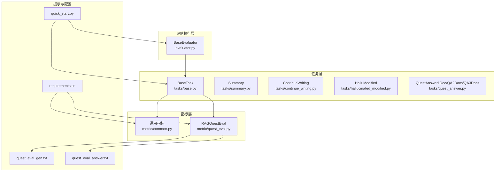
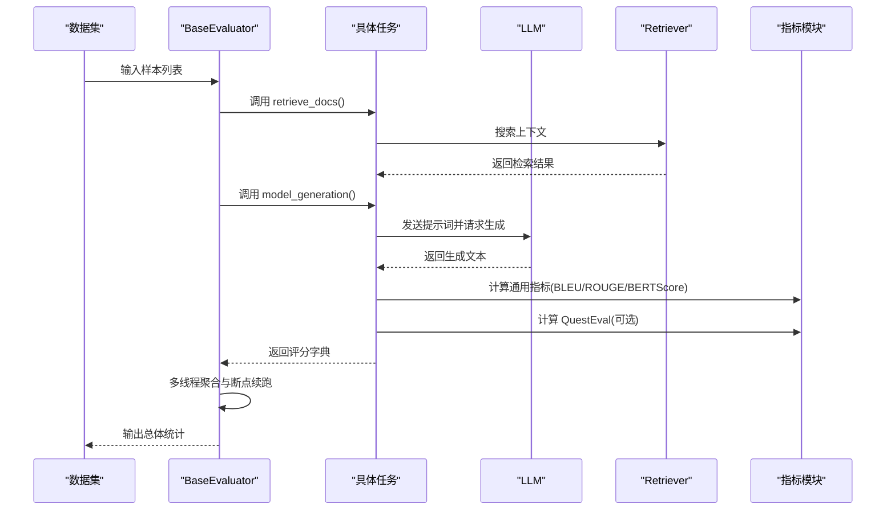
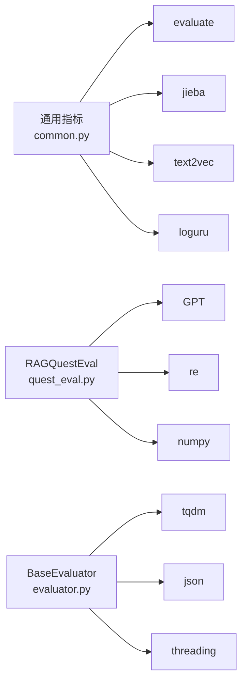

# 评估指标

<cite>
**本文引用的文件**
- [common.py](file://src/metric/common.py)
- [quest_eval.py](file://src/metric/quest_eval.py)
- [evaluator.py](file://evaluator.py)
- [quick_start.py](file://quick_start.py)
- [base.py](file://src/tasks/base.py)
- [summary.py](file://src/tasks/summary.py)
- [continue_writing.py](file://src/tasks/continue_writing.py)
- [hallucinated_modified.py](file://src/tasks/hallucinated_modified.py)
- [quest_answer.py](file://src/tasks/quest_answer.py)
- [quest_eval_gen.txt](file://src/prompts/quest_eval_gen.txt)
- [quest_eval_answer.txt](file://src/prompts/quest_eval_answer.txt)
- [README.md](file://README.md)
- [requirements.txt](file://requirements.txt)
</cite>

## 目录
1. [简介](#简介)
2. [项目结构](#项目结构)
3. [核心组件](#核心组件)
4. [架构总览](#架构总览)
5. [详细组件分析](#详细组件分析)
6. [依赖关系分析](#依赖关系分析)
7. [性能考量](#性能考量)
8. [故障排查指南](#故障排查指南)
9. [结论](#结论)
10. [附录](#附录)

## 简介
本文件系统化梳理 CRUD-RAG 项目中的评估指标体系，覆盖通用指标（BLEU、ROUGE、BERTScore）与专业指标（RAGQuestEval）。文档从实现原理、适用场景、优缺点、参数配置、结果解读与性能对比等方面进行说明，并结合项目代码路径给出可操作的使用建议与最佳实践。

## 项目结构
评估相关模块主要分布在以下位置：
- 通用指标：src/metric/common.py
- 专业指标：src/metric/quest_eval.py
- 评测执行器：evaluator.py
- 任务封装与评分：src/tasks/*（summary、continue_writing、hallucinated_modified、quest_answer）
- 提示模板：src/prompts/quest_eval*.txt
- 快速开始与参数入口：quick_start.py
- 依赖声明：requirements.txt

图表来源
- [evaluator.py:13-151](file://evaluator.py#L13-L151)
- [base.py:13-74](file://src/tasks/base.py#L13-L74)
- [summary.py:12-121](file://src/tasks/summary.py#L12-L121)
- [continue_writing.py:13-119](file://src/tasks/continue_writing.py#L13-L119)
- [hallucinated_modified.py:14-124](file://src/tasks/hallucinated_modified.py#L14-L124)
- [quest_answer.py:14-134](file://src/tasks/quest_answer.py#L14-L134)
- [common.py:23-86](file://src/metric/common.py#L23-L86)
- [quest_eval.py:23-152](file://src/metric/quest_eval.py#L23-L152)
- [quest_eval_gen.txt:1-10](file://src/prompts/quest_eval_gen.txt#L1-L10)
- [quest_eval_answer.txt:1-49](file://src/prompts/quest_eval_answer.txt#L1-L49)
- [quick_start.py:14-110](file://quick_start.py#L14-L110)
- [requirements.txt:1-13](file://requirements.txt#L1-L13)

章节来源
- [README.md:27-68](file://README.md#L27-L68)
- [quick_start.py:14-110](file://quick_start.py#L14-L110)

## 核心组件
- 通用指标模块（metric/common.py）
  - BLEU：基于中文分词的 n-gram 精确率与 brevity penalty 组合，支持返回各阶精确率与可选惩罚修正值。
  - ROUGE-L：基于最长公共子序列的匹配长度归一化得分。
  - BERTScore：基于中文句子向量相似度的语义相似度。
  - 关键词精度（kw_precision）：基于关键词抽取的生成内容与参考文本的关键词重叠比例。
  - 分类指标（classifications）：二分类准确率、精确率、召回率、F1。
- 专业指标模块（metric/quest_eval.py）
  - QuestEval：通过大模型自动生成问题与答案，构造问答对，计算问题级 F1 与召回，过滤“无法推断”的答案后统计平均值。
- 评测执行器（evaluator.py）
  - 多线程批处理评分，支持断点续跑、结果持久化、整体统计。
- 任务封装（tasks/*）
  - 各任务在 scoring 中统一调用通用指标与 QuestEval，并在 compute_overall 中做平均统计。

章节来源
- [common.py:23-117](file://src/metric/common.py#L23-L117)
- [quest_eval.py:23-152](file://src/metric/quest_eval.py#L23-L152)
- [evaluator.py:13-192](file://evaluator.py#L13-L192)
- [base.py:13-74](file://src/tasks/base.py#L13-L74)
- [summary.py:61-121](file://src/tasks/summary.py#L61-L121)
- [continue_writing.py:62-119](file://src/tasks/continue_writing.py#L62-L119)
- [hallucinated_modified.py:66-124](file://src/tasks/hallucinated_modified.py#L66-L124)
- [quest_answer.py:63-134](file://src/tasks/quest_answer.py#L63-L134)

## 架构总览
下图展示从数据点到最终指标统计的整体流程，包括检索、生成、评分与汇总。

图表来源
- [evaluator.py:42-151](file://evaluator.py#L42-L151)
- [summary.py:36-99](file://src/tasks/summary.py#L36-L99)
- [continue_writing.py:37-99](file://src/tasks/continue_writing.py#L37-L99)
- [hallucinated_modified.py:38-103](file://src/tasks/hallucinated_modified.py#L38-L103)
- [quest_answer.py:38-100](file://src/tasks/quest_answer.py#L38-L100)
- [common.py:23-86](file://src/metric/common.py#L23-L86)
- [quest_eval.py:92-129](file://src/metric/quest_eval.py#L92-L129)

## 详细组件分析

### 通用指标：BLEU、ROUGE-L、BERTScore、关键词精度、分类指标
- BLEU（src/metric/common.py）
  - 实现要点
    - 使用中文分词器对预测与参考文本进行分词。
    - 调用 evaluate 库加载本地缓存的 BLEU 实现，计算各阶 n-gram 精确率与 brevity penalty。
    - 支持返回带惩罚修正或不带惩罚的 BLEU 平均值，以及各阶精确率。
  - 参数与行为
    - with_penalty：是否返回惩罚修正后的 BLEU；默认返回未惩罚的平均 BLEU。
  - 适用场景
    - 文本生成质量的字符串层面匹配度评估，适合结构化、简洁输出的任务。
  - 优缺点
    - 优点：计算快速、可解释性强、对短文本友好。
    - 缺点：对语义差异敏感度低、易受输出风格影响（如标题、表情符号等）。
  - 结果解读
    - BLEU-1/2/3/4 反映不同 n-gram 的匹配程度；BLEU-avg 作为综合指标。
  - 代码路径
    - [bleu_score 函数:24-44](file://src/metric/common.py#L24-L44)

- ROUGE-L（src/metric/common.py）
  - 实现要点
    - 基于最长公共子序列（LCS）的长度归一化，衡量预测与参考之间的重叠。
    - 使用中文分词器进行 token 化。
  - 适用场景
    - 对长文本、段落级匹配更敏感的任务，强调语义连贯性。
  - 优缺点
    - 优点：对顺序与连续性敏感，适合摘要与续写。
    - 缺点：对词序微小变化不敏感，可能忽略语义差异。
  - 结果解读
    - ROUGE-L 数值越高表示与参考文本的最长公共子序列越长。
  - 代码路径
    - [rougeL_score 函数:47-55](file://src/metric/common.py#L47-L55)

- BERTScore（src/metric/common.py）
  - 实现要点
    - 使用本地缓存的中文句子向量模型计算相似度。
    - 首次网络访问会下载模型，后续复用缓存。
  - 适用场景
    - 强调语义一致性的任务，对风格差异不敏感。
  - 优缺点
    - 优点：语义层面更稳健，适合复杂表达。
    - 缺点：计算开销较大、首次运行需联网下载模型。
  - 结果解读
    - 相似度越高表示语义越接近。
  - 代码路径
    - [bert_score 函数:75-85](file://src/metric/common.py#L75-L85)

- 关键词精度（kw_precision）
  - 实现要点
    - 通过关键词提取器对生成文本抽取关键词，计算与参考文本的重叠比例。
    - 可选择返回关键词列表以便进一步分析。
  - 适用场景
    - 需要验证事实性、关键信息保留的任务。
  - 优缺点
    - 优点：简单直观，便于定位信息缺失。
    - 缺点：依赖关键词提取质量，对语义抽象能力有限。
  - 代码路径
    - [kw_precision 函数:58-72](file://src/metric/common.py#L58-L72)

- 分类指标（classifications）
  - 实现要点
    - 计算二分类的准确率、精确率、召回率与 F1。
  - 适用场景
    - 将生成结果转化为二分类（如正确/错误、可推断/不可推断）时的评估。
  - 代码路径
    - [classifications 函数:88-117](file://src/metric/common.py#L88-L117)

章节来源
- [common.py:23-117](file://src/metric/common.py#L23-L117)

### 专业指标：RAGQuestEval
- 设计思路
  - 通过大模型从参考文本中抽取关键信息并生成问题，再用生成文本回答同一组问题，比较答案一致性。
  - 过滤“无法推断”的答案，仅对可推断问题计算平均 F1 与召回。
  - 采用中文分词的词级 F1 计算，避免大小写与标点差异。
- 实现方法
  - QuestEval 类
    - question_generation：读取模板，生成问题与关键信息。
    - question_answer：用参考文本与生成文本分别回答问题，解析响应。
    - get_QA_pair：缓存已生成的 QA 对，避免重复调用大模型。
    - quest_eval：主流程，过滤不可推断项，计算平均 F1 与召回。
  - 辅助函数
    - compute_f1：对单个答案对计算词级 F1。
    - word_based_f1_score：对一组答案对求平均。
- 适用场景
  - 需要从知识库中抽取事实并进行问答一致性评估的任务。
- 优缺点
  - 优点：贴近真实问答场景，能反映事实性与可推断性。
  - 缺点：依赖外部大模型、耗时较长、首次运行需生成并缓存 QA 对。
- 结果解读
  - QA_avg_F1：可推断问题的平均 F1，越高越好。
  - QA_recall：可推断问题的比例，越高表示问题越可被回答。
- 代码路径
  - [QuestEval 类:23-129](file://src/metric/quest_eval.py#L23-L129)
  - [compute_f1:132-144](file://src/metric/quest_eval.py#L132-L144)
  - [word_based_f1_score:146-150](file://src/metric/quest_eval.py#L146-L150)
  - [提示模板：问题生成:1-10](file://src/prompts/quest_eval_gen.txt#L1-L10)
  - [提示模板：问题回答:1-49](file://src/prompts/quest_eval_answer.txt#L1-L49)

章节来源
- [quest_eval.py:23-152](file://src/metric/quest_eval.py#L23-L152)
- [quest_eval_gen.txt:1-10](file://src/prompts/quest_eval_gen.txt#L1-L10)
- [quest_eval_answer.txt:1-49](file://src/prompts/quest_eval_answer.txt#L1-L49)

### 评测执行器与任务封装
- BaseEvaluator
  - 多线程批处理评分，支持断点续跑、结果持久化、整体统计。
  - 在 run 中调用任务 compute_overall，按任务需求对指标求平均。
- 各任务的 scoring
  - Summary、ContinueWriting、HalluModified、QuestAnswer* 统一在 scoring 中调用通用指标与 QuestEval，并记录日志与有效性标记。
  - compute_overall 对指标进行平均，对 QuestEval 的平均值按有效问答数归一化。
- 代码路径
  - [BaseEvaluator.run:118-151](file://evaluator.py#L118-L151)
  - [BaseEvaluator.multithread_batch_scoring:56-107](file://evaluator.py#L56-L107)
  - [Summary.scoring:61-99](file://src/tasks/summary.py#L61-L99)
  - [ContinueWriting.scoring:62-99](file://src/tasks/continue_writing.py#L62-99)
  - [HalluModified.scoring:66-103](file://src/tasks/hallucinated_modified.py#L66-103)
  - [QuestAnswer.scoring:63-100](file://src/tasks/quest_answer.py#L63-100)

章节来源
- [evaluator.py:13-192](file://evaluator.py#L13-L192)
- [summary.py:61-121](file://src/tasks/summary.py#L61-L121)
- [continue_writing.py:62-119](file://src/tasks/continue_writing.py#L62-L119)
- [hallucinated_modified.py:66-124](file://src/tasks/hallucinated_modified.py#L66-L124)
- [quest_answer.py:63-134](file://src/tasks/quest_answer.py#L63-L134)

## 依赖关系分析
- 通用指标依赖
  - evaluate（BLEU）、rouge_score（ROUGE-L）、text2vec（BERTScore）、jieba（中文分词）、loguru（日志）。
- 专业指标依赖
  - GPT（QuestEval）、正则表达式解析响应、numpy（平均值计算）。
- 评测执行器依赖
  - 多线程并发、TQDM 进度条、JSON 文件读写。

图表来源
- [requirements.txt:1-13](file://requirements.txt#L1-L13)
- [common.py:7-10](file://src/metric/common.py#L7-L10)
- [quest_eval.py:4-6](file://src/metric/quest_eval.py#L4-L6)
- [evaluator.py:6-11](file://evaluator.py#L6-L11)

章节来源
- [requirements.txt:1-13](file://requirements.txt#L1-L13)

## 性能考量
- 计算成本
  - BLEU/ROUGE-L：极快，适合大规模批量评估。
  - BERTScore：较慢，首次运行需下载模型，后续复用缓存。
  - QuestEval：最慢，涉及多次大模型调用与 QA 对缓存。
- 并发与断点续跑
  - BaseEvaluator 支持多线程与断点续跑，显著提升吞吐与稳定性。
- 输出风格与指标稳定性
  - README 指出模型输出风格变化会影响 BLEU；建议在提示中要求简洁输出以获得更稳定的结果。

章节来源
- [README.md:20-25](file://README.md#L20-L25)
- [evaluator.py:56-107](file://evaluator.py#L56-L107)

## 故障排查指南
- 通用指标异常
  - catch_all_exceptions 包裹指标函数，出现异常会记录警告并返回默认值，确保评测继续。
  - 若返回 0 或 NaN，检查输入文本是否为空、分词器是否可用。
- QuestEval 异常
  - 大模型请求失败或解析响应失败时，会记录警告并返回空 QA 结果，不影响整体评测。
  - 确认提示模板存在且路径正确。
- 评测执行器
  - 多线程锁保护与进度条显示有助于定位阻塞与卡顿。
  - 断点续跑：若输出文件存在，将自动跳过已评估样本。

章节来源
- [common.py:13-21](file://src/metric/common.py#L13-L21)
- [quest_eval.py:121-127](file://src/metric/quest_eval.py#L121-L127)
- [evaluator.py:42-54](file://evaluator.py#L42-L54)
- [evaluator.py:68-75](file://evaluator.py#L68-L75)

## 结论
- 通用指标（BLEU/ROUGE-L/BERTScore）适合快速、可解释的文本质量评估，BLEU/ROUGE-L 对风格敏感，BERTScore 更稳健。
- 专业指标（QuestEval）贴近问答场景，能评估事实性与可推断性，但计算成本最高。
- 建议组合使用：以 BLEU/ROUGE-L 为主，BERTScore 作为语义一致性补充，QuestEval 用于关键问答一致性验证。

## 附录

### 指标选择与使用建议
- 任务类型与指标匹配
  - 摘要/总结：BLEU-avg、ROUGE-L、BERTScore、QuestEval（可选）。
  - 续写/延续写作：BLEU-avg、ROUGE-L、BERTScore、QuestEval（可选）。
  - 幻觉修正：BLEU-avg、ROUGE-L、BERTScore、QuestEval（可选）。
  - 问答任务：BLEU-avg、ROUGE-L、BERTScore、QuestEval（推荐）。
- 参数配置
  - BLEU：with_penalty 控制是否返回惩罚修正后的平均值。
  - QuestEval：通过任务构造函数启用 use_quest_eval，指定 quest_eval_model。
  - BERTScore：首次运行需网络访问下载模型，后续复用缓存。
- 结果解读与对比
  - 对比多个模型/检索器时，优先看 QuestEval 的 QA_avg_F1 与 QA_recall，其次看 BLEU-avg 与 ROUGE-L，最后看 BERTScore。
  - 注意不同任务的输出风格差异，必要时调整提示以获得更稳定的 BLEU 结果。

章节来源
- [quick_start.py:42-49](file://quick_start.py#L42-L49)
- [summary.py:66-99](file://src/tasks/summary.py#L66-L99)
- [continue_writing.py:67-99](file://src/tasks/continue_writing.py#L67-L99)
- [hallucinated_modified.py:71-103](file://src/tasks/hallucinated_modified.py#L71-L103)
- [quest_answer.py:68-100](file://src/tasks/quest_answer.py#L68-L100)
- [README.md:20-25](file://README.md#L20-L25)