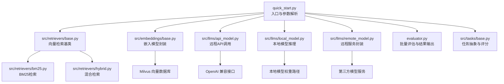
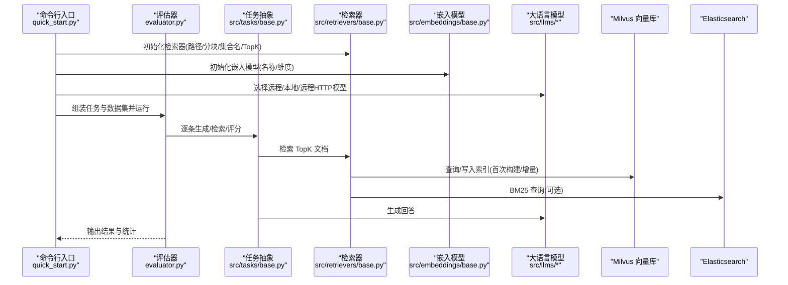
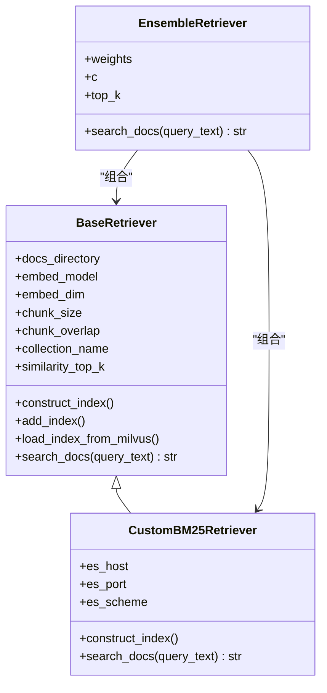
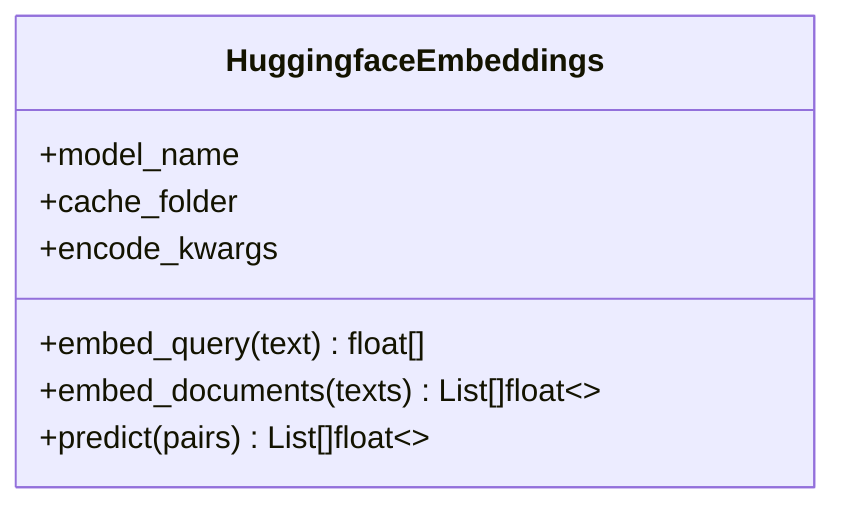
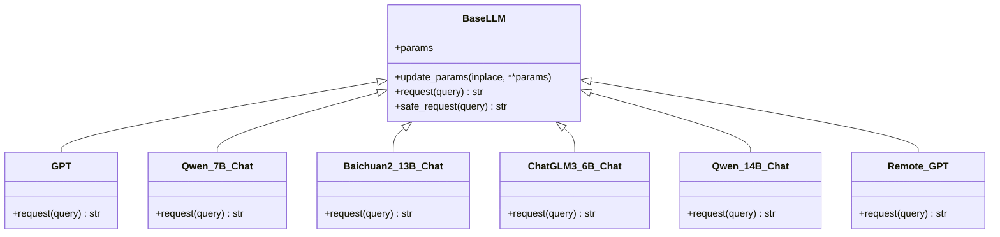
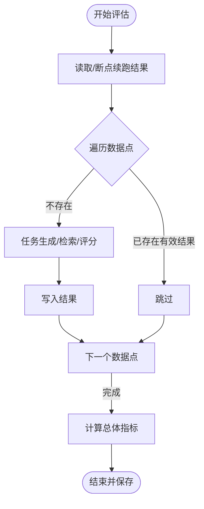
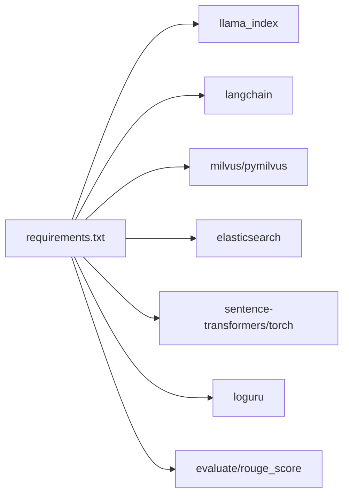

# 部署与运维

<cite>
**本文引用的文件**
- [README.md](file://README.md)
- [README.zh_CN.md](file://README.zh_CN.md)
- [requirements.txt](file://requirements.txt)
- [quick_start.py](file://quick_start.py)
- [evaluator.py](file://evaluator.py)
- [src/configs/config.py](file://src/configs/config.py)
- [src/embeddings/base.py](file://src/embeddings/base.py)
- [src/retrievers/base.py](file://src/retrievers/base.py)
- [src/retrievers/bm25.py](file://src/retrievers/bm25.py)
- [src/retrievers/hybrid.py](file://src/retrievers/hybrid.py)
- [src/llms/base.py](file://src/llms/base.py)
- [src/llms/api_model.py](file://src/llms/api_model.py)
- [src/llms/local_model.py](file://src/llms/local_model.py)
- [src/llms/remote_model.py](file://src/llms/remote_model.py)
- [src/tasks/base.py](file://src/tasks/base.py)
</cite>

## 目录
1. [简介](#简介)
2. [项目结构](#项目结构)
3. [核心组件](#核心组件)
4. [架构总览](#架构总览)
5. [详细组件分析](#详细组件分析)
6. [依赖关系分析](#依赖关系分析)
7. [性能考量](#性能考量)
8. [故障排查指南](#故障排查指南)
9. [结论](#结论)
10. [附录](#附录)

## 简介
本指南面向生产环境的部署与运维，围绕 CRUD-RAG 的检索增强生成（RAG）系统，提供从环境准备、Milvus 向量数据库安装与配置、Docker 容器化部署到性能监控、日志管理、扩容与负载均衡、故障恢复与灾备、资源与成本优化以及日常运维排障的全流程实践建议。文档以仓库现有代码为依据，结合可扩展的最佳实践，帮助运维人员快速落地并稳定运行该系统。

## 项目结构
项目采用模块化分层组织：数据集、嵌入模型、检索器、大语言模型适配层、任务与评估、指标与提示词等。核心入口为启动脚本，负责解析参数、构建检索器与 LLM、加载数据集并执行评估。

图示来源
- [quick_start.py:1-110](file://quick_start.py#L1-L110)
- [src/retrievers/base.py:1-142](file://src/retrievers/base.py#L1-L142)
- [src/embeddings/base.py:1-88](file://src/embeddings/base.py#L1-L88)
- [src/llms/api_model.py:1-33](file://src/llms/api_model.py#L1-L33)
- [src/llms/local_model.py:1-114](file://src/llms/local_model.py#L1-L114)
- [src/llms/remote_model.py:1-111](file://src/llms/remote_model.py#L1-L111)
- [evaluator.py:1-192](file://evaluator.py#L1-L192)
- [src/tasks/base.py:1-74](file://src/tasks/base.py#L1-L74)

章节来源
- [README.md:27-68](file://README.md#L27-L68)
- [quick_start.py:14-51](file://quick_start.py#L14-L51)

## 核心组件
- 检索器（Retriever）
  - 基于 Milvus 的向量检索：支持首次构建索引、增量添加索引、从 Milvus 加载已有索引，并通过查询引擎返回上下文。
  - BM25 检索：基于 Elasticsearch 的关键词检索，适合与向量检索融合。
  - 混合检索：对 BM25 与向量检索结果进行 RRF 融合排序，提升召回质量。
- 嵌入模型（Embeddings）
  - 封装 sentence-transformers，支持 bi-encoder 与 cross-encoder，统一编码接口。
- 大语言模型（LLM）
  - 远程 API：OpenAI 兼容接口或代理转发。
  - 本地模型：Qwen、Baichuan、ChatGLM 等本地权重加载与推理。
  - 远程服务封装：通过 HTTP 接口调用第三方模型服务。
- 评估器（Evaluator）
  - 支持多线程批处理、断点续跑、结果持久化与总体指标计算。
- 任务与指标（Tasks/Metrics）
  - 抽象任务定义生成、检索、评分流程；支持 BLEU、ROUGE、BERTScore 与 RAGQuestEval。

章节来源
- [src/retrievers/base.py:16-142](file://src/retrievers/base.py#L16-L142)
- [src/retrievers/bm25.py:14-92](file://src/retrievers/bm25.py#L14-L92)
- [src/retrievers/hybrid.py:13-81](file://src/retrievers/hybrid.py#L13-L81)
- [src/embeddings/base.py:14-88](file://src/embeddings/base.py#L14-L88)
- [src/llms/base.py:6-47](file://src/llms/base.py#L6-L47)
- [src/llms/api_model.py:12-33](file://src/llms/api_model.py#L12-L33)
- [src/llms/local_model.py:11-114](file://src/llms/local_model.py#L11-L114)
- [src/llms/remote_model.py:14-111](file://src/llms/remote_model.py#L14-L111)
- [evaluator.py:13-192](file://evaluator.py#L13-L192)
- [src/tasks/base.py:13-74](file://src/tasks/base.py#L13-L74)

## 架构总览
下图展示从命令行入口到检索、生成与评估的整体流程，以及与 Milvus、Elasticsearch、外部 LLM API 的交互。

图示来源
- [quick_start.py:54-108](file://quick_start.py#L54-L108)
- [evaluator.py:118-151](file://evaluator.py#L118-L151)
- [src/retrievers/base.py:37-87](file://src/retrievers/base.py#L37-L87)
- [src/retrievers/bm25.py:44-68](file://src/retrievers/bm25.py#L44-L68)
- [src/embeddings/base.py:58-73](file://src/embeddings/base.py#L58-L73)
- [src/llms/api_model.py:17-32](file://src/llms/api_model.py#L17-L32)
- [src/llms/local_model.py:27-33](file://src/llms/local_model.py#L27-L33)
- [src/llms/remote_model.py:15-34](file://src/llms/remote_model.py#L15-L34)

## 详细组件分析

### 检索器组件
- 向量检索（Milvus）
  - 首次构建索引按固定步长分片写入，避免单次写入过大导致失败。
  - 从 Milvus 加载已有索引，直接进行查询。
  - 查询后对响应文本进行清洗，去除路径信息，保留内容。
- BM25 检索（Elasticsearch）
  - 支持构造索引与查询 DSL，按 TopK 返回匹配内容。
- 混合检索（RRF）
  - 对 BM25 与向量检索结果取并集，按 RRF 权重与常数 c 计算得分并排序。

图示来源
- [src/retrievers/base.py:16-142](file://src/retrievers/base.py#L16-L142)
- [src/retrievers/bm25.py:14-92](file://src/retrievers/bm25.py#L14-L92)
- [src/retrievers/hybrid.py:13-81](file://src/retrievers/hybrid.py#L13-L81)

章节来源
- [src/retrievers/base.py:37-142](file://src/retrievers/base.py#L37-L142)
- [src/retrievers/bm25.py:44-92](file://src/retrievers/bm25.py#L44-L92)
- [src/retrievers/hybrid.py:50-81](file://src/retrievers/hybrid.py#L50-L81)

### 嵌入模型组件
- 支持 bi-encoder 与 cross-encoder 自动识别与实例化。
- 统一 embed_query/embed_documents/predict 接口，便于替换不同模型。
- 默认模型名称与缓存目录可通过环境变量或参数控制。

图示来源
- [src/embeddings/base.py:14-88](file://src/embeddings/base.py#L14-L88)

章节来源
- [src/embeddings/base.py:25-73](file://src/embeddings/base.py#L25-L73)

### LLM 组件
- 抽象基类提供统一参数与安全请求封装。
- 远程 API：OpenAI 兼容接口，支持自定义 base_url 与上报 token 消耗。
- 本地模型：自动加载本地权重，设备映射与生成参数配置。
- 远程 HTTP：通过 Token 与 JSON 请求调用第三方服务。

图示来源
- [src/llms/base.py:6-47](file://src/llms/base.py#L6-L47)
- [src/llms/api_model.py:12-33](file://src/llms/api_model.py#L12-L33)
- [src/llms/local_model.py:11-114](file://src/llms/local_model.py#L11-L114)
- [src/llms/remote_model.py:14-111](file://src/llms/remote_model.py#L14-L111)

章节来源
- [src/llms/base.py:25-45](file://src/llms/base.py#L25-L45)
- [src/llms/api_model.py:17-32](file://src/llms/api_model.py#L17-L32)
- [src/llms/local_model.py:14-33](file://src/llms/local_model.py#L14-L33)
- [src/llms/remote_model.py:15-34](file://src/llms/remote_model.py#L15-L34)

### 评估器与任务
- 评估器支持多线程批处理、断点续跑、结果持久化与总体指标计算。
- 任务抽象定义检索、生成、评分与总体统计接口，便于扩展新任务。

图示来源
- [evaluator.py:56-107](file://evaluator.py#L56-L107)
- [evaluator.py:118-151](file://evaluator.py#L118-L151)
- [src/tasks/base.py:52-74](file://src/tasks/base.py#L52-L74)

章节来源
- [evaluator.py:118-192](file://evaluator.py#L118-L192)
- [src/tasks/base.py:34-74](file://src/tasks/base.py#L34-L74)

## 依赖关系分析
- Python 依赖集中在检索、嵌入、向量数据库、评估与日志等模块。
- 检索链路依赖 Milvus 或 Elasticsearch；生成链路依赖 OpenAI 兼容接口或本地模型。
- 评估器与任务解耦，便于扩展新的评测指标与任务类型。

图示来源
- [requirements.txt:1-13](file://requirements.txt#L1-L13)

章节来源
- [requirements.txt:1-13](file://requirements.txt#L1-L13)

## 性能考量
- 索引构建
  - Milvus 分片写入：按固定步长切分节点写入，降低单次写入压力，缩短等待时间。
  - 增量索引：支持在已有集合上追加节点，避免重复全量构建。
- 检索性能
  - TopK 控制：合理设置 TopK，平衡召回与延迟。
  - 混合检索：RRF 融合可提升相关性排序质量，减少无效文档传输。
- 生成性能
  - 多线程评估：评估器使用线程池并发处理，提高吞吐。
  - 本地模型：设备映射与 dtype 优化（如 bfloat16）可降低显存占用。
- 存储与缓存
  - 嵌入模型缓存目录可通过环境变量配置，减少重复下载与加载时间。
- 日志与监控
  - 使用日志库记录关键事件与 token 消耗，便于性能分析与计费追踪。

章节来源
- [src/retrievers/base.py:74-87](file://src/retrievers/base.py#L74-L87)
- [src/retrievers/hybrid.py:68-71](file://src/retrievers/hybrid.py#L68-L71)
- [evaluator.py:102-107](file://evaluator.py#L102-L107)
- [src/embeddings/base.py:18-20](file://src/embeddings/base.py#L18-L20)
- [src/llms/local_model.py:44-46](file://src/llms/local_model.py#L44-L46)
- [src/llms/api_model.py:30-31](file://src/llms/api_model.py#L30-L31)

## 故障排查指南
- 启动与依赖
  - 确认依赖安装与版本兼容，特别是向量库与嵌入模型相关包。
- Milvus 连接
  - 若首次构建索引失败，检查集合名、维度与写入权限；确认分片写入逻辑是否正常完成。
  - 若加载已有索引失败，检查集合是否存在、字段与维度一致。
- Elasticsearch 连接
  - 确认主机、端口与协议配置正确；索引构造与查询 DSL 是否匹配。
- LLM 调用
  - 远程 API：检查密钥、base_url 与网络连通性；关注 token 消耗与限流。
  - 本地模型：确认权重路径、设备映射与 dtype 设置；注意显存不足导致的 OOM。
- 评估器异常
  - 断点续跑：检查输出目录与 JSON 结构完整性；确保 ID 唯一且有效。
  - 多线程：若出现竞态或锁阻塞，检查共享资源访问与异常捕获。
- 日志定位
  - 关键路径均使用日志记录，优先查看评估器与 LLM 层的日志输出。

章节来源
- [src/retrievers/base.py:67-87](file://src/retrievers/base.py#L67-L87)
- [src/retrievers/bm25.py:55-57](file://src/retrievers/bm25.py#L55-L57)
- [src/llms/api_model.py:18-20](file://src/llms/api_model.py#L18-L20)
- [src/llms/local_model.py:15-18](file://src/llms/local_model.py#L15-L18)
- [evaluator.py:49-51](file://evaluator.py#L49-L51)
- [evaluator.py:98-100](file://evaluator.py#L98-L100)

## 结论
本指南基于仓库现有代码梳理了 CRUD-RAG 的生产部署与运维要点，覆盖 Milvus/Elasticsearch 的安装配置、向量索引构建与维护、Docker 容器化部署建议、性能监控与日志管理、扩容与负载均衡策略、故障恢复与灾备方案、资源与成本优化以及日常运维排障。建议在生产环境中结合业务规模与 SLA，对索引策略、并发度、缓存与监控体系进行持续优化。

## 附录

### 生产环境部署步骤与配置要求
- 环境准备
  - 安装依赖：参考依赖清单，确保版本兼容。
  - 准备向量数据库：部署 Milvus 或 Elasticsearch，配置网络与存储。
  - 准备模型：下载并放置本地模型权重目录，或配置远程 API 密钥与地址。
- 参数配置
  - 在配置文件中填写 API 密钥、代理地址与本地模型路径。
  - 在启动脚本中设置数据路径、集合名、TopK、分块大小与线程数等参数。
- 首次索引构建
  - 使用启动脚本的构建索引参数，按分片写入 Milvus，完成后可复用集合名进行后续查询。
- 运行与验证
  - 执行评估流程，观察日志与输出目录，确认结果可断点续跑。

章节来源
- [requirements.txt:1-13](file://requirements.txt#L1-L13)
- [src/configs/config.py:1-14](file://src/configs/config.py#L1-L14)
- [quick_start.py:87-105](file://quick_start.py#L87-L105)
- [src/retrievers/base.py:56-87](file://src/retrievers/base.py#L56-L87)

### Docker 容器化部署（最佳实践）
- 镜像构建
  - 基于 Python 基础镜像，安装依赖与模型权重。
  - 将 Milvus/Elasticsearch 作为独立服务，通过网络连接。
- 容器编排
  - 使用编排工具将应用容器与数据库容器分离，分别扩缩容。
  - 挂载持久化卷至输出目录与模型缓存目录。
- 环境变量
  - 通过环境变量传递 API 密钥、数据库地址与集合名等配置。
- 健康检查与重启策略
  - 配置健康检查探测应用状态，设置合理的重启策略与超时时间。

（本节为通用最佳实践说明，未直接分析具体源码文件）

### Milvus 向量数据库的安装、配置与维护
- 安装与启动
  - 参考官方文档安装 Milvus 服务，确保端口开放与存储可用。
- 集合与索引
  - 首次构建时指定集合名与维度；分片写入避免单次写入过大。
  - 增量添加索引时保持集合名与维度一致。
- 维护与监控
  - 定期检查集合大小、写入速率与查询延迟；根据数据增长调整分片策略。

章节来源
- [src/retrievers/base.py:67-87](file://src/retrievers/base.py#L67-L87)
- [src/retrievers/base.py:105-119](file://src/retrievers/base.py#L105-L119)

### 性能监控与日志管理
- 日志
  - 在 LLM 与评估器关键路径记录日志，包括 token 消耗、异常与进度。
- 监控
  - 监控 Milvus/Elasticsearch 的写入与查询延迟、错误率与资源使用。
  - 监控应用容器的 CPU、内存与线程池使用情况。

章节来源
- [src/llms/api_model.py:30-31](file://src/llms/api_model.py#L30-L31)
- [evaluator.py:56-107](file://evaluator.py#L56-L107)

### 系统扩容与负载均衡
- 水平扩展
  - 应用容器水平扩展，结合负载均衡器分发请求。
  - 数据库容器独立扩缩容，确保写入与查询能力满足峰值需求。
- 负载均衡
  - 对外暴露统一入口，内部通过服务发现与健康检查实现流量调度。

（本节为通用策略说明，未直接分析具体源码文件）

### 故障恢复与灾难备份
- 备份
  - 定期备份 Milvus/Elasticsearch 数据与应用输出目录。
- 恢复
  - 在新环境重建依赖与配置，恢复索引与输出结果，验证一致性。
- 灾备
  - 异地部署备用集群，定期同步数据，演练切换流程。

（本节为通用策略说明，未直接分析具体源码文件）

### 资源使用与成本优化
- 显存优化
  - 本地模型使用设备映射与 dtype 优化；控制生成长度与温度参数。
- 存储优化
  - 合理设置分块大小与重叠，减少冗余；清理临时缓存目录。
- 成本优化
  - 远程 API 调用需关注 token 消耗与单价；本地化部署可降低长期成本。

章节来源
- [src/llms/local_model.py:44-46](file://src/llms/local_model.py#L44-L46)
- [src/embeddings/base.py:18-20](file://src/embeddings/base.py#L18-L20)
- [src/llms/api_model.py:30-31](file://src/llms/api_model.py#L30-L31)

### 日常维护与问题排查
- 日常维护
  - 定期更新依赖与模型权重；检查磁盘空间与日志轮转。
- 排查流程
  - 从日志入手定位异常；逐步缩小范围至检索、嵌入或生成环节；核对参数与配置文件。

章节来源
- [evaluator.py:49-51](file://evaluator.py#L49-L51)
- [evaluator.py:98-100](file://evaluator.py#L98-L100)