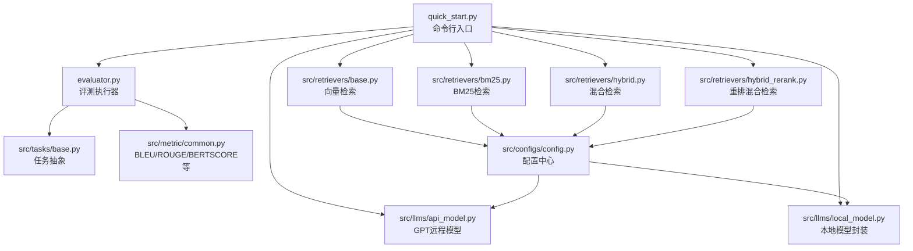
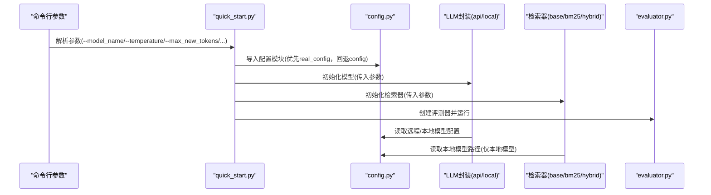
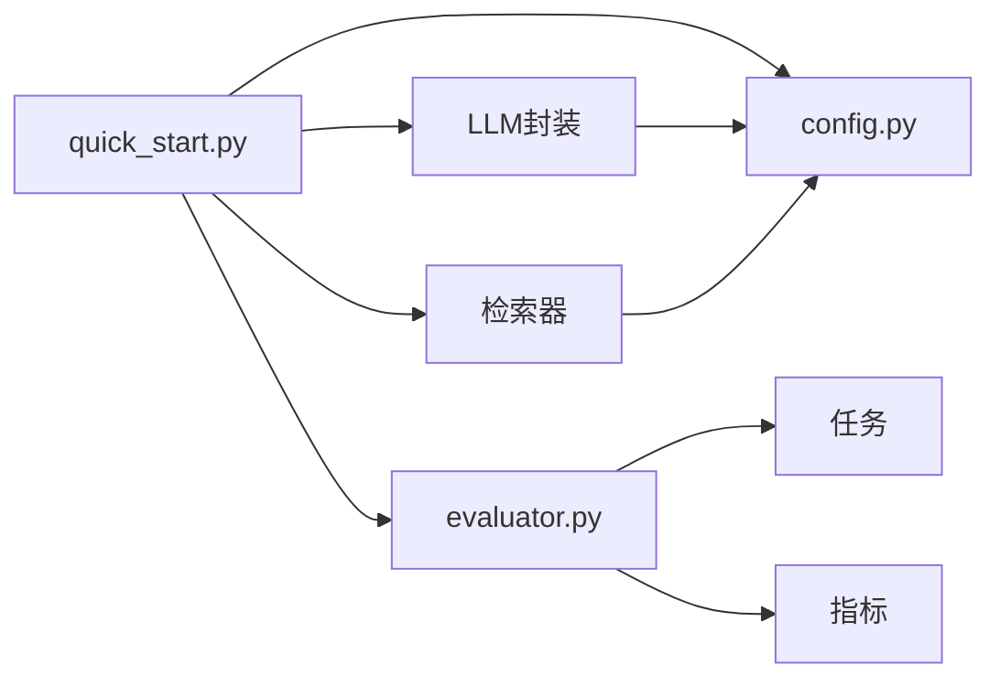

# 配置管理

<cite>
**本文引用的文件**
- [config.py](file://src/configs/config.py)
- [quick_start.py](file://quick_start.py)
- [api_model.py](file://src/llms/api_model.py)
- [local_model.py](file://src/llms/local_model.py)
- [base.py（基础LLM）](file://src/llms/base.py)
- [base.py（基础检索器）](file://src/retrievers/base.py)
- [bm25.py](file://src/retrievers/bm25.py)
- [hybrid.py](file://src/retrievers/hybrid.py)
- [hybrid_rerank.py](file://src/retrievers/hybrid_rerank.py)
- [base.py（基础任务）](file://src/tasks/base.py)
- [common.py（通用指标）](file://src/metric/common.py)
- [evaluator.py](file://evaluator.py)
- [requirements.txt](file://requirements.txt)
- [README.md](file://README.md)
</cite>

## 目录
1. [简介](#简介)
2. [项目结构](#项目结构)
3. [核心组件](#核心组件)
4. [架构总览](#架构总览)
5. [详细组件分析](#详细组件分析)
6. [依赖分析](#依赖分析)
7. [性能考虑](#性能考虑)
8. [故障排查指南](#故障排查指南)
9. [结论](#结论)
10. [附录](#附录)

## 简介
本文件面向CRUD-RAG的配置管理，围绕config.py中的配置项展开，系统性说明模型参数、检索参数与评估参数的配置方法、优化策略、不同配置组合对系统性能的影响，并提供针对不同使用场景的推荐配置方案、版本管理与迁移建议、命令行覆盖方式、调试与验证方法以及高级用户自定义扩展指引。

## 项目结构
CRUD-RAG采用按功能分层的组织方式：配置集中在src/configs中；运行入口在根目录quick_start.py；大模型调用封装在src/llms下；检索模块在src/retrievers；评估与指标在src/metric与src/tasks；执行器在evaluator.py。

图表来源
- [quick_start.py:1-110](file://quick_start.py#L1-L110)
- [api_model.py:1-33](file://src/llms/api_model.py#L1-L33)
- [local_model.py:1-114](file://src/llms/local_model.py#L1-L114)
- [base.py（基础检索器）:1-142](file://src/retrievers/base.py#L1-L142)
- [bm25.py:1-92](file://src/retrievers/bm25.py#L1-L92)
- [hybrid.py:1-81](file://src/retrievers/hybrid.py#L1-L81)
- [hybrid_rerank.py:1-81](file://src/retrievers/hybrid_rerank.py#L1-L81)
- [evaluator.py:1-192](file://evaluator.py#L1-L192)
- [base.py（基础任务）:1-74](file://src/tasks/base.py#L1-L74)
- [common.py（通用指标）:1-117](file://src/metric/common.py#L1-L117)
- [config.py:1-14](file://src/configs/config.py#L1-L14)

章节来源
- [README.md:27-68](file://README.md#L27-L68)
- [quick_start.py:1-110](file://quick_start.py#L1-L110)

## 核心组件
本节聚焦config.py中的配置项及其在系统中的作用机制。

- 远程模型（OpenAI兼容）相关
  - GPT_api_key：用于鉴权远程模型请求
  - GPT_api_base：远程模型服务的基础URL
  - GPT_transit_url/GPT_transit_token/GPT_transit_user：可选的中转代理/令牌/用户信息，便于网络受限或合规场景
  - 作用机制：在api_model.py中读取上述配置，构造openai客户端并发起对话补全请求；温度、最大生成长度等由命令行参数传入，最终体现在请求参数中

- 本地模型路径相关
  - Qwen_7B_local_path、Baichuan2_13b_local_path、ChatGLM3_local_path、Qwen_14B_local_path：分别对应各本地模型的本地权重路径
  - 作用机制：在local_model.py中读取对应路径，加载tokenizer与模型，并以生成参数（温度、采样、最大生成长度、top_p、top_k）控制生成行为

- 检索相关（通过命令行参数间接影响）
  - embedding_name/embedding_dim：嵌入模型名称与维度，影响向量库构建与相似度计算
  - chunk_size/chunk_overlap：文本切片大小与重叠，影响召回粒度与召回质量
  - collection_name：Milvus集合名，决定向量库命名与持久化位置
  - retriever_name/retrieve_top_k：检索器类型与返回TopK，直接影响上下文丰富度与速度

- 评测相关（通过命令行参数间接影响）
  - quest_eval/bert_score_eval：是否启用RAGQuestEval与BERTScore评测
  - task：评测任务选择，影响输出目录与指标统计

章节来源
- [config.py:1-14](file://src/configs/config.py#L1-L14)
- [api_model.py:17-32](file://src/llms/api_model.py#L17-L32)
- [local_model.py:14-25](file://src/llms/local_model.py#L14-L25)
- [quick_start.py:16-51](file://quick_start.py#L16-L51)

## 架构总览
下图展示从命令行到模型与检索器的配置注入流程，以及配置项在各组件中的使用位置。

图表来源
- [quick_start.py:14-51](file://quick_start.py#L14-L51)
- [api_model.py:8-10](file://src/llms/api_model.py#L8-L10)
- [local_model.py:5-8](file://src/llms/local_model.py#L5-L8)
- [config.py:1-14](file://src/configs/config.py#L1-L14)

## 详细组件分析

### 配置参数详解与优化策略
- 远程模型（OpenAI兼容）
  - GPT_api_key：必须正确设置以通过鉴权；建议使用环境变量并在代码中读取，避免硬编码
  - GPT_api_base：若使用自建网关或镜像源，需确保URL格式正确且支持所需接口
  - GPT_transit相关：在网络受限时可配置中转；注意安全与合规性
  - 优化策略：合理设置temperature与max_new_tokens，前者控制创造性，后者限制输出长度；结合任务复杂度调整

- 本地模型路径
  - 各模型路径需指向已下载的本地权重目录；路径不存在会导致初始化失败
  - 优化策略：根据GPU显存与推理速度选择合适模型；生成参数（top_p/top_k）与温度共同决定输出多样性

- 检索参数
  - embedding_name：建议使用中文语境下的高质量句子级嵌入模型
  - embedding_dim：与嵌入模型一致，避免不匹配导致的向量维度错误
  - chunk_size/chunk_overlap：较小chunk提升细粒度召回但增加向量数量；较大overlap增强连续性但可能引入冗余
  - collection_name：统一命名便于多实验对比与复现
  - retriever_name：base（向量）、bm25（关键词）、hybrid（融合）、hybrid-rerank（重排）；按数据规模与精度需求选择
  - retrieve_top_k：越大召回越丰富但耗时与噪声增加；通常在4~16之间折中

- 评测参数
  - quest_eval：依赖远程模型进行问答评估，需远程模型可用；可选开启
  - bert_score_eval：依赖网络连接进行相似度计算，稳定性受网络影响
  - task：按需选择单任务或多任务组合，影响输出目录与指标统计

章节来源
- [api_model.py:18-27](file://src/llms/api_model.py#L18-L27)
- [local_model.py:14-25](file://src/llms/local_model.py#L14-L25)
- [quick_start.py:25-49](file://quick_start.py#L25-L49)
- [base.py（基础检索器）:17-54](file://src/retrievers/base.py#L17-L54)
- [bm25.py:14-42](file://src/retrievers/bm25.py#L14-L42)
- [hybrid.py:13-48](file://src/retrievers/hybrid.py#L13-L48)
- [hybrid_rerank.py:26-61](file://src/retrievers/hybrid_rerank.py#L26-L61)
- [base.py（基础任务）:13-31](file://src/tasks/base.py#L13-L31)

### 不同配置组合对系统性能的影响
- 模型侧
  - 远程模型：延迟与成本受API速率限制与token消耗影响；temperature过高易产生离题内容
  - 本地模型：显存占用与吞吐取决于模型规模与设备；top_k/top_p与温度共同影响生成稳定性

- 检索侧
  - 向量检索：chunk_size过小导致召回碎片化；过大则召回冗余；overlap有助于上下文连续性
  - BM25：适合关键词强相关场景；与向量检索融合可兼顾语义与关键词
  - 混合与重排：提升排序质量但增加计算开销；retrieve_top_k需与rerank阈值协同

- 评测侧
  - quest_eval与bert_score_eval会显著增加评测时间；建议在基准测试时开启，快速迭代阶段关闭

章节来源
- [evaluator.py:118-151](file://evaluator.py#L118-L151)
- [common.py（通用指标）:24-85](file://src/metric/common.py#L24-L85)

### 推荐配置方案（按场景）
- 快速原型/小规模数据
  - 模型：本地7B/14B（如资源允许），或远程轻量模型
  - 检索：base或bm25，chunk_size=128，retrieve_top_k=4~8
  - 评测：仅BLEU/ROUGE，关闭quest_eval
- 中等规模/追求召回质量
  - 模型：本地14B或远程中等规模模型
  - 检索：hybrid，chunk_size=128~256，retrieve_top_k=8~16
  - 评测：开启quest_eval与BERTScore
- 大规模/追求排序质量
  - 检索：hybrid-rerank，chunk_size=256，retrieve_top_k=8~12
  - 评测：开启quest_eval，谨慎使用BERTScore

章节来源
- [quick_start.py:88-105](file://quick_start.py#L88-L105)
- [README.md:20-24](file://README.md#L20-L24)

### 命令行参数覆盖默认配置
- 模型参数
  - --model_name：指定模型名称（如gpt-3.5-turbo、qwen7b）
  - --temperature：控制随机性
  - --max_new_tokens：限制最大生成长度
- 数据与索引
  - --data_path：数据集路径
  - --docs_path/docs_type：文档路径与类型
  - --chunk_size/chunk_overlap：切片参数
  - --construct_index/--add_index：首次构建或增量添加索引
  - --collection_name：集合名
- 检索与评测
  - --retriever_name：检索器类型
  - --retrieve_top_k：TopK
  - --task：评测任务
  - --num_threads：线程数
  - --show_progress_bar/--contain_original_data：显示进度与保留原始数据
  - --quest_eval/--bert_score_eval：评测开关

章节来源
- [quick_start.py:14-51](file://quick_start.py#L14-L51)

### 版本管理与迁移
- 配置模块切换
  - 代码优先尝试加载real_config，回退至config；建议在部署环境中提供real_config以隔离默认示例
- 版本演进建议
  - 新增配置项时保持向后兼容，新增字段默认None或空字符串，避免破坏既有逻辑
  - 对于敏感信息（API密钥、代理信息）建议通过环境变量注入，不在仓库中提交
- 迁移步骤
  - 在新版本中新增字段时，先在config.py中添加默认值，再在api_model.py/local_model.py中适配读取
  - 若检索器参数变更，同步更新quick_start.py与各检索器构造函数

章节来源
- [api_model.py:8-10](file://src/llms/api_model.py#L8-L10)
- [local_model.py:5-8](file://src/llms/local_model.py#L5-L8)

### 调试与验证方法
- 日志与输出
  - 使用loguru记录关键事件（如token消耗、索引进度、异常信息）
  - 输出目录包含任务名、模型名、集合名与TopK，便于结果定位与对比
- 常见问题
  - 远程模型不可用：检查GPT_api_key与GPT_api_base；确认网络连通与限额
  - 本地模型路径错误：确认路径存在且包含有效权重
  - 检索为空：检查chunk_size与collection_name；确认索引已构建
  - 评测异常：检查quest_eval依赖的远程模型可用性与网络状况
- 验证手段
  - 小样本运行：先用少量数据验证端到端流程
  - 指标一致性：多次运行取均值，观察指标波动
  - 结果比对：对比不同TopK与检索器的输出差异

章节来源
- [evaluator.py:118-151](file://evaluator.py#L118-L151)
- [README.md:20-24](file://README.md#L20-L24)

### 高级用户扩展指导
- 自定义模型
  - 在src/llms下新增类，继承BaseLLM，实现request方法；在config.py中新增路径字段并在类中读取
- 自定义检索器
  - 在src/retrievers下新增类，实现search_docs；在quick_start.py中注册并支持命令行选择
- 自定义评测指标
  - 在src/metric下新增函数或类，遵循BaseTask的scoring接口；在BaseEvaluator中集成
- 配置扩展
  - 在config.py中新增字段，提供默认值；在相应模块中读取并应用；必要时在quick_start.py中暴露命令行参数

章节来源
- [base.py（基础LLM）:1-74](file://src/llms/base.py)
- [base.py（基础检索器）:16-142](file://src/retrievers/base.py#L16-L142)
- [base.py（基础任务）:52-74](file://src/tasks/base.py#L52-L74)
- [common.py（通用指标）:13-117](file://src/metric/common.py#L13-L117)

## 依赖分析
- 组件耦合
  - quick_start.py是控制流入口，依赖config.py与各模块初始化
  - LLM封装依赖config.py中的密钥与路径
  - 检索器依赖embedding模型与向量库（Milvus/Elasticsearch）
  - 评测器依赖任务与指标模块
- 外部依赖
  - llama_index/langchain/milvus/elasticsearch等第三方库
  - 评测指标依赖evaluate、text2vec等

图表来源
- [quick_start.py:14-51](file://quick_start.py#L14-L51)
- [evaluator.py:13-40](file://evaluator.py#L13-L40)
- [requirements.txt:1-13](file://requirements.txt#L1-L13)

章节来源
- [requirements.txt:1-13](file://requirements.txt#L1-L13)
- [quick_start.py:14-51](file://quick_start.py#L14-L51)

## 性能考虑
- 模型侧
  - 远程模型：关注API延迟与配额；适当降低temperature与max_new_tokens可减少token消耗
  - 本地模型：根据显存选择模型规模；合理设置top_k/top_p与温度平衡生成质量与速度
- 检索侧
  - 向量检索：chunk_size与overlap需权衡召回质量与性能；retrieve_top_k越大越耗时
  - BM25：适合关键词强相关场景；与向量检索融合可提升整体效果
  - 混合与重排：在精度与延迟间折中；建议先基线测试再逐步引入
- 评测侧
  - quest_eval与bert_score_eval显著增加评测时间；建议在稳定版本开启，在快速迭代阶段关闭

## 故障排查指南
- 远程模型无法访问
  - 检查GPT_api_key与GPT_api_base是否正确；确认网络连通与限额
- 本地模型加载失败
  - 检查Qwen_7B_local_path等路径是否存在且包含有效权重
- 检索无结果
  - 检查chunk_size与collection_name；确认索引已成功构建
- 评测异常
  - 检查quest_eval依赖的远程模型可用性；确认网络状况
- 输出目录与结果定位
  - 输出目录包含集合名、TopK与模型名，便于结果对比与复现

章节来源
- [evaluator.py:118-151](file://evaluator.py#L118-L151)
- [README.md:20-24](file://README.md#L20-L24)

## 结论
CRUD-RAG的配置体系以config.py为核心，贯穿模型、检索与评测三个层面。通过命令行参数与配置文件的协同，用户可在不同场景下灵活调整参数组合以获得最佳性能与效果。建议在生产环境中使用real_config隔离默认示例，严格管理敏感信息，并通过小样本验证与指标对比持续优化配置。

## 附录
- 关键参数一览
  - 模型：GPT_api_key、GPT_api_base、GPT_transit_*、Qwen_*_local_path、Baichuan2_*_local_path、ChatGLM3_local_path、Qwen_14B_local_path
  - 检索：embedding_name、embedding_dim、chunk_size、chunk_overlap、collection_name、retriever_name、retrieve_top_k
  - 评测：quest_eval、bert_score_eval、task、num_threads、show_progress_bar、contain_original_data

章节来源
- [config.py:1-14](file://src/configs/config.py#L1-L14)
- [quick_start.py:16-51](file://quick_start.py#L16-L51)