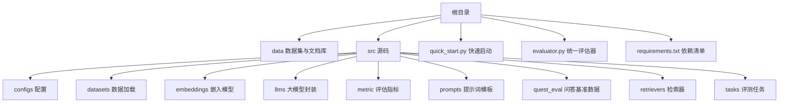
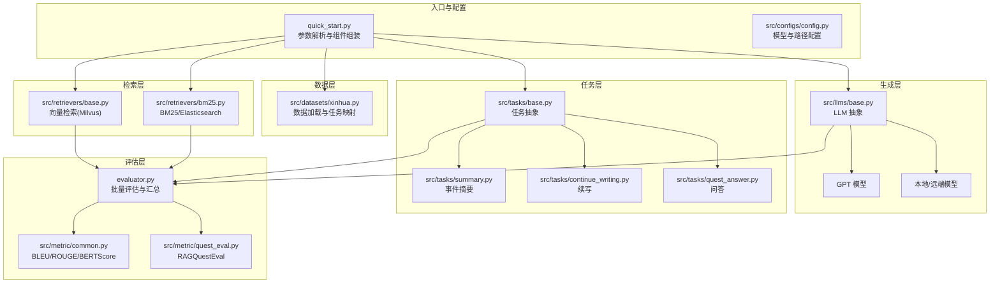
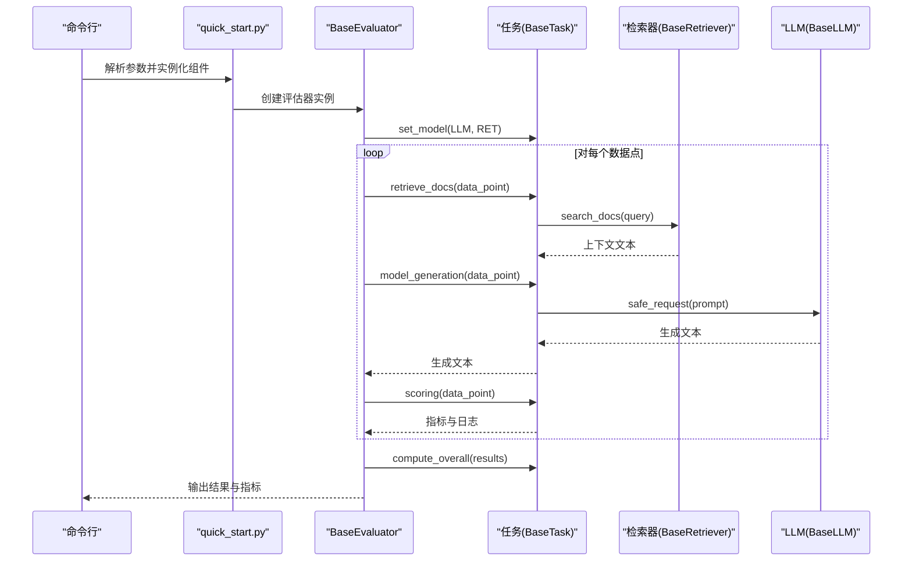
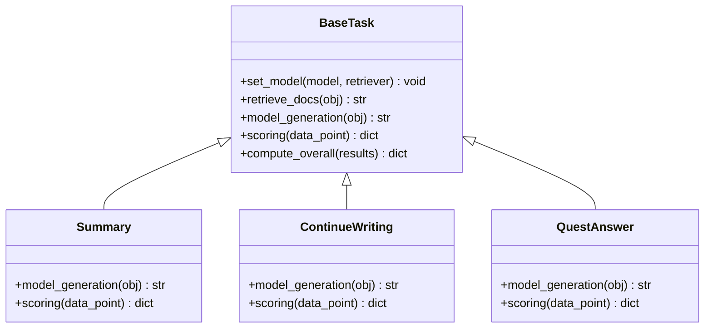
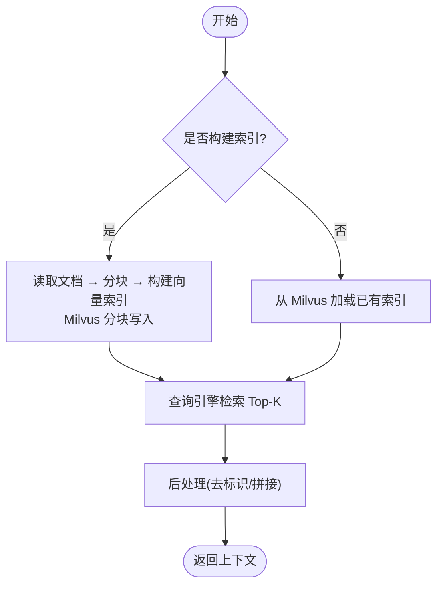
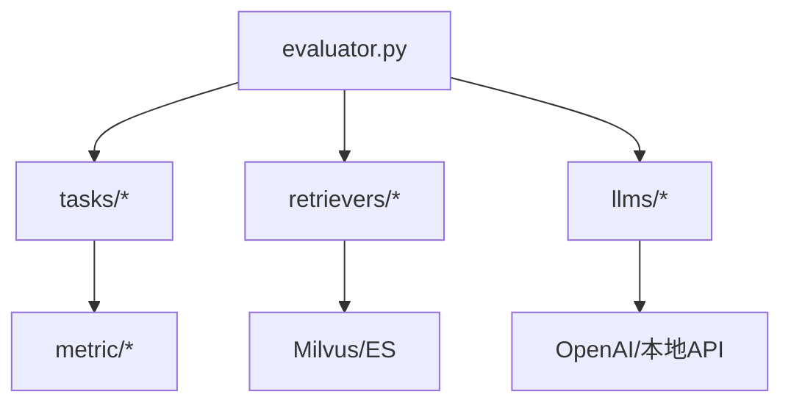

# 项目概述

<cite>
**本文引用的文件**
- [README.zh_CN.md](file://README.zh_CN.md)
- [README.md](file://README.md)
- [requirements.txt](file://requirements.txt)
- [quick_start.py](file://quick_start.py)
- [evaluator.py](file://evaluator.py)
- [src/configs/config.py](file://src/configs/config.py)
- [src/taks/base.py](file://src/tasks/base.py)
- [src/retrievers/base.py](file://src/retrievers/base.py)
- [src/llms/base.py](file://src/llms/base.py)
- [src/embeddings/base.py](file://src/embeddings/base.py)
- [src/tasks/summary.py](file://src/tasks/summary.py)
- [src/tasks/continue_writing.py](file://src/tasks/continue_writing.py)
- [src/tasks/quest_answer.py](file://src/tasks/quest_answer.py)
- [src/datasets/xinhua.py](file://src/datasets/xinhua.py)
- [src/retrievers/bm25.py](file://src/retrievers/bm25.py)
</cite>

## 目录
1. [简介](#简介)
2. [项目结构](#项目结构)
3. [核心组件](#核心组件)
4. [架构总览](#架构总览)
5. [详细组件分析](#详细组件分析)
6. [依赖分析](#依赖分析)
7. [性能考量](#性能考量)
8. [故障排查指南](#故障排查指南)
9. [结论](#结论)
10. [附录](#附录)

## 简介
CRUD-RAG 是一个面向中文检索增强生成（RAG）的综合性基准测试框架，旨在系统化地评估大语言模型在多种中文任务上的检索与生成能力。项目围绕“数据-检索-生成-评估”的完整流水线进行设计，提供统一的接口与可扩展的模块化架构，支持多类检索器、多模态嵌入模型、多类型评估指标，并覆盖事件摘要、续写、问答与消融等典型任务。

- 设计理念与价值定位
  - 中文优先：内置中文语料与中文嵌入模型，适配中文检索与生成场景。
  - 基准统一：提供标准化数据集、任务定义与评估指标，便于横向对比。
  - 可扩展性：抽象出 LLM、检索器、嵌入模型、任务与评估器等核心组件，便于替换与扩展。
  - 工业可用：提供快速启动流程与向量化索引构建工具，降低上手门槛。

- 学术与工业意义
  - 学术研究：提供可控、可复现的中文 RAG 评测平台，支撑检索质量、生成稳定性与鲁棒性研究。
  - 工业应用：通过可插拔的检索与生成模块，适配不同规模与成本约束的生产环境。

- 应用场景示例
  - 新闻/政务摘要：基于事件描述生成摘要，结合检索增强提升事实准确性。
  - 续写与扩写：以检索到的上下文为依据，延续或扩展文本内容。
  - 问答系统：针对问题检索相关文档，生成简洁准确的答案。
  - 消融研究：通过切换检索器、嵌入模型与提示模板，评估各模块对最终效果的影响。

**章节来源**
- [README.zh_CN.md:18-26](file://README.zh_CN.md#L18-L26)
- [README.md:17-25](file://README.md#L17-L25)

## 项目结构
项目采用按职责分层的组织方式，核心目录与职责如下：
- data：包含中文数据集与大规模文档库，用于构建检索数据库与评测。
- src：核心源码，按功能划分为 configs、datasets、embeddings、llms、metric、prompts、quest_eval、retrievers、tasks 等子包。
- 顶层脚本：quick_start.py 提供一键启动流程；evaluator.py 提供统一评估器；requirements.txt 管理依赖。

**图示来源**
- [README.md:27-68](file://README.md#L27-L68)
- [README.zh_CN.md:28-72](file://README.zh_CN.md#L28-L72)

**章节来源**
- [README.md:27-68](file://README.md#L27-L68)
- [README.zh_CN.md:28-72](file://README.zh_CN.md#L28-L72)

## 核心组件
- 评估器（BaseEvaluator）
  - 负责批量执行任务、并发调度、结果聚合与持久化，支持断点续跑与进度可视化。
- 任务（BaseTask 及其实现）
  - 定义统一的任务接口：检索上下文、模型生成、评分与总体统计。
  - 具体任务包括事件摘要、续写、问答与消融任务。
- 检索器（BaseRetriever 及其实现）
  - 封装向量检索与 BM25/Elasticsearch 检索，支持 Milvus 向量库与分块索引。
- 嵌入模型（HuggingfaceEmbeddings）
  - 支持句子级编码与交叉编码器，适配中文语境。
- 大模型（BaseLLM 及具体实现）
  - 抽象请求接口，提供安全请求与参数更新能力，支持本地与远端模型。
- 数据集（Xinhua）
  - 提供统一的数据加载与任务映射，支持随机打乱与统计信息。

**章节来源**
- [evaluator.py:13-192](file://evaluator.py#L13-L192)
- [src/tasks/base.py:13-74](file://src/tasks/base.py#L13-L74)
- [src/retrievers/base.py:16-142](file://src/retrievers/base.py#L16-L142)
- [src/embeddings/base.py:14-88](file://src/embeddings/base.py#L14-L88)
- [src/llms/base.py:6-47](file://src/llms/base.py#L6-L47)
- [src/datasets/xinhua.py:8-54](file://src/datasets/xinhua.py#L8-L54)

## 架构总览
CRUD-RAG 的整体工作流由“数据加载 → 检索 → 生成 → 评分 → 汇总”构成。用户通过命令行参数指定模型、检索器、任务与指标，quick_start.py 组装各组件并交由 BaseEvaluator 执行。

**图示来源**
- [quick_start.py:14-110](file://quick_start.py#L14-L110)
- [evaluator.py:13-192](file://evaluator.py#L13-L192)
- [src/retrievers/base.py:16-142](file://src/retrievers/base.py#L16-L142)
- [src/retrievers/bm25.py:14-92](file://src/retrievers/bm25.py#L14-L92)
- [src/llms/base.py:6-47](file://src/llms/base.py#L6-L47)
- [src/tasks/base.py:13-74](file://src/tasks/base.py#L13-L74)
- [src/tasks/summary.py:12-121](file://src/tasks/summary.py#L12-L121)
- [src/tasks/continue_writing.py:13-119](file://src/tasks/continue_writing.py#L13-L119)
- [src/tasks/quest_answer.py:14-134](file://src/tasks/quest_answer.py#L14-L134)

## 详细组件分析

### 评估器（BaseEvaluator）
- 职责
  - 接收任务、模型与检索器，对数据集进行批处理评估。
  - 支持多线程并发、断点续跑、结果持久化与总体统计。
- 关键流程
  - 初始化输出目录与任务绑定模型与检索器。
  - 逐样本执行“检索上下文 → 模型生成 → 评分”，过滤无效结果。
  - 聚合指标并保存结果。

**图示来源**
- [quick_start.py:54-108](file://quick_start.py#L54-L108)
- [evaluator.py:13-192](file://evaluator.py#L13-L192)
- [src/tasks/base.py:34-74](file://src/tasks/base.py#L34-L74)
- [src/retrievers/base.py:133-142](file://src/retrievers/base.py#L133-L142)
- [src/llms/base.py:38-47](file://src/llms/base.py#L38-L47)

**章节来源**
- [evaluator.py:13-192](file://evaluator.py#L13-L192)

### 任务（BaseTask 与具体实现）
- BaseTask
  - 定义统一接口：set_model、retrieve_docs、model_generation、scoring、compute_overall。
  - 支持可选的 RAGQuestEval 与 BERTScore 评估。
- 典型任务
  - 事件摘要：根据事件描述生成摘要，结合检索增强。
  - 续写：基于开头文本续写后续内容。
  - 问答：针对问题检索文档并生成答案。
  - 消融任务：控制检索上下文数量（如 1/2/3 文档）以评估检索影响。

**图示来源**
- [src/tasks/base.py:13-74](file://src/tasks/base.py#L13-L74)
- [src/tasks/summary.py:12-121](file://src/tasks/summary.py#L12-L121)
- [src/tasks/continue_writing.py:13-119](file://src/tasks/continue_writing.py#L13-L119)
- [src/tasks/quest_answer.py:14-134](file://src/tasks/quest_answer.py#L14-L134)

**章节来源**
- [src/tasks/base.py:13-74](file://src/tasks/base.py#L13-L74)
- [src/tasks/summary.py:12-121](file://src/tasks/summary.py#L12-L121)
- [src/tasks/continue_writing.py:13-119](file://src/tasks/continue_writing.py#L13-L119)
- [src/tasks/quest_answer.py:14-134](file://src/tasks/quest_answer.py#L14-L134)

### 检索器（BaseRetriever 与 BM25）
- BaseRetriever
  - 使用 LlamaIndex + Milvus 构建/加载向量索引，支持分块索引以规避单次插入限制。
  - 提供查询引擎与 Top-K 检索。
- BM25Retriever
  - 使用 Elasticsearch 进行 BM25 检索，适合快速原型与轻量部署。

**图示来源**
- [src/retrievers/base.py:56-88](file://src/retrievers/base.py#L56-L88)
- [src/retrievers/base.py:121-142](file://src/retrievers/base.py#L121-L142)
- [src/retrievers/bm25.py:44-69](file://src/retrievers/bm25.py#L44-L69)
- [src/retrievers/bm25.py:70-92](file://src/retrievers/bm25.py#L70-L92)

**章节来源**
- [src/retrievers/base.py:16-142](file://src/retrievers/base.py#L16-L142)
- [src/retrievers/bm25.py:14-92](file://src/retrievers/bm25.py#L14-L92)

### 嵌入模型（HuggingfaceEmbeddings）
- 支持两类模型：双编码器（SentenceTransformer）与交叉编码器（CrossEncoder）。
- 自动判断模型类型并进行编码，支持张量输出与归一化。

**章节来源**
- [src/embeddings/base.py:14-88](file://src/embeddings/base.py#L14-L88)

### 大模型（BaseLLM）
- 统一参数管理与安全请求接口，支持温度、最大生成长度等通用参数。
- 提供参数更新能力，便于在评估过程中动态调整。

**章节来源**
- [src/llms/base.py:6-47](file://src/llms/base.py#L6-L47)

### 数据集（Xinhua）
- 从 JSON 文件加载数据，支持按任务切分与随机打乱。
- 提供统计信息与切片访问接口。

**章节来源**
- [src/datasets/xinhua.py:8-54](file://src/datasets/xinhua.py#L8-L54)

## 依赖分析
- 外部库与版本要点
  - LlamaIndex、LangChain：构建索引与检索引擎。
  - Milvus/Pymilvus：向量数据库。
  - sentence-transformers：中文嵌入模型。
  - evaluate、rouge_score：指标计算。
  - elasticsearch：BM25 检索。
- 组件耦合
  - 评估器与任务强耦合（通过 set_model 注入模型与检索器）。
  - 任务与检索器弱耦合（仅依赖检索接口）。
  - 检索器与向量库/ES 强耦合（实现细节依赖）。

**图示来源**
- [requirements.txt:1-13](file://requirements.txt#L1-L13)
- [evaluator.py:13-192](file://evaluator.py#L13-L192)
- [src/retrievers/base.py:16-142](file://src/retrievers/base.py#L16-L142)
- [src/llms/base.py:6-47](file://src/llms/base.py#L6-L47)

**章节来源**
- [requirements.txt:1-13](file://requirements.txt#L1-L13)

## 性能考量
- 索引构建
  - 向量索引分块写入（每批约 8000 节点），避免 Milvus 单次写入上限；首次构建耗时较长，建议一次性完成。
- 并发与吞吐
  - 评估器支持多线程并发执行，合理设置线程数以平衡 CPU 与 I/O。
- 检索效率
  - Top-K 与分块检索策略需权衡召回与速度；BM25 适合快速原型，Milvus 更适合大规模向量检索。
- 生成稳定性
  - 不同模型对提示词敏感度差异较大，建议针对小模型简化提示词并控制输出风格。

**章节来源**
- [src/retrievers/base.py:74-87](file://src/retrievers/base.py#L74-L87)
- [README.zh_CN.md:22-26](file://README.zh_CN.md#L22-L26)
- [README.md:20-25](file://README.md#L20-L25)

## 故障排查指南
- 索引构建失败或超时
  - 检查文档路径与格式，确认分块大小与集合名正确；首次运行务必添加构建索引参数。
- Milvus/ES 连接异常
  - 确认服务已启动且网络可达；检查集合名与端口配置。
- 生成为空或报错
  - 使用安全请求包装，捕获异常并记录日志；检查提示词模板是否存在。
- 评估中断后重新运行
  - 评估器支持断点续跑，自动跳过已有效结果；确保输出目录权限正常。

**章节来源**
- [evaluator.py:42-55](file://evaluator.py#L42-L55)
- [evaluator.py:170-191](file://evaluator.py#L170-L191)
- [README.md:76-83](file://README.md#L76-L83)

## 结论
CRUD-RAG 通过模块化设计与中文场景优化，提供了从数据、检索、生成到评估的一体化评测框架。其统一的接口与可扩展的组件体系，既满足学术研究的严谨性，也兼顾工业落地的灵活性。建议在实际使用中结合任务特性选择合适的检索器与评估指标，并根据资源情况调整并发与索引策略。

## 附录
- 快速开始
  - 安装依赖、启动 Milvus、下载中文嵌入模型、修改配置、运行 quick_start.py。
- 常用参数说明
  - 模型名称、温度、最大生成长度、数据路径、文档路径与类型、分块大小与重叠、是否构建索引、检索 Top-K、任务类型、线程数与进度条显示等。

**章节来源**
- [README.md:70-109](file://README.md#L70-L109)
- [README.zh_CN.md:74-109](file://README.zh_CN.md#L74-L109)
- [quick_start.py:14-51](file://quick_start.py#L14-L51)