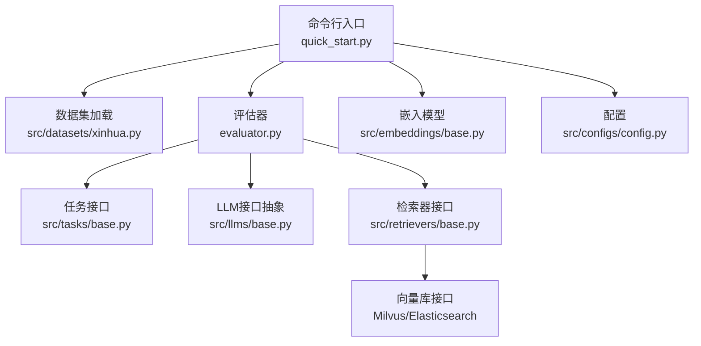
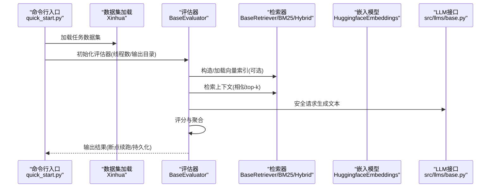
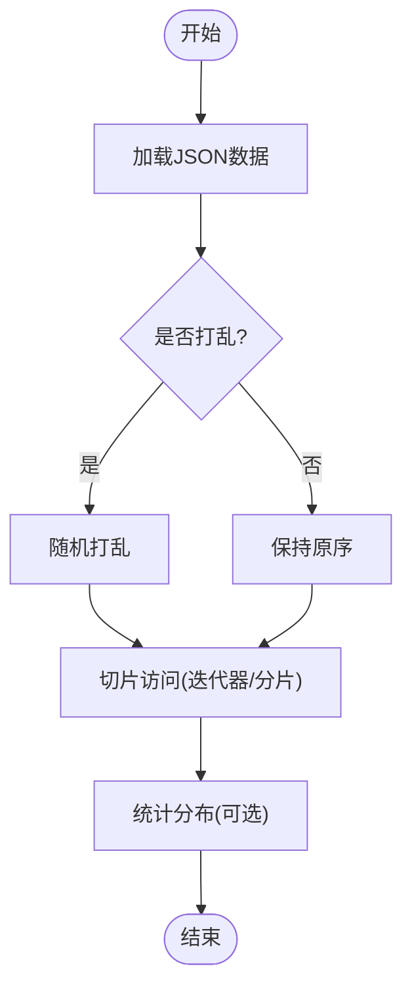
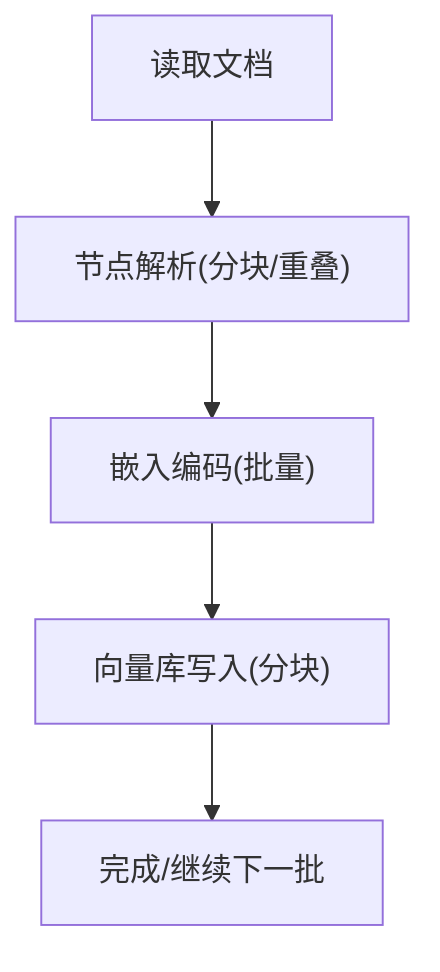
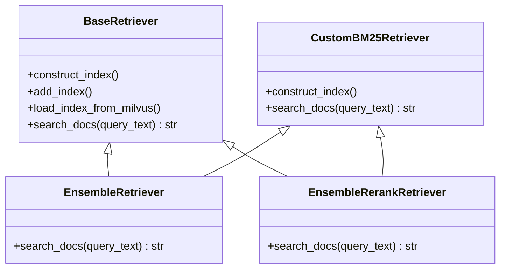
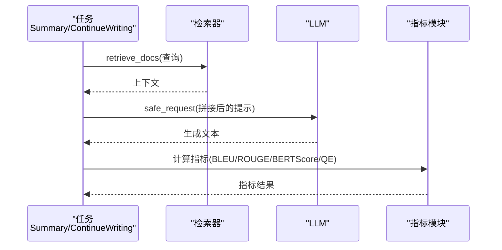
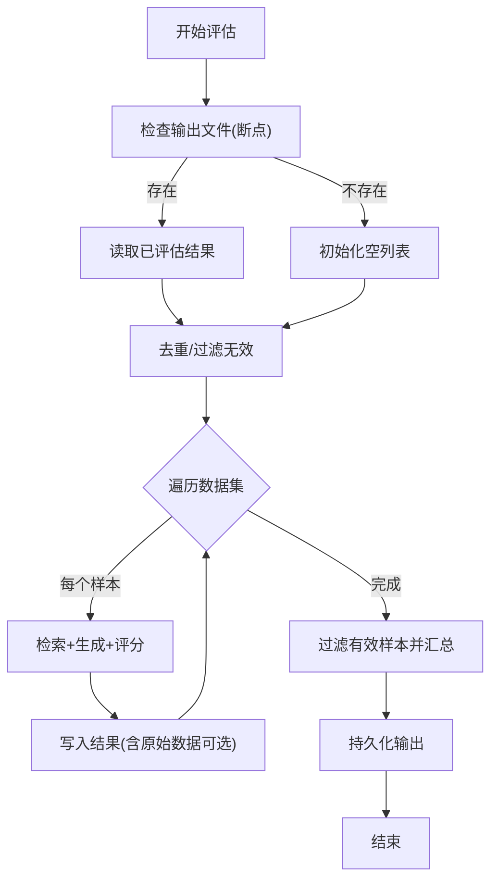
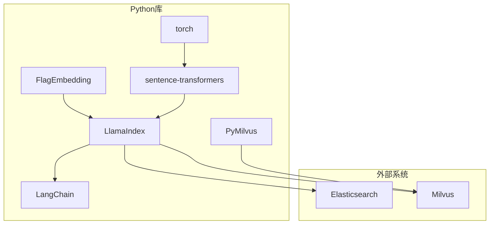

# 大规模数据处理

<cite>
**本文引用的文件**
- [README.md](file://README.md)
- [quick_start.py](file://quick_start.py)
- [evaluator.py](file://evaluator.py)
- [src/configs/config.py](file://src/configs/config.py)
- [src/datasets/base.py](file://src/datasets/base.py)
- [src/datasets/xinhua.py](file://src/datasets/xinhua.py)
- [src/tasks/base.py](file://src/tasks/base.py)
- [src/tasks/summary.py](file://src/tasks/summary.py)
- [src/tasks/continue_writing.py](file://src/tasks/continue_writing.py)
- [src/embeddings/base.py](file://src/embeddings/base.py)
- [src/retrievers/base.py](file://src/retrievers/base.py)
- [src/retrievers/bm25.py](file://src/retrievers/bm25.py)
- [src/retrievers/hybrid.py](file://src/retrievers/hybrid.py)
- [src/retrievers/hybrid_rerank.py](file://src/retrievers/hybrid_rerank.py)
- [requirements.txt](file://requirements.txt)
</cite>

## 目录
1. [简介](#简介)
2. [项目结构](#项目结构)
3. [核心组件](#核心组件)
4. [架构总览](#架构总览)
5. [详细组件分析](#详细组件分析)
6. [依赖分析](#依赖分析)
7. [性能考虑](#性能考虑)
8. [故障排查指南](#故障排查指南)
9. [结论](#结论)
10. [附录](#附录)

## 简介
本指南面向在CRUD-RAG中进行大规模数据处理与评估的工程实践，聚焦以下目标：
- 高效处理大型数据集：数据分片、增量处理、内存管理策略
- 优化数据加载与预处理流程：向量化索引构建、分块与重叠参数调优
- 分布式处理与集群部署建议：多线程并发、外部向量库（Milvus/Elasticsearch）配合
- 缓存与持久化最佳实践：模型缓存目录、输出结果落盘、断点续跑
- 性能优化与资源利用率：线程池大小、批处理分片、I/O与计算分离
- 数据一致性与异常处理：锁保护、异常捕获、无效结果剔除
- 容错与恢复：断点续跑、错误日志记录、重试与降级

## 项目结构
项目采用按功能域分层组织：数据集加载、嵌入模型、检索器、任务与指标、评估器、配置与启动脚本。

图示来源
- [quick_start.py:1-110](file://quick_start.py#L1-L110)
- [evaluator.py:1-192](file://evaluator.py#L1-L192)
- [src/datasets/xinhua.py:1-54](file://src/datasets/xinhua.py#L1-L54)
- [src/tasks/base.py:1-74](file://src/tasks/base.py#L1-L74)
- [src/retrievers/base.py:1-142](file://src/retrievers/base.py#L1-L142)
- [src/embeddings/base.py:1-88](file://src/embeddings/base.py#L1-L88)
- [src/configs/config.py:1-14](file://src/configs/config.py#L1-L14)

章节来源
- [README.md:27-68](file://README.md#L27-L68)
- [quick_start.py:1-110](file://quick_start.py#L1-L110)

## 核心组件
- 数据集加载与分发
  - 抽象基类定义统一接口，具体实现负责加载与切片访问。
  - 示例：Xinhua数据集支持随机打乱、切片读取与统计。
- 嵌入模型
  - 封装SentenceTransformer/CrossEncoder，支持批量编码与预测。
- 检索器
  - 向量检索（Milvus）、BM25（Elasticsearch）、混合检索（RRF）、重排（BGE-Rerank）。
- 任务与指标
  - 任务基类定义生成、评分、汇总流程；支持BLEU、ROUGE、BERTScore、RAGQuestEval。
- 评估器
  - 多线程批处理、断点续跑、结果聚合与持久化。

章节来源
- [src/datasets/base.py:1-20](file://src/datasets/base.py#L1-L20)
- [src/datasets/xinhua.py:1-54](file://src/datasets/xinhua.py#L1-L54)
- [src/embeddings/base.py:1-88](file://src/embeddings/base.py#L1-L88)
- [src/retrievers/base.py:1-142](file://src/retrievers/base.py#L1-L142)
- [src/retrievers/bm25.py:1-92](file://src/retrievers/bm25.py#L1-L92)
- [src/retrievers/hybrid.py:1-81](file://src/retrievers/hybrid.py#L1-L81)
- [src/retrievers/hybrid_rerank.py:1-81](file://src/retrievers/hybrid_rerank.py#L1-L81)
- [src/tasks/base.py:1-74](file://src/tasks/base.py#L1-L74)
- [src/tasks/summary.py:1-121](file://src/tasks/summary.py#L1-L121)
- [src/tasks/continue_writing.py:1-119](file://src/tasks/continue_writing.py#L1-L119)
- [evaluator.py:1-192](file://evaluator.py#L1-L192)

## 架构总览
下图展示从命令行到数据加载、检索、生成与评分的整体流程。

图示来源
- [quick_start.py:54-108](file://quick_start.py#L54-L108)
- [evaluator.py:13-151](file://evaluator.py#L13-L151)
- [src/retrievers/base.py:37-87](file://src/retrievers/base.py#L37-L87)
- [src/embeddings/base.py:14-88](file://src/embeddings/base.py#L14-L88)

## 详细组件分析

### 数据集加载与分片
- 设计要点
  - 抽象基类约束长度、索引与加载接口，确保不同数据源的一致性。
  - 具体实现支持随机打乱、切片访问与统计。
- 大数据策略
  - 使用切片访问避免一次性加载全部样本。
  - 通过参数控制是否打乱，便于训练/评估的随机性与可复现性。
- 断点续跑
  - 评估器在输出目录按任务与模型名生成唯一路径，避免重复计算。

图示来源
- [src/datasets/xinhua.py:32-54](file://src/datasets/xinhua.py#L32-L54)
- [src/datasets/base.py:4-20](file://src/datasets/base.py#L4-L20)

章节来源
- [src/datasets/base.py:1-20](file://src/datasets/base.py#L1-L20)
- [src/datasets/xinhua.py:1-54](file://src/datasets/xinhua.py#L1-L54)
- [evaluator.py:109-116](file://evaluator.py#L109-L116)

### 嵌入模型与向量化索引
- 设计要点
  - 支持Bi-encoder（SentenceTransformer）与Cross-encoder（CrossEncoder），自动识别模型类型。
  - 批量编码，支持归一化与张量输出。
- 大数据策略
  - 分块索引：将节点按固定步长切分为批次写入向量库，缓解单次写入压力。
  - 维度与集合名可配置，便于多版本/多主题索引隔离。
- 内存管理
  - 批次处理减少单次内存峰值；LangChain适配器封装降低显存占用。

图示来源
- [src/embeddings/base.py:58-86](file://src/embeddings/base.py#L58-L86)
- [src/retrievers/base.py:74-87](file://src/retrievers/base.py#L74-L87)

章节来源
- [src/embeddings/base.py:1-88](file://src/embeddings/base.py#L1-L88)
- [src/retrievers/base.py:1-142](file://src/retrievers/base.py#L1-L142)

### 检索器与查询引擎
- 组件族
  - 向量检索：基于Milvus的GPTVectorStoreIndex，支持构造/加载/增量添加。
  - BM25检索：基于Elasticsearch，支持DSL查询与结果拼接。
  - 混合检索：RRF融合BM25与向量检索结果。
  - 重排检索：使用BGE-Reranker对候选进行重排。
- 查询流程
  - 输入查询文本，返回合并后的上下文字符串，供LLM生成使用。

图示来源
- [src/retrievers/base.py:16-142](file://src/retrievers/base.py#L16-L142)
- [src/retrievers/bm25.py:14-92](file://src/retrievers/bm25.py#L14-L92)
- [src/retrievers/hybrid.py:13-81](file://src/retrievers/hybrid.py#L13-L81)
- [src/retrievers/hybrid_rerank.py:26-81](file://src/retrievers/hybrid_rerank.py#L26-L81)

章节来源
- [src/retrievers/base.py:1-142](file://src/retrievers/base.py#L1-L142)
- [src/retrievers/bm25.py:1-92](file://src/retrievers/bm25.py#L1-L92)
- [src/retrievers/hybrid.py:1-81](file://src/retrievers/hybrid.py#L1-L81)
- [src/retrievers/hybrid_rerank.py:1-81](file://src/retrievers/hybrid_rerank.py#L1-L81)

### 任务与评分
- 设计要点
  - 任务基类定义生成、检索、评分与汇总模板方法。
  - 支持多种指标：BLEU、ROUGE-L、BERTScore、RAGQuestEval。
- 生成与检索
  - 检索阶段先获取上下文，再拼接到提示词中，最后调用LLM安全请求接口。
- 聚合与断点
  - 评估器统一收集结果，支持断点续跑与无效结果剔除。

图示来源
- [src/tasks/summary.py:36-98](file://src/tasks/summary.py#L36-L98)
- [src/tasks/continue_writing.py:37-99](file://src/tasks/continue_writing.py#L37-L99)
- [src/tasks/base.py:34-72](file://src/tasks/base.py#L34-L72)

章节来源
- [src/tasks/base.py:1-74](file://src/tasks/base.py#L1-L74)
- [src/tasks/summary.py:1-121](file://src/tasks/summary.py#L1-L121)
- [src/tasks/continue_writing.py:1-119](file://src/tasks/continue_writing.py#L1-L119)

### 评估器与多线程批处理
- 并发模型
  - 使用ThreadPoolExecutor执行批处理，进度条可视化。
  - 通过锁保护共享状态，避免竞态条件。
- 断点续跑
  - 若输出文件存在，则读取已评估结果，跳过已验证的有效样本。
- 结果聚合
  - 过滤无效样本后，调用任务compute_overall进行汇总。

图示来源
- [evaluator.py:56-107](file://evaluator.py#L56-L107)
- [evaluator.py:118-151](file://evaluator.py#L118-L151)

章节来源
- [evaluator.py:1-192](file://evaluator.py#L1-L192)

## 依赖分析
- 外部系统
  - 向量数据库：Milvus（本地服务）
  - 搜索引擎：Elasticsearch（BM25）
  - LLM：OpenAI API或本地模型（通过LLM接口抽象）
- Python依赖
  - LlamaIndex、LangChain、PyMilvus、Elasticsearch、FlagEmbedding、sentence-transformers、torch等

图示来源
- [requirements.txt:1-13](file://requirements.txt#L1-L13)
- [src/retrievers/base.py:13-131](file://src/retrievers/base.py#L13-L131)
- [src/retrievers/bm25.py:55-82](file://src/retrievers/bm25.py#L55-L82)

章节来源
- [requirements.txt:1-13](file://requirements.txt#L1-L13)
- [README.md:76-86](file://README.md#L76-L86)

## 性能考虑
- 数据分片与批处理
  - 向量索引构建按固定步长分片写入，降低单次内存与网络压力。
  - 评估器使用线程池并发处理样本，线程数应结合CPU核数与I/O瓶颈调优。
- 内存管理
  - 嵌入模型批量编码，避免逐条调用；注意批次大小与设备显存。
  - 检索器返回上下文字符串，避免在内存中保留大量中间节点。
- I/O与计算分离
  - 索引构建与查询分离，查询阶段尽量只做检索与拼接。
  - 输出结果落盘，避免内存累积。
- 参数调优
  - 分块大小与重叠：平衡召回与冗余；较大重叠提升召回但增加索引体积。
  - Top-k：影响上下文长度与LLM输入成本。
  - 线程数：根据CPU与外部服务限流策略调整。

章节来源
- [src/retrievers/base.py:74-87](file://src/retrievers/base.py#L74-L87)
- [evaluator.py:102-107](file://evaluator.py#L102-L107)

## 故障排查指南
- 常见问题
  - 向量索引构建失败：检查Milvus服务状态与集合名/维度配置。
  - BM25检索无结果：确认Elasticsearch连接参数与索引存在。
  - LLM请求失败：检查API密钥/代理配置与网络连通性。
  - 评估中断：利用断点续跑功能自动跳过已完成样本。
- 错误处理
  - 评估器在检索与生成阶段捕获异常并记录警告，跳过当前样本继续。
  - 无效结果剔除：仅保留valid为True的结果参与汇总。
- 日志与输出
  - 使用loguru记录关键信息；输出目录按任务与模型名隔离，便于定位问题。

章节来源
- [evaluator.py:49-54](file://evaluator.py#L49-L54)
- [evaluator.py:98-100](file://evaluator.py#L98-L100)
- [evaluator.py:145-147](file://evaluator.py#L145-L147)
- [src/configs/config.py:1-14](file://src/configs/config.py#L1-L14)

## 结论
本指南围绕CRUD-RAG在大规模数据处理中的关键环节，给出了数据分片、增量处理、内存管理、并发与持久化的系统性建议，并结合现有组件的实现细节提供了可操作的优化路径。通过合理配置分块参数、线程池大小与外部向量库，可在保证质量的前提下显著提升吞吐与资源利用率。

## 附录
- 快速开始与参数参考
  - 参考命令行入口脚本中的参数说明，结合实际硬件与数据规模进行调参。
- 配置项清单
  - LLM相关：模型名称、温度、最大生成长度
  - 数据与索引：数据路径、分块大小、重叠、集合名、是否构建/追加索引
  - 检索：Top-k、检索器类型
  - 评估：任务类型、线程数、进度条显示、是否包含原始数据

章节来源
- [quick_start.py:14-51](file://quick_start.py#L14-L51)
- [quick_start.py:54-108](file://quick_start.py#L54-L108)
- [README.md:70-105](file://README.md#L70-L105)