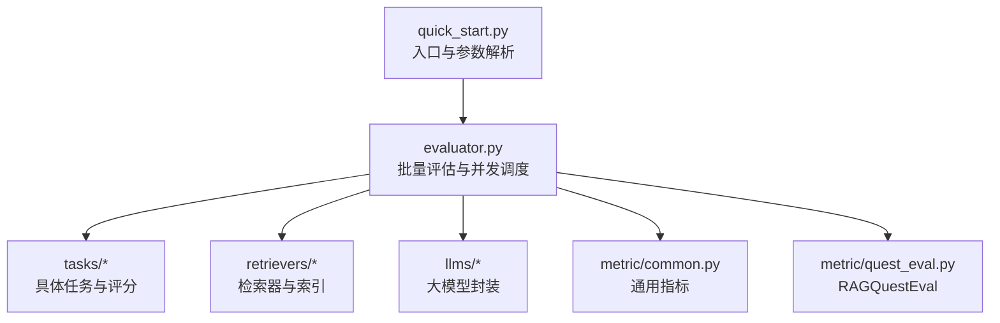
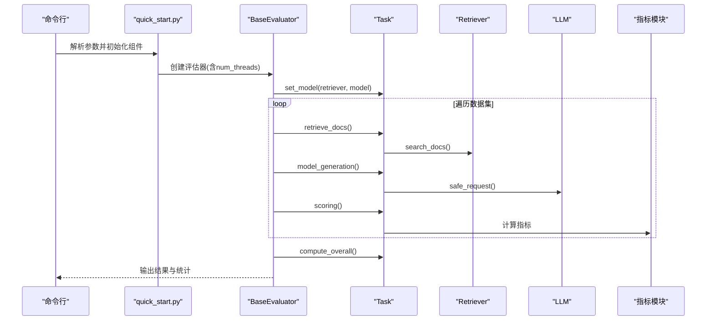
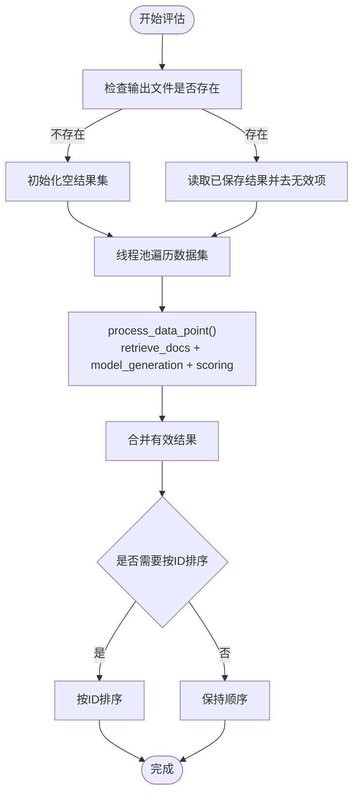
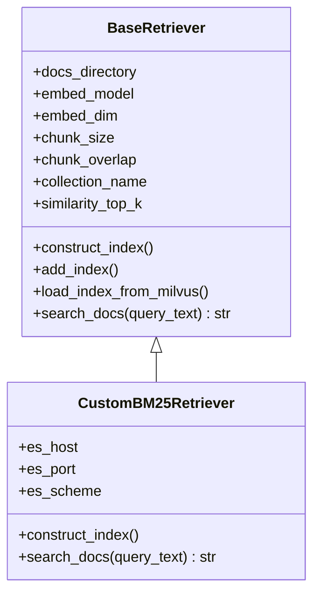
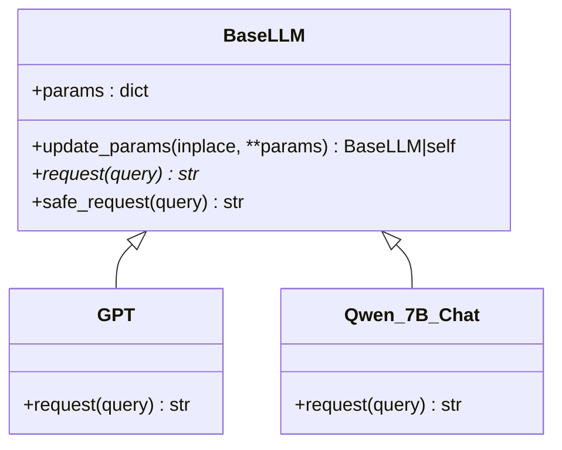
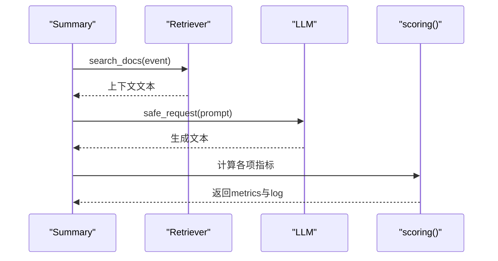
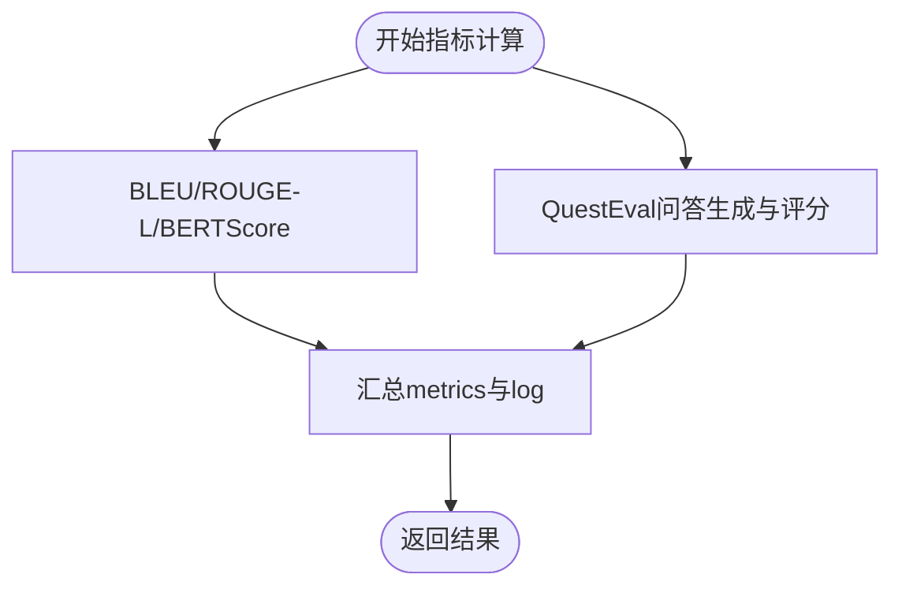
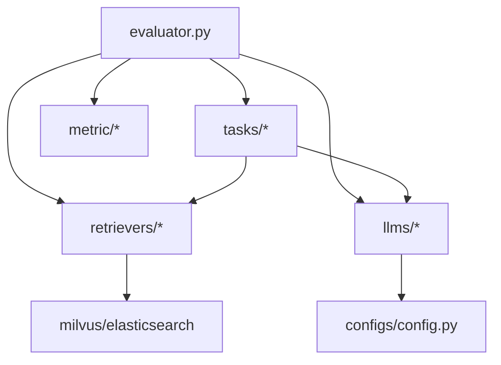

# 性能监控与调试

<cite>
**本文引用的文件**   
- [README.md](file://README.md)
- [quick_start.py](file://quick_start.py)
- [evaluator.py](file://evaluator.py)
- [src/configs/config.py](file://src/configs/config.py)
- [src/taks/base.py](file://src/tasks/base.py)
- [src/retrievers/base.py](file://src/retrievers/base.py)
- [src/llms/base.py](file://src/llms/base.py)
- [src/metric/common.py](file://src/metric/common.py)
- [src/llms/api_model.py](file://src/llms/api_model.py)
- [src/llms/local_model.py](file://src/llms/local_model.py)
- [src/retrievers/bm25.py](file://src/retrievers/bm25.py)
- [src/tasks/summary.py](file://src/tasks/summary.py)
- [src/metric/quest_eval.py](file://src/metric/quest_eval.py)
- [requirements.txt](file://requirements.txt)
</cite>

## 目录
1. [简介](#简介)
2. [项目结构](#项目结构)
3. [核心组件](#核心组件)
4. [架构总览](#架构总览)
5. [详细组件分析](#详细组件分析)
6. [依赖分析](#依赖分析)
7. [性能考量](#性能考量)
8. [故障排查指南](#故障排查指南)
9. [结论](#结论)
10. [附录](#附录)

## 简介
本指南面向CRUD-RAG评估系统的性能监控与调试，聚焦以下目标：
- 多线程并发配置与调试：解释如何通过线程池参数控制吞吐与稳定性，并给出调优建议。
- 评估过程性能指标监控：覆盖吞吐量、延迟、内存使用等关键指标的观测点与采集路径。
- 故障排查与常见问题：基于现有代码的异常处理与日志策略，提供系统化定位思路。
- 大规模数据集优化：结合索引构建、检索与LLM请求的瓶颈点，提出可操作的优化建议。
- 日志与错误处理最佳实践：统一日志记录规范与异常捕获策略。
- 监控体系建设：建议在现有流程中嵌入可观测性指标，形成闭环。

## 项目结构
项目采用模块化设计，围绕“数据加载—检索—任务执行—评分—输出”链路组织代码。关键目录与职责如下：
- data：包含基准数据与大规模文档集合，支撑向量索引构建与检索。
- src：核心实现，按功能域划分（configs、datasets、embeddings、llms、metric、prompts、quest_eval、retrievers、tasks）。
- 根级脚本：quick_start.py作为入口；evaluator.py负责批量评估与并发调度。

图表来源
- [quick_start.py:1-110](file://quick_start.py#L1-L110)
- [evaluator.py:1-192](file://evaluator.py#L1-L192)

章节来源
- [README.md:27-68](file://README.md#L27-L68)
- [quick_start.py:14-51](file://quick_start.py#L14-L51)

## 核心组件
- 评估器 BaseEvaluator：负责批量评分、结果缓存与恢复、并发执行与进度条展示、整体统计与输出保存。
- 任务 Task：定义检索、生成、评分与总体统计接口，不同任务实现各自指标与提示词模板。
- 检索器 Retriever：支持Milvus与Elasticsearch两种后端，具备索引构建、增量添加与查询引擎装配能力。
- LLM封装：统一抽象与安全请求接口，分别对接OpenAI API与本地模型（如Qwen系列）。
- 指标模块：提供BLEU、ROUGE-L、BERTScore等指标计算，以及QuestEval问答式评估。

章节来源
- [evaluator.py:13-41](file://evaluator.py#L13-L41)
- [src/tasks/base.py:13-74](file://src/tasks/base.py#L13-L74)
- [src/retrievers/base.py:16-54](file://src/retrievers/base.py#L16-L54)
- [src/llms/base.py:6-47](file://src/llms/base.py#L6-L47)
- [src/metric/common.py:13-117](file://src/metric/common.py#L13-L117)

## 架构总览
下图展示了从命令行到最终输出的完整流程，以及并发与异常处理的关键节点。

图表来源
- [quick_start.py:54-108](file://quick_start.py#L54-L108)
- [evaluator.py:118-151](file://evaluator.py#L118-L151)
- [src/tasks/base.py:34-45](file://src/tasks/base.py#L34-L45)
- [src/retrievers/base.py:133-140](file://src/retrievers/base.py#L133-L140)
- [src/llms/base.py:38-45](file://src/llms/base.py#L38-L45)
- [src/metric/common.py:23-86](file://src/metric/common.py#L23-L86)

## 详细组件分析

### 并发执行与线程池配置
- 入口参数：命令行提供num_threads，默认值为1；建议在资源充足时提升至20或更高以提高吞吐。
- 执行机制：BaseEvaluator使用ThreadPoolExecutor管理线程池，map遍历数据集，配合tqdm显示进度。
- 锁与并发安全：对共享资源（如QuestEval保存）使用Lock保护，避免竞态条件。
- 结果聚合：将future结果收集后去空值并按ID排序，保证输出一致性。

图表来源
- [evaluator.py:56-107](file://evaluator.py#L56-L107)
- [evaluator.py:158-191](file://evaluator.py#L158-L191)

章节来源
- [quick_start.py:47](file://quick_start.py#L47)
- [evaluator.py:102-107](file://evaluator.py#L102-L107)
- [evaluator.py:141-143](file://evaluator.py#L141-L143)

### 检索器与索引构建
- Milvus向量索引：支持从零构建与增量添加，分批处理节点以规避单次写入压力。
- Elasticsearch BM25：提供BM25检索实现，便于对比与混合方案。
- 查询引擎：组装RetrieverQueryEngine，统一search_docs接口返回拼接后的上下文文本。

图表来源
- [src/retrievers/base.py:16-54](file://src/retrievers/base.py#L16-L54)
- [src/retrievers/bm25.py:14-92](file://src/retrievers/bm25.py#L14-L92)

章节来源
- [src/retrievers/base.py:56-87](file://src/retrievers/base.py#L56-L87)
- [src/retrievers/base.py:89-119](file://src/retrievers/base.py#L89-L119)
- [src/retrievers/base.py:121-131](file://src/retrievers/base.py#L121-L131)
- [src/retrievers/base.py:133-140](file://src/retrievers/base.py#L133-L140)
- [src/retrievers/bm25.py:44-68](file://src/retrievers/bm25.py#L44-L68)
- [src/retrievers/bm25.py:70-90](file://src/retrievers/bm25.py#L70-L90)

### LLM封装与安全请求
- 统一抽象：BaseLLM定义参数字典与安全请求接口，确保异常被捕获并返回空字符串，避免中断评估。
- 远程模型：GPT类对接OpenAI API，支持自定义base_url与token，记录token消耗。
- 本地模型：Qwen系列等本地模型通过transformers加载，自动分配设备并生成响应。

图表来源
- [src/llms/base.py:6-47](file://src/llms/base.py#L6-L47)
- [src/llms/api_model.py:12-32](file://src/llms/api_model.py#L12-L32)
- [src/llms/local_model.py:11-114](file://src/llms/local_model.py#L11-L114)

章节来源
- [src/llms/base.py:25-45](file://src/llms/base.py#L25-L45)
- [src/llms/api_model.py:17-32](file://src/llms/api_model.py#L17-L32)
- [src/llms/local_model.py:27-33](file://src/llms/local_model.py#L27-L33)

### 任务与评分
- 任务基类：定义检索、生成、评分与总体统计接口；支持可选的QuestEval与BERTScore。
- 摘要任务示例：组合检索上下文与提示模板，调用LLM生成摘要，计算BLEU、ROUGE-L、BERTScore与QA指标。

图表来源
- [src/tasks/summary.py:36-50](file://src/tasks/summary.py#L36-L50)
- [src/tasks/summary.py:61-98](file://src/tasks/summary.py#L61-L98)
- [src/retrievers/base.py:133-140](file://src/retrievers/base.py#L133-L140)
- [src/llms/base.py:38-45](file://src/llms/base.py#L38-L45)

章节来源
- [src/tasks/base.py:34-72](file://src/tasks/base.py#L34-L72)
- [src/tasks/summary.py:12-31](file://src/tasks/summary.py#L12-L31)
- [src/tasks/summary.py:61-98](file://src/tasks/summary.py#L61-L98)

### 通用指标与QuestEval
- 通用指标：BLEU、ROUGE-L、BERTScore均通过装饰器捕获异常，保证评估不中断。
- QuestEval：基于GPT生成问题并回答，计算F1与召回，同时持久化问答对以复用。

图表来源
- [src/metric/common.py:23-86](file://src/metric/common.py#L23-L86)
- [src/metric/quest_eval.py:34-53](file://src/metric/quest_eval.py#L34-L53)
- [src/metric/quest_eval.py:92-129](file://src/metric/quest_eval.py#L92-L129)

章节来源
- [src/metric/common.py:13-21](file://src/metric/common.py#L13-L21)
- [src/metric/quest_eval.py:23-28](file://src/metric/quest_eval.py#L23-L28)
- [src/metric/quest_eval.py:30-33](file://src/metric/quest_eval.py#L30-L33)

## 依赖分析
- 第三方库：llama_index、langchain、milvus/pymilvus、elasticsearch、evaluate、text2vec、torch、jieba、loguru等。
- 关键耦合点：evaluator依赖task/retriever/llm/metric；task依赖retriever与llm；retriever依赖向量存储后端；llm依赖配置模块。

图表来源
- [evaluator.py:14-40](file://evaluator.py#L14-L40)
- [src/tasks/base.py:34-36](file://src/tasks/base.py#L34-L36)
- [src/retrievers/base.py:16-44](file://src/retrievers/base.py#L16-L44)
- [src/llms/api_model.py:7-10](file://src/llms/api_model.py#L7-L10)
- [src/llms/local_model.py:5-8](file://src/llms/local_model.py#L5-L8)
- [src/configs/config.py:1-14](file://src/configs/config.py#L1-L14)

章节来源
- [requirements.txt:1-13](file://requirements.txt#L1-L13)

## 性能考量
- 吞吐量与延迟
  - 线程数：num_threads越大，吞吐越高，但需考虑LLM与向量数据库的并发限制。建议先以20起步，逐步调优。
  - 进度条：show_progress_bar启用时会增加UI开销，建议在大批量评估时关闭以减少额外负载。
  - LLM请求：远程API存在速率限制与网络抖动，本地模型受GPU显存与生成长度影响。
- 内存使用
  - 索引构建：分批8000节点写入Milvus，避免单次内存峰值过高。
  - 本地模型：device_map自动分配，注意显存占用与batch大小。
- I/O与网络
  - 检索：Milvus/Elasticsearch的查询延迟取决于索引质量与硬件配置。
  - 指标：BERTScore与QuestEval依赖网络访问，建议离线缓存或限流。

章节来源
- [quick_start.py:47](file://quick_start.py#L47)
- [evaluator.py:102-107](file://evaluator.py#L102-L107)
- [src/retrievers/base.py:74-78](file://src/retrievers/base.py#L74-L78)
- [src/llms/local_model.py:17](file://src/llms/local_model.py#L17)

## 故障排查指南
- 并发与锁问题
  - 症状：部分任务输出缺失或重复。
  - 排查：确认Lock保护的临界区是否正确释放；检查process_data_point中异常分支是否释放锁。
- LLM请求失败
  - 症状：生成为空或报错。
  - 排查：查看safe_request异常捕获与日志；检查API密钥、base_url与网络连通性；确认token上限与温度参数设置。
- 检索失败
  - 症状：检索结果为空或异常。
  - 排查：确认Milvus服务状态、集合名与维度一致；验证索引是否成功构建；检查chunk_size与overlap设置。
- 指标计算异常
  - 症状：某些指标为0或报错。
  - 排查：通用指标装饰器会吞掉异常，建议开启更详细的日志级别；确认参考文本非空且格式正确。
- QuestEval不可用
  - 症状：问答对为空或F1为0。
  - 排查：确认Ground Truth问答对文件存在；检查GPT可用性与提示词模板路径。

章节来源
- [evaluator.py:43-54](file://evaluator.py#L43-L54)
- [evaluator.py:98-100](file://evaluator.py#L98-L100)
- [src/llms/base.py:38-45](file://src/llms/base.py#L38-L45)
- [src/metric/common.py:13-21](file://src/metric/common.py#L13-L21)
- [src/metric/quest_eval.py:92-129](file://src/metric/quest_eval.py#L92-L129)

## 结论
通过合理配置线程池、优化索引与检索、加强日志与异常处理，CRUD-RAG评估系统可在大规模数据集上稳定高效地运行。建议在生产环境中引入更细粒度的指标埋点与告警，持续监控吞吐、延迟与错误率，以实现闭环的性能治理。

## 附录
- 快速启动与参数说明
  - 模型与温度、最大新token数、任务类型、线程数、是否显示进度条、是否构建索引等均可通过命令行传入。
- 配置文件
  - 支持OpenAI API密钥与代理配置，以及本地模型路径配置。

章节来源
- [README.md:70-105](file://README.md#L70-L105)
- [quick_start.py:14-51](file://quick_start.py#L14-L51)
- [src/configs/config.py:1-14](file://src/configs/config.py#L1-L14)