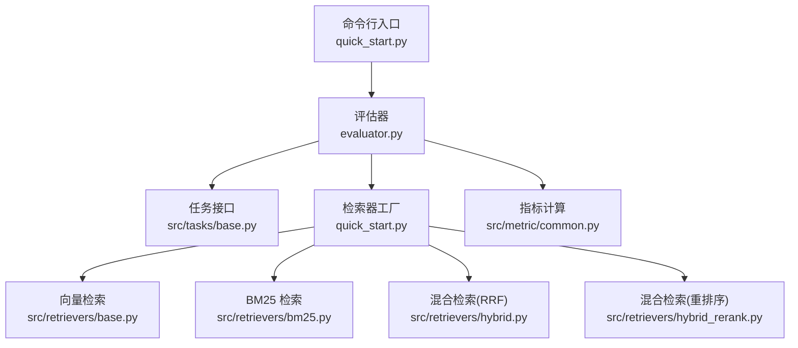
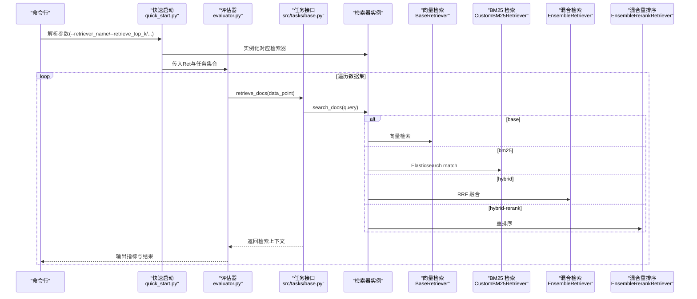
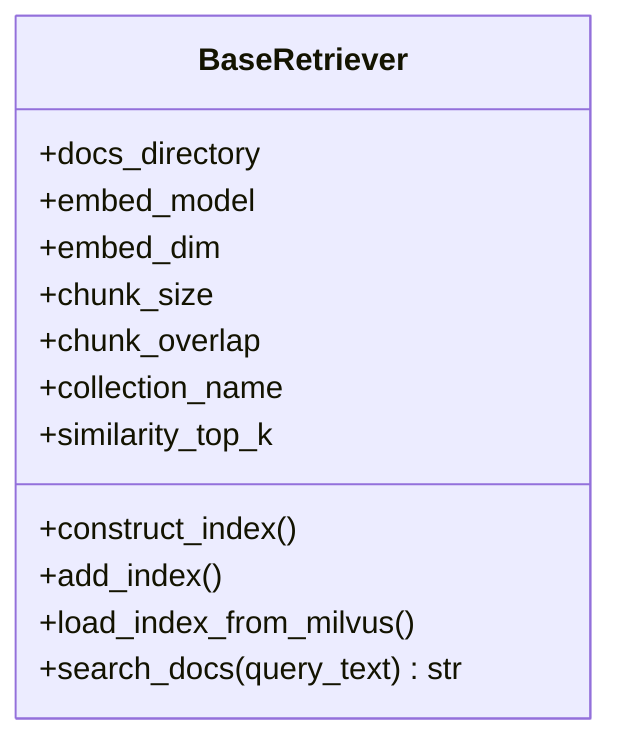
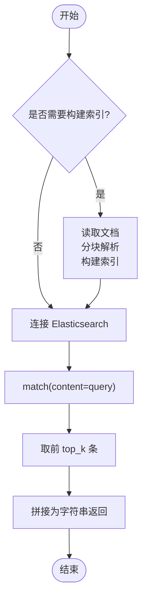
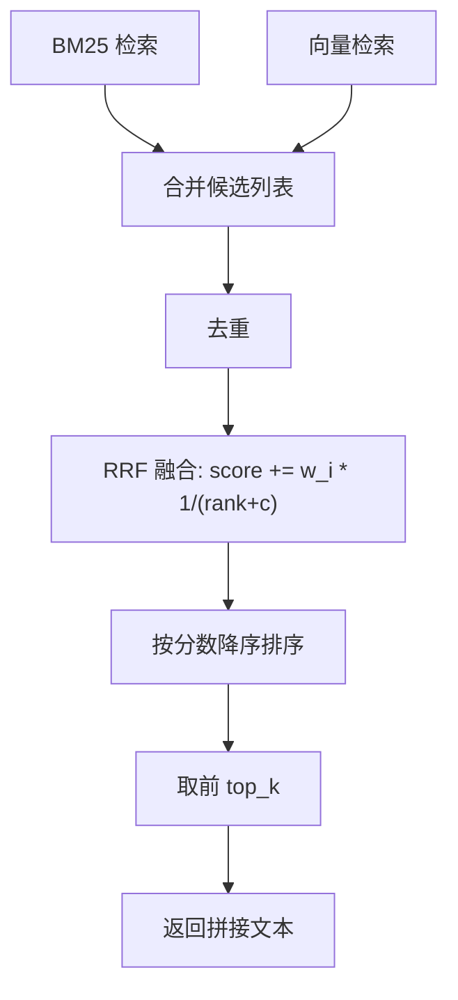
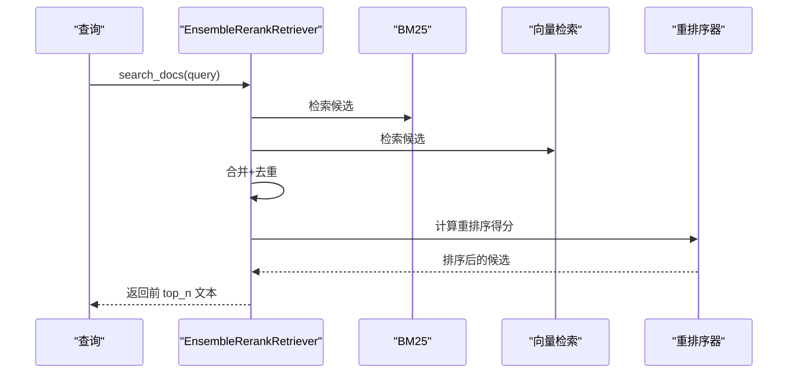
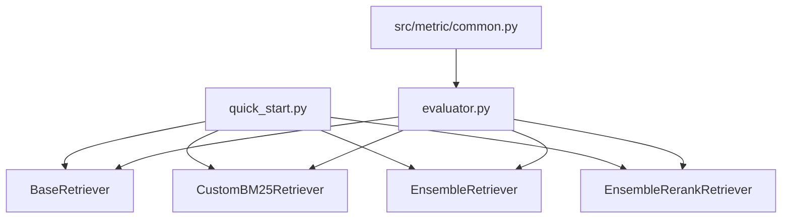

# 检索策略优化

<cite>
**本文引用的文件**
- [README.md](file://README.md)
- [quick_start.py](file://quick_start.py)
- [src/retrievers/base.py](file://src/retrievers/base.py)
- [src/retrievers/bm25.py](file://src/retrievers/bm25.py)
- [src/retrievers/hybrid.py](file://src/retrievers/hybrid.py)
- [src/retrievers/hybrid_rerank.py](file://src/retrievers/hybrid_rerank.py)
- [src/configs/config.py](file://src/configs/config.py)
- [evaluator.py](file://evaluator.py)
- [src/metric/common.py](file://src/metric/common.py)
- [src/tasks/base.py](file://src/tasks/base.py)
- [src/prompts/quest_answer.txt](file://src/prompts/quest_answer.txt)
- [requirements.txt](file://requirements.txt)
</cite>

## 目录
1. [引言](#引言)
2. [项目结构](#项目结构)
3. [核心组件](#核心组件)
4. [架构总览](#架构总览)
5. [详细组件分析](#详细组件分析)
6. [依赖分析](#依赖分析)
7. [性能考虑](#性能考虑)
8. [故障排查指南](#故障排查指南)
9. [结论](#结论)
10. [附录](#附录)

## 引言
本指南围绕 CRUD-RAG 的检索策略优化展开，系统阐述 BM25、向量检索与混合检索（含重排序）三类策略的实现原理、适用场景与参数调优方法。结合项目中的检索器实现与评估流程，给出相似度阈值、top-k、重排序策略等关键参数的优化建议，并提供基于数据特征与任务需求的策略组合选择思路、效果评估方法与性能监控技巧。

## 项目结构
CRUD-RAG 将检索器置于 src/retrievers 目录下，分别实现了基础向量检索、BM25 检索以及两种混合检索方案；通过 quick_start.py 提供命令行入口，支持在不同检索器之间切换；评估流程由 evaluator.py 统一调度，结合多种指标模块完成结果汇总与输出。

图表来源
- [quick_start.py:14-89](file://quick_start.py#L14-L89)
- [evaluator.py:13-41](file://evaluator.py#L13-L41)
- [src/retrievers/base.py:16-54](file://src/retrievers/base.py#L16-L54)
- [src/retrievers/bm25.py:14-42](file://src/retrievers/bm25.py#L14-L42)
- [src/retrievers/hybrid.py:13-48](file://src/retrievers/hybrid.py#L13-L48)
- [src/retrievers/hybrid_rerank.py:26-61](file://src/retrievers/hybrid_rerank.py#L26-L61)
- [src/metric/common.py:13-20](file://src/metric/common.py#L13-L20)

章节来源
- [README.md:27-68](file://README.md#L27-L68)
- [quick_start.py:14-89](file://quick_start.py#L14-L89)

## 核心组件
- 基础向量检索器（BaseRetriever）
  - 使用 Milvus 向量数据库构建/加载索引，基于向量相似度检索，支持分块索引与增量添加。
  - 关键参数：chunk_size、chunk_overlap、similarity_top_k、collection_name、embed_dim 等。
- BM25 检索器（CustomBM25Retriever）
  - 使用 Elasticsearch 构建倒排索引，执行 match 查询，返回 top_k 文档。
  - 关键参数：similarity_top_k、es_host/port/scheme、collection_name。
- 混合检索（EnsembleRetriever）
  - 融合 BM25 与向量检索结果，采用 Reciprocal Rank Fusion（RRF）融合打分，再取 top_k。
  - 关键参数：weights、c（常数）、top_k。
- 混合检索（EnsembleRerankRetriever）
  - 融合 BM25 与向量检索候选，使用 bge-rerank 进行重排序，再取 top_n。
  - 关键参数：rerank 模型、top_n。

章节来源
- [src/retrievers/base.py:16-142](file://src/retrievers/base.py#L16-L142)
- [src/retrievers/bm25.py:14-92](file://src/retrievers/bm25.py#L14-L92)
- [src/retrievers/hybrid.py:13-81](file://src/retrievers/hybrid.py#L13-L81)
- [src/retrievers/hybrid_rerank.py:15-81](file://src/retrievers/hybrid_rerank.py#L15-L81)

## 架构总览
检索器在运行时由 quick_start.py 根据命令行参数选择实例化，随后在评估流程中被统一调用。评估器负责并发执行任务、评分与结果持久化。

图表来源
- [quick_start.py:61-89](file://quick_start.py#L61-L89)
- [evaluator.py:42-54](file://evaluator.py#L42-L54)
- [src/retrievers/base.py:133-140](file://src/retrievers/base.py#L133-L140)
- [src/retrievers/bm25.py:70-90](file://src/retrievers/bm25.py#L70-L90)
- [src/retrievers/hybrid.py:50-80](file://src/retrievers/hybrid.py#L50-L80)
- [src/retrievers/hybrid_rerank.py:63-80](file://src/retrievers/hybrid_rerank.py#L63-L80)

## 详细组件分析

### 向量检索（BaseRetriever）
- 实现要点
  - 分块构建索引，避免单次节点过多导致内存或服务压力。
  - 支持从 Milvus 加载已有索引，或增量添加新文档。
  - 通过 VectorIndexRetriever 设置 similarity_top_k 控制召回数量。
- 参数与复杂度
  - 时间复杂度近似 O(n×d)（n 为候选节点数，d 为向量维度），受 similarity_top_k 影响较大。
  - 空间复杂度与索引规模、向量维度相关。
- 适用场景
  - 结构化文本、长文档切片、语义相近但关键词差异较大的查询。
- 优化建议
  - top-k：从 4~16 逐步试验，观察指标拐点；过小易漏召回，过大增加 LLM 负担。
  - 分块策略：chunk_size 与 chunk_overlap 需平衡语义完整性与召回粒度。
  - 增量索引：add_index 分批追加，避免一次性重建索引。

图表来源
- [src/retrievers/base.py:16-142](file://src/retrievers/base.py#L16-L142)

章节来源
- [src/retrievers/base.py:16-142](file://src/retrievers/base.py#L16-L142)

### BM25 检索（CustomBM25Retriever）
- 实现要点
  - 使用 Elasticsearch 的 match 查询，直接对 content 字段进行全文匹配。
  - 支持首次构建索引与连接现有索引。
- 参数与复杂度
  - 查询复杂度近似 O(m)（m 为倒排表大小），受索引构建质量影响。
- 适用场景
  - 关键词明确、短文本、事实性查询；对精确匹配敏感的任务。
- 优化建议
  - top-k：与向量检索互补，可适当提高以提升召回。
  - 索引构建：首次构建耗时较长，后续复用需确保字段映射一致。
  - DSL 扩展：可引入布尔查询、短语匹配等增强召回。

图表来源
- [src/retrievers/bm25.py:44-68](file://src/retrievers/bm25.py#L44-L68)
- [src/retrievers/bm25.py:70-90](file://src/retrievers/bm25.py#L70-L90)

章节来源
- [src/retrievers/bm25.py:14-92](file://src/retrievers/bm25.py#L14-L92)

### 混合检索（RRF，EnsembleRetriever）
- 实现要点
  - 并行调用 BM25 与向量检索，去重后以 RRF 融合打分，再取 top_k。
  - weights 控制各子检索器权重，c 为平滑常数，影响排名衰减速度。
- 适用场景
  - 需要兼顾关键词与语义的混合查询；对召回多样性要求较高。
- 优化建议
  - weights：初始可设为 0.5:0.5，依据任务指标微调。
  - c：较小值更偏向高排名，较大值更平滑；可尝试 30~100 区间。
  - top_k：建议略高于单一策略，再经 RRF 降噪。

图表来源
- [src/retrievers/hybrid.py:50-80](file://src/retrievers/hybrid.py#L50-L80)

章节来源
- [src/retrievers/hybrid.py:13-81](file://src/retrievers/hybrid.py#L13-L81)

### 混合检索（重排序，EnsembleRerankRetriever）
- 实现要点
  - 并行调用 BM25 与向量检索，去重后使用 bge-rerank 对候选进行重排序，再取 top_n。
  - 重排序显著提升相关性，适合对最终排序精度要求高的场景。
- 适用场景
  - 高质量问答、事实核查、摘要生成等对排序敏感的任务。
- 优化建议
  - top_n：通常小于等于 RRF 的 top_k，避免 LLM 输入冗余。
  - 模型选择：bge-rerank-base 已内置，如需更高精度可考虑更大模型（需权衡延迟）。
  - 去重：先去重再重排序，减少重复样本对排序的影响。

图表来源
- [src/retrievers/hybrid_rerank.py:63-80](file://src/retrievers/hybrid_rerank.py#L63-L80)
- [src/retrievers/hybrid_rerank.py:15-24](file://src/retrievers/hybrid_rerank.py#L15-L24)

章节来源
- [src/retrievers/hybrid_rerank.py:15-81](file://src/retrievers/hybrid_rerank.py#L15-L81)

## 依赖分析
- 外部依赖
  - 向量检索：llama_index、pymilvus、milvus。
  - BM25：elasticsearch。
  - 重排序：FlagEmbedding。
  - 评测指标：evaluate、text2vec、jieba 等。
- 内部耦合
  - quick_start.py 作为入口，集中管理检索器实例化与参数传递。
  - evaluator.py 统一调度任务与评分，检索器接口一致，便于替换。

图表来源
- [quick_start.py:61-89](file://quick_start.py#L61-L89)
- [evaluator.py:13-41](file://evaluator.py#L13-L41)
- [requirements.txt:1-13](file://requirements.txt#L1-13)

章节来源
- [requirements.txt:1-13](file://requirements.txt#L1-L13)
- [quick_start.py:61-89](file://quick_start.py#L61-L89)
- [evaluator.py:13-41](file://evaluator.py#L13-L41)

## 性能考虑
- 相似度阈值
  - 向量检索：可通过后处理过滤低分节点（例如使用 SimilarityPostprocessor），但当前实现未显式启用，建议在 BaseRetriever 中扩展该步骤以降低噪声。
  - BM25：match 查询无显式阈值，可通过调整查询策略（如布尔组合、短语匹配）间接控制召回质量。
- top-k 优化
  - 建议以 4、8、12、16 为候选，结合任务指标（BLEU、ROUGE、BERTScore 或 RAGQuestEval）观察拐点。
  - 混合策略中，BM25 与向量检索的 top_k 可分别试验，再通过 RRF 或重排序统一收敛。
- 重排序策略
  - RRF：适合快速融合，参数 c 控制排名衰减，weights 控制来源权重。
  - 重排序：bge-rerank 提升最终排序质量，但会增加推理时间，适合对排序敏感的任务。
- 数据与索引
  - 分块大小与重叠：chunk_size 与 chunk_overlap 需结合文档长度与任务类型权衡。
  - 索引构建：首次构建耗时较长，建议固定参数并缓存索引；后续增量构建使用 add_index。
- 并发与吞吐
  - 评估器支持多线程批量评分，合理设置 num_threads 以提升吞吐。
- 指标与监控
  - BLEU、ROUGE-L、BERTScore、RAGQuestEval 等指标可用于量化评估。
  - 输出目录按 collection_name 与 top_k 组织，便于横向对比。

章节来源
- [src/retrievers/base.py:46-54](file://src/retrievers/base.py#L46-L54)
- [evaluator.py:31-39](file://evaluator.py#L31-L39)
- [src/metric/common.py:23-85](file://src/metric/common.py#L23-L85)

## 故障排查指南
- 索引构建失败
  - 现象：构建过程中内存不足或超时。
  - 处理：减小分块大小（spilt_ids 步长）或降低 chunk_size；检查 Milvus/Elasticsearch 服务状态。
- 连接异常
  - 现象：无法连接 Milvus 或 Elasticsearch。
  - 处理：核对地址、端口与协议；确认服务已启动。
- 重排序报错
  - 现象：bge-rerank 初始化失败或计算异常。
  - 处理：检查 FlagEmbedding 安装与模型路径；确保 CUDA/驱动环境满足要求。
- 评估中断
  - 现象：部分样本无效或输出为空。
  - 处理：评估器会跳过无效样本并记录警告；检查 LLM 调用与网络状态。

章节来源
- [src/retrievers/base.py:74-87](file://src/retrievers/base.py#L74-L87)
- [src/retrievers/bm25.py:41-42](file://src/retrievers/bm25.py#L41-L42)
- [evaluator.py:76-100](file://evaluator.py#L76-L100)

## 结论
- 单一策略
  - 向量检索：适合语义相关、长文档场景；需谨慎设置 top-k 与分块参数。
  - BM25：适合关键词明确、事实性查询；可配合 DSL 优化召回。
- 混合策略
  - RRF：快速融合，适合召回多样性与排序稳定性的平衡。
  - 重排序：显著提升最终排序质量，适合对准确性要求高的任务。
- 评估与监控
  - 建立以 collection_name 与 top_k 为维度的结果组织方式，便于横向对比。
  - 结合 BLEU、ROUGE、BERTScore 与 RAGQuestEval 多维指标综合评估。

## 附录
- 快速开始与参数说明
  - 命令行参数示例与检索器选择逻辑见 quick_start.py。
  - 配置文件中可设置 LLM API 信息（如需）。
- 任务与提示
  - 任务接口定义与评分模板位于 tasks/base.py 与 prompts/quest_answer.txt。
- 依赖安装
  - 通过 requirements.txt 安装所需依赖。

章节来源
- [quick_start.py:14-51](file://quick_start.py#L14-L51)
- [src/configs/config.py:1-14](file://src/configs/config.py#L1-L14)
- [src/tasks/base.py:13-74](file://src/tasks/base.py#L13-L74)
- [src/prompts/quest_answer.txt:1-15](file://src/prompts/quest_answer.txt#L1-L15)
- [requirements.txt:1-13](file://requirements.txt#L1-L13)