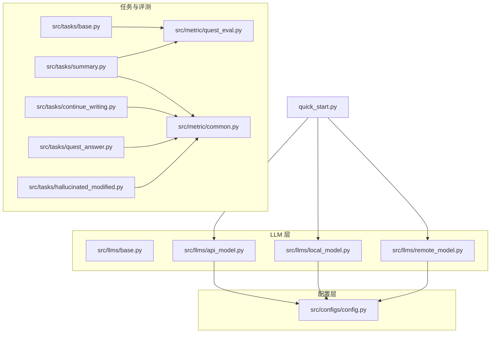
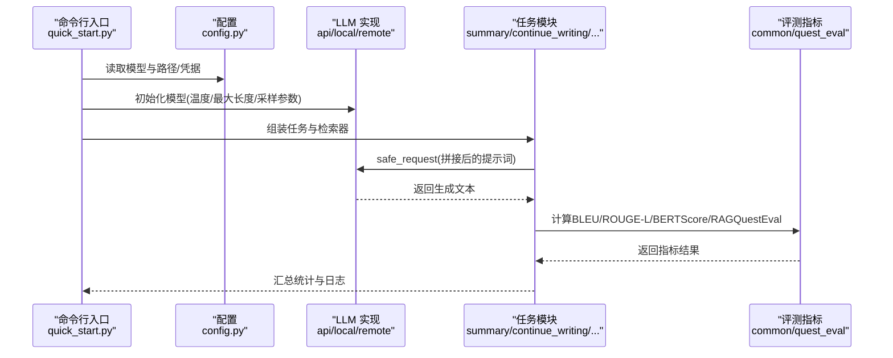
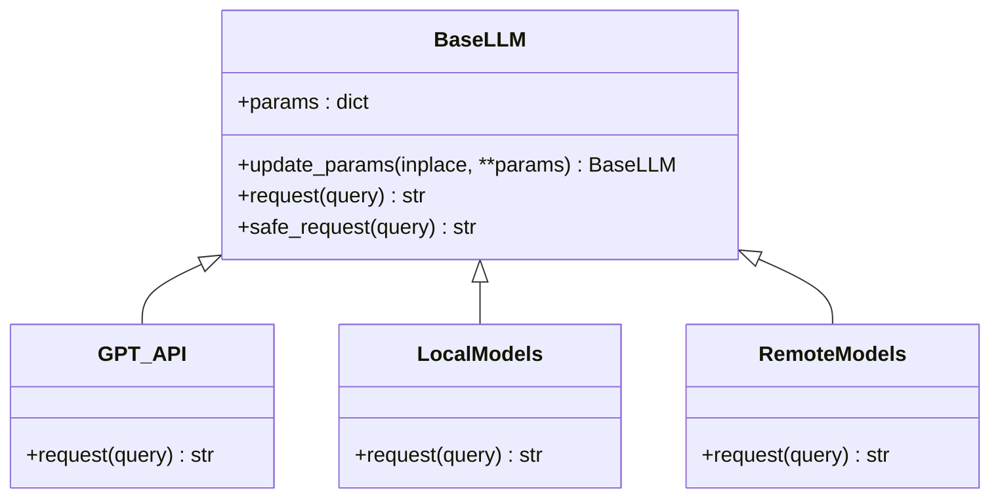
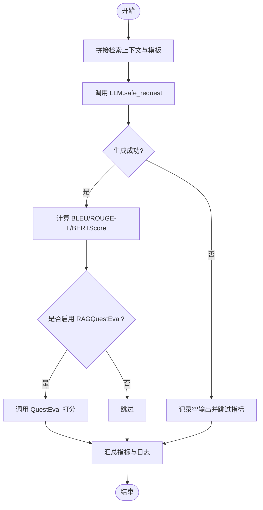
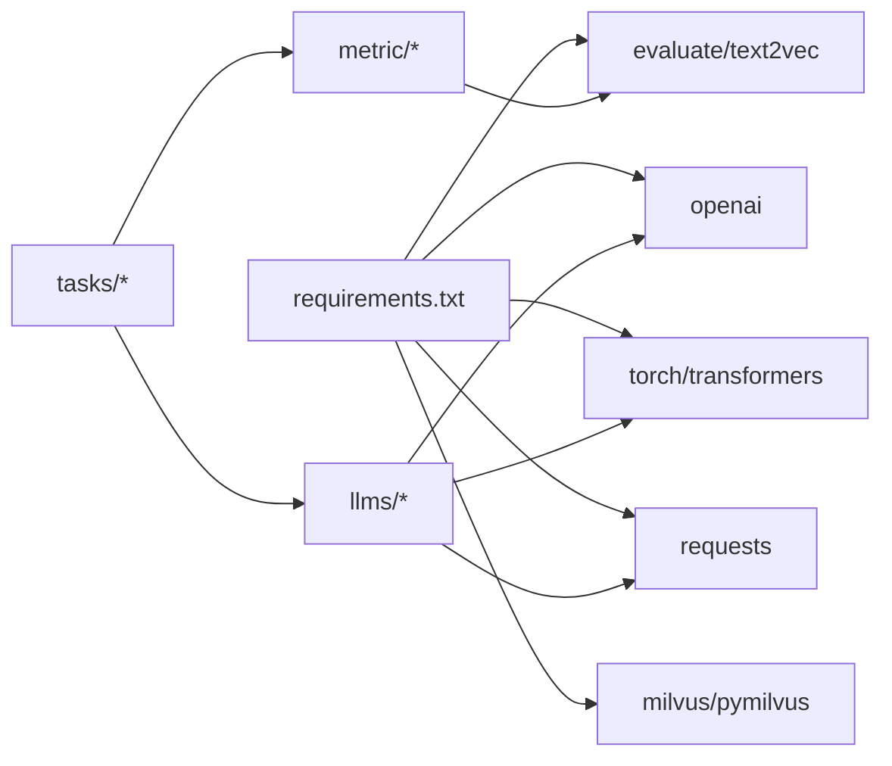

# 模型参数调优

<cite>
**本文引用的文件**
- [src/llms/base.py](file://src/llms/base.py)
- [src/llms/api_model.py](file://src/llms/api_model.py)
- [src/llms/local_model.py](file://src/llms/local_model.py)
- [src/llms/remote_model.py](file://src/llms/remote_model.py)
- [src/configs/config.py](file://src/configs/config.py)
- [quick_start.py](file://quick_start.py)
- [README.md](file://README.md)
- [src/tasks/base.py](file://src/tasks/base.py)
- [src/tasks/summary.py](file://src/tasks/summary.py)
- [src/tasks/continue_writing.py](file://src/tasks/continue_writing.py)
- [src/tasks/quest_answer.py](file://src/tasks/quest_answer.py)
- [src/tasks/hallucinated_modified.py](file://src/tasks/hallucinated_modified.py)
- [src/metric/common.py](file://src/metric/common.py)
- [src/metric/quest_eval.py](file://src/metric/quest_eval.py)
- [requirements.txt](file://requirements.txt)
</cite>

## 目录
1. [简介](#简介)
2. [项目结构](#项目结构)
3. [核心组件](#核心组件)
4. [架构总览](#架构总览)
5. [详细组件分析](#详细组件分析)
6. [依赖分析](#依赖分析)
7. [性能考虑](#性能考虑)
8. [故障排查指南](#故障排查指南)
9. [结论](#结论)
10. [附录](#附录)

## 简介
本指南围绕 CRUD-RAG 的 LLM 参数调优展开，系统说明温度（temperature）、最大生成长度（max_new_tokens）、top-p、top-k 等关键参数在不同模型类型（API 模型、本地模型、远程模型）中的配置与影响，并结合项目中已实现的任务与指标，给出面向不同 RAG 任务的参数配置建议、实验设计方法、效果评估指标、硬件与性能权衡以及自动化批量实验方案。

## 项目结构
CRUD-RAG 将 LLM 抽象为统一接口，通过不同实现适配 API、本地与远程部署；评测流程由任务模块驱动，使用多种指标（BLEU、ROUGE-L、BERT Score、RAGQuestEval）进行量化评估。

图表来源
- [quick_start.py:54-57](file://quick_start.py#L54-L57)
- [src/llms/api_model.py:12-32](file://src/llms/api_model.py#L12-L32)
- [src/llms/local_model.py:11-114](file://src/llms/local_model.py#L11-L114)
- [src/llms/remote_model.py:14-111](file://src/llms/remote_model.py#L14-L111)
- [src/tasks/summary.py:12-121](file://src/tasks/summary.py#L12-L121)
- [src/tasks/continue_writing.py:71-106](file://src/tasks/continue_writing.py#L71-L106)
- [src/tasks/quest_answer.py:72-107](file://src/tasks/quest_answer.py#L72-L107)
- [src/tasks/hallucinated_modified.py:71-123](file://src/tasks/hallucinated_modified.py#L71-L123)
- [src/metric/common.py:23-117](file://src/metric/common.py#L23-L117)
- [src/metric/quest_eval.py:23-152](file://src/metric/quest_eval.py#L23-L152)

章节来源
- [README.md:27-68](file://README.md#L27-L68)
- [quick_start.py:54-57](file://quick_start.py#L54-L57)

## 核心组件
- 统一抽象基类：定义通用参数字典与更新机制，提供安全请求封装，屏蔽具体实现差异。
- API 模型：封装 OpenAI Chat Completions 接口，支持自定义 base_url 与 token 记录。
- 本地模型：基于 Transformers 的本地推理，统一采样策略与生成参数映射。
- 远程模型：封装远程服务的 JSON API 调用，参数透传至远端推理服务。
- 配置管理：集中存放各模型的本地路径或远程访问凭据。
- 任务与评测：按任务组织 Prompt、检索上下文、模型生成与评分，集成 BLEU、ROUGE-L、BERT Score、RAGQuestEval。

章节来源
- [src/llms/base.py:6-47](file://src/llms/base.py#L6-L47)
- [src/llms/api_model.py:12-32](file://src/llms/api_model.py#L12-L32)
- [src/llms/local_model.py:11-114](file://src/llms/local_model.py#L11-L114)
- [src/llms/remote_model.py:14-111](file://src/llms/remote_model.py#L14-L111)
- [src/configs/config.py:1-14](file://src/configs/config.py#L1-L14)
- [src/tasks/base.py:13-36](file://src/tasks/base.py#L13-L36)
- [src/metric/common.py:23-117](file://src/metric/common.py#L23-L117)
- [src/metric/quest_eval.py:23-152](file://src/metric/quest_eval.py#L23-L152)

## 架构总览
下图展示从命令行入口到 LLM、任务与评测的整体调用链路。

图表来源
- [quick_start.py:54-57](file://quick_start.py#L54-L57)
- [src/llms/api_model.py:17-32](file://src/llms/api_model.py#L17-L32)
- [src/llms/local_model.py:27-33](file://src/llms/local_model.py#L27-L33)
- [src/llms/remote_model.py:15-34](file://src/llms/remote_model.py#L15-L34)
- [src/tasks/summary.py:42-50](file://src/tasks/summary.py#L42-L50)
- [src/metric/common.py:23-117](file://src/metric/common.py#L23-L117)
- [src/metric/quest_eval.py:92-129](file://src/metric/quest_eval.py#L92-L129)

## 详细组件分析

### 统一 LLM 抽象与参数传递
- 参数键集合：model_name、temperature、max_new_tokens、top_p、top_k，以及任意额外键值对。
- 更新策略：支持原地更新与深拷贝后返回新对象，便于实验对比。
- 安全请求：捕获异常并返回空字符串，避免单点失败中断整体流程。

图表来源
- [src/llms/base.py:6-47](file://src/llms/base.py#L6-L47)
- [src/llms/api_model.py:12-32](file://src/llms/api_model.py#L12-L32)
- [src/llms/local_model.py:11-114](file://src/llms/local_model.py#L11-L114)
- [src/llms/remote_model.py:14-111](file://src/llms/remote_model.py#L14-L111)

章节来源
- [src/llms/base.py:6-47](file://src/llms/base.py#L6-L47)

### API 模型（OpenAI）
- 关键参数映射：temperature、max_tokens、top_p。
- 可选记录 token 消耗，便于成本控制与资源规划。
- 支持自定义 base_url，便于企业代理或私有化部署。

章节来源
- [src/llms/api_model.py:12-32](file://src/llms/api_model.py#L12-L32)
- [src/configs/config.py:1-14](file://src/configs/config.py#L1-L14)

### 本地模型（Transformers）
- 统一采样开关：do_sample=True。
- 生成参数映射：temperature、max_new_tokens、top_p、top_k。
- 设备映射：device_map="auto"，自动调度 GPU/CPU。
- 部分模型需在输入中加入系统/用户/助手角色标记以适配其对话格式。

章节来源
- [src/llms/local_model.py:11-114](file://src/llms/local_model.py#L11-L114)

### 远程模型（HTTP API）
- 统一参数透传：temperature、max_new_tokens、top_p、top_k。
- 请求头携带 token 与 Content-Type 等信息。
- 返回字段解析：从 choices 中提取答案。

章节来源
- [src/llms/remote_model.py:14-111](file://src/llms/remote_model.py#L14-L111)

### 任务与评测流水线
- 任务侧负责拼接检索上下文与 Prompt，调用 LLM 的 safe_request 获取生成文本。
- 评测侧计算 BLEU、ROUGE-L、BERT Score，并在启用 RAGQuestEval 时调用 QuestEval 对问答一致性与召回进行打分。

图表来源
- [src/tasks/summary.py:42-50](file://src/tasks/summary.py#L42-L50)
- [src/tasks/summary.py:61-98](file://src/tasks/summary.py#L61-L98)
- [src/metric/common.py:23-117](file://src/metric/common.py#L23-L117)
- [src/metric/quest_eval.py:92-129](file://src/metric/quest_eval.py#L92-L129)

章节来源
- [src/tasks/base.py:13-36](file://src/tasks/base.py#L13-L36)
- [src/tasks/summary.py:12-121](file://src/tasks/summary.py#L12-L121)
- [src/tasks/continue_writing.py:71-106](file://src/tasks/continue_writing.py#L71-L106)
- [src/tasks/quest_answer.py:72-107](file://src/tasks/quest_answer.py#L72-L107)
- [src/tasks/hallucinated_modified.py:71-123](file://src/tasks/hallucinated_modified.py#L71-L123)
- [src/metric/common.py:23-117](file://src/metric/common.py#L23-L117)
- [src/metric/quest_eval.py:23-152](file://src/metric/quest_eval.py#L23-L152)

## 依赖分析
- 外部依赖：torch、transformers、openai、requests、evaluate、text2vec、milvus 等。
- 内部耦合：任务模块依赖评测指标模块；评测模块可选依赖 QuestEval；LLM 模块依赖配置模块。

图表来源
- [requirements.txt:1-13](file://requirements.txt#L1-L13)
- [src/tasks/summary.py:12-121](file://src/tasks/summary.py#L12-L121)
- [src/metric/common.py:23-117](file://src/metric/common.py#L23-L117)
- [src/metric/quest_eval.py:23-152](file://src/metric/quest_eval.py#L23-L152)
- [src/llms/api_model.py:12-32](file://src/llms/api_model.py#L12-L32)
- [src/llms/local_model.py:11-114](file://src/llms/local_model.py#L11-L114)
- [src/llms/remote_model.py:14-111](file://src/llms/remote_model.py#L14-L111)

章节来源
- [requirements.txt:1-13](file://requirements.txt#L1-L13)

## 性能考虑
- 温度（temperature）
  - 低温度（如 0.1）提升确定性与一致性，适合摘要、问答等需要稳定输出的任务。
  - 高温度（如 0.7~1.0）增强创造性，适合续写、创意写作等场景，但可能降低事实性与稳定性。
  - 在 API 与本地模型中均作为采样温度使用；远程模型同样透传该参数。
- 最大生成长度（max_new_tokens）
  - 增大可提升长文档摘要与问答的完整性，但会增加延迟与显存占用。
  - API 模型使用 max_tokens；本地/远程模型使用 max_new_tokens。
- top-p 与 top-k
  - top-p 控制核采样范围，top-k 限制候选集规模；二者共同约束采样空间。
  - 本地模型与远程模型均透传这两个参数；API 模型使用 top_p。
- 硬件与资源
  - 本地模型受 GPU 显存与 CUDA 可用性影响；device_map="auto" 自动调度。
  - API 模型受网络与并发限制；可通过 base_url 与 token 管理。
  - 远程模型受服务端吞吐与带宽限制；需关注请求头与超时设置。

章节来源
- [src/llms/api_model.py:21-27](file://src/llms/api_model.py#L21-L27)
- [src/llms/local_model.py:19-25](file://src/llms/local_model.py#L19-L25)
- [src/llms/remote_model.py:17-26](file://src/llms/remote_model.py#L17-L26)
- [src/llms/base.py:16-23](file://src/llms/base.py#L16-L23)

## 故障排查指南
- 异常处理
  - LLM 的 safe_request 包裹异常，避免因单次请求失败导致整体中断。
- 常见问题定位
  - API 模型：检查 GPT_api_key、GPT_api_base 是否正确；确认 token 消耗日志是否出现。
  - 本地模型：确认本地路径与 trust_remote_code 设置；检查 CUDA 可用性与显存。
  - 远程模型：核对 URL、token 与 Content-Type；检查服务端返回结构与 choices 字段。
- 指标异常
  - 若 QuestEval 无法解析响应，检查提示词模板与正则匹配；确认服务端返回格式。
  - BLEU/ROUGE-BLEU 为 0 或异常，检查分词器与参考文本格式。

章节来源
- [src/llms/base.py:38-45](file://src/llms/base.py#L38-L45)
- [src/llms/api_model.py:17-32](file://src/llms/api_model.py#L17-L32)
- [src/llms/local_model.py:27-33](file://src/llms/local_model.py#L27-L33)
- [src/llms/remote_model.py:15-34](file://src/llms/remote_model.py#L15-L34)
- [src/metric/quest_eval.py:51-53](file://src/metric/quest_eval.py#L51-L53)

## 结论
- 参数调优应围绕任务目标与资源约束进行权衡：摘要/问答偏向低温度与合理长度；续写/创意偏向高温度与更长长度。
- 不同模型类型在参数映射上保持一致，便于跨类型迁移与对比实验。
- 评测指标覆盖文本相似度与问答一致性，建议在关键任务上同时启用 BLEU、ROUGE-L、BERT Score 与 RAGQuestEval。

## 附录

### 针对不同任务的参数配置建议
- 摘要（Summary）
  - 目标：简洁、准确、连贯。
  - 建议：温度较低（如 0.1~0.3），适当增大 max_new_tokens（如 1024~1500），top_p 保持中等（如 0.8~0.9），top_k 适中（如 5~10）。
- 续写（Continue Writing）
  - 目标：延续风格、保持一致性。
  - 建议：温度中低（如 0.2~0.4），较长 max_new_tokens（如 1200~2000），top_p 略高（如 0.85~0.95），top_k 适中（如 5~10）。
- 问答（Quest Answer）
  - 目标：事实性与准确性优先。
  - 建议：温度较低（如 0.1~0.2），max_new_tokens 适中（如 1000~1500），top_p 适中（如 0.8~0.9），top_k 较小（如 5）。
- 假设检测（Hallu Modified）
  - 目标：识别与抑制幻觉。
  - 建议：温度最低（如 0.0~0.1），max_new_tokens 适中（如 1000~1400），top_p 低（如 0.7~0.85），top_k 更小（如 3~5）。

### 实验设计与批量执行
- 单因素扫描
  - 固定其他参数，仅改变温度（如 0.0、0.1、0.3、0.5、0.7、0.9、1.0），记录 BLEU、ROUGE-L、BERT Score、QA_avg_F1、QA_recall、长度与耗时。
- 多因素组合
  - 温度 × 最大生成长度 × top-p × top-k，采用网格/随机/贝叶斯优化策略筛选最优组合。
- 批量执行
  - 使用 quick_start.py 的参数入口，通过脚本循环或外部调度器（如 Python 多进程/多线程）批量运行不同参数组合，保存指标与日志。
- 指标汇总
  - 汇总 avg. BLEU-avg、avg. ROUGE-L、avg. BERTScore、avg. QA_avg_F1、avg. QA_recall、avg. length，结合标准差评估稳定性。

### 硬件与性能选择
- API 模型
  - 适合低延迟、高并发场景；注意并发数与 token 限额；可通过 base_url 与代理优化网络。
- 本地模型
  - 适合隐私与离线需求；根据显存大小选择合适模型（如 Qwen-7B/14B、Baichuan2-13B、ChatGLM3-6B）；确保 CUDA 与 transformers 版本兼容。
- 远程模型
  - 适合快速接入与弹性扩展；关注服务端吞吐与带宽；确保请求头与鉴权配置正确。

### 自动化与可重复性
- 参数化配置
  - 将温度、最大生成长度、top-p、top-k 作为命令行参数，便于脚本化与 CI/CD 集成。
- 日志与报告
  - 记录每次实验的参数、指标、耗时与错误信息，形成可追溯的实验报告。
- 评测自动化
  - 在任务模块中统一调用指标计算，减少手工干预；对 QuestEval 的问答对缓存可复用，节省重复调用。