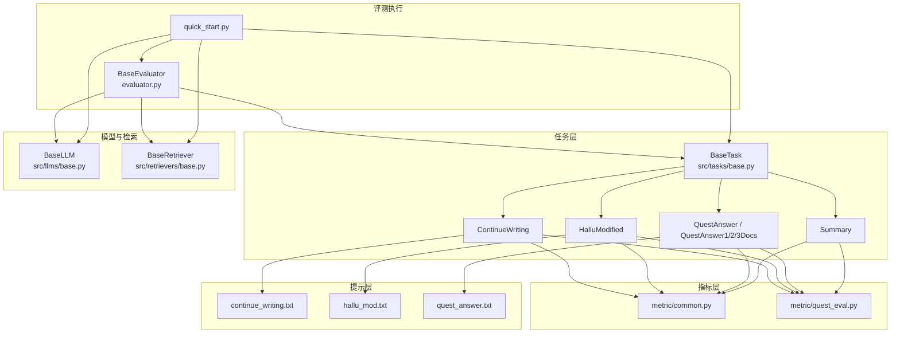
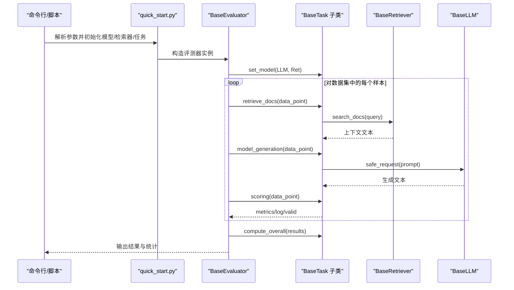
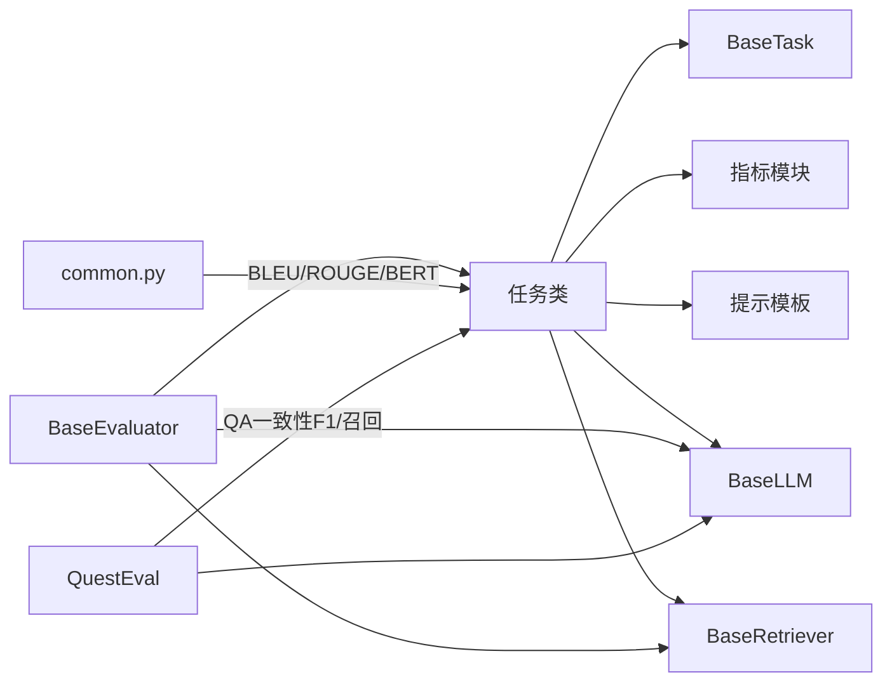

# 自定义任务开发

<cite>
**本文引用的文件**
- [src/tasks/base.py](file://src/tasks/base.py)
- [src/tasks/continue_writing.py](file://src/tasks/continue_writing.py)
- [src/tasks/hallucinated_modified.py](file://src/tasks/hallucinated_modified.py)
- [src/tasks/quest_answer.py](file://src/tasks/quest_answer.py)
- [src/tasks/summary.py](file://src/tasks/summary.py)
- [src/metric/common.py](file://src/metric/common.py)
- [src/metric/quest_eval.py](file://src/metric/quest_eval.py)
- [src/prompts/continue_writing.txt](file://src/prompts/continue_writing.txt)
- [src/prompts/hallu_mod.txt](file://src/prompts/hallu_mod.txt)
- [src/prompts/quest_answer.txt](file://src/prompts/quest_answer.txt)
- [src/llms/base.py](file://src/llms/base.py)
- [src/retrievers/base.py](file://src/retrievers/base.py)
- [quick_start.py](file://quick_start.py)
- [evaluator.py](file://evaluator.py)
- [src/configs/config.py](file://src/configs/config.py)
- [README.md](file://README.md)
</cite>

## 目录
1. [简介](#简介)
2. [项目结构](#项目结构)
3. [核心组件](#核心组件)
4. [架构总览](#架构总览)
5. [详细组件分析](#详细组件分析)
6. [依赖分析](#依赖分析)
7. [性能考量](#性能考量)
8. [故障排查指南](#故障排查指南)
9. [结论](#结论)
10. [附录](#附录)

## 简介
本指南面向希望在 CRUD-RAG 评测框架中开发“自定义任务”的工程师与研究者。文档将系统讲解如何继承 BaseTask 基类创建新评估任务，解释任务接口的设计原理与关键方法的实现要求，提供从数据格式、提示模板设计到评分逻辑与整体统计的完整开发流程，并展示如何扩展现有任务类型（例如新增 RAG 评估场景）。同时，文档说明任务与检索器、语言模型的集成方式，给出常见问题与最佳实践，帮助快速、稳健地完成自定义任务开发。

## 项目结构
CRUD-RAG 的任务体系围绕“任务-指标-提示-评测器-模型-检索器”展开。核心模块如下：
- 任务层：src/tasks 下的各具体任务类，均继承自 BaseTask
- 指标层：src/metric 提供 BLEU、ROUGE-L、BERT Score、QuestEval 等指标
- 提示层：src/prompts 下存放各任务的提示模板
- 评测执行：evaluator.py 提供统一的批处理与并发评测流程
- 快速入口：quick_start.py 展示如何装配模型、检索器与任务并运行评测
- 配置与依赖：src/configs/config.py 提供模型访问配置；README.md 提供使用说明

图表来源
- [src/tasks/base.py:13-74](file://src/tasks/base.py#L13-L74)
- [src/tasks/continue_writing.py:13-119](file://src/tasks/continue_writing.py#L13-L119)
- [src/tasks/hallucinated_modified.py:14-124](file://src/tasks/hallucinated_modified.py#L14-L124)
- [src/tasks/quest_answer.py:14-134](file://src/tasks/quest_answer.py#L14-L134)
- [src/tasks/summary.py:12-121](file://src/tasks/summary.py#L12-L121)
- [src/metric/common.py:23-117](file://src/metric/common.py#L23-L117)
- [src/metric/quest_eval.py:23-152](file://src/metric/quest_eval.py#L23-L152)
- [src/prompts/continue_writing.txt:1-18](file://src/prompts/continue_writing.txt#L1-L18)
- [src/prompts/hallu_mod.txt:1-23](file://src/prompts/hallu_mod.txt#L1-L23)
- [src/prompts/quest_answer.txt:1-15](file://src/prompts/quest_answer.txt#L1-L15)
- [evaluator.py:13-192](file://evaluator.py#L13-L192)
- [quick_start.py:14-110](file://quick_start.py#L14-L110)
- [src/llms/base.py:6-47](file://src/llms/base.py#L6-L47)
- [src/retrievers/base.py:16-142](file://src/retrievers/base.py#L16-L142)

章节来源
- [README.md:27-68](file://README.md#L27-L68)
- [quick_start.py:14-110](file://quick_start.py#L14-L110)

## 核心组件
- BaseTask 抽象基类：定义任务生命周期与统一接口，包括 set_model、retrieve_docs、model_generation、scoring、compute_overall 等方法，以及 QuestEval/BERT Score 的可选开关。
- 具体任务类：如 ContinueWriting、HalluModified、QuestAnswer、Summary 等，均覆盖上述方法并结合各自提示模板与评分策略。
- 指标模块：提供 BLEU、ROUGE-L、BERT Score 等通用指标，以及 QuestEval（基于 GPT 的问答一致性度量）。
- 提示模板：每个任务对应一个或多个提示文件，用于构造最终的模型输入。
- 评测执行器：BaseEvaluator 统一调度检索、生成、评分与结果汇总，支持并发与断点续跑。
- 模型与检索器：BaseLLM 定义统一请求接口，BaseRetriever 封装向量检索流程。

章节来源
- [src/tasks/base.py:13-74](file://src/tasks/base.py#L13-L74)
- [src/tasks/continue_writing.py:13-119](file://src/tasks/continue_writing.py#L13-L119)
- [src/tasks/hallucinated_modified.py:14-124](file://src/tasks/hallucinated_modified.py#L14-L124)
- [src/tasks/quest_answer.py:14-134](file://src/tasks/quest_answer.py#L14-L134)
- [src/tasks/summary.py:12-121](file://src/tasks/summary.py#L12-L121)
- [src/metric/common.py:23-117](file://src/metric/common.py#L23-L117)
- [src/metric/quest_eval.py:23-152](file://src/metric/quest_eval.py#L23-L152)
- [evaluator.py:13-192](file://evaluator.py#L13-L192)
- [src/llms/base.py:6-47](file://src/llms/base.py#L6-L47)
- [src/retrievers/base.py:16-142](file://src/retrievers/base.py#L16-L142)

## 架构总览
下图展示了“任务-评测器-模型-检索器”的交互关系与数据流：

图表来源
- [quick_start.py:54-110](file://quick_start.py#L54-L110)
- [evaluator.py:42-151](file://evaluator.py#L42-L151)
- [src/tasks/base.py:34-74](file://src/tasks/base.py#L34-L74)
- [src/retrievers/base.py:133-142](file://src/retrievers/base.py#L133-L142)
- [src/llms/base.py:38-46](file://src/llms/base.py#L38-L46)

## 详细组件分析

### BaseTask 接口与实现要点
- 初始化参数
  - output_dir：输出目录，自动创建
  - quest_eval_model/use_quest_eval/use_bert_score：控制是否启用 QuestEval 与 BERT Score
- 关键方法
  - set_model：注入模型与检索器实例，供后续调用
  - retrieve_docs：从数据点提取查询文本并调用检索器返回上下文
  - model_generation：读取提示模板，拼接上下文与问题，调用模型安全请求，解析响应
  - _read_prompt_template：加载提示模板文件
  - scoring：计算指标（metrics）、记录日志（log）、标记有效性（valid）
  - compute_overall：对批量结果进行聚合统计
- 设计原则
  - 方法职责单一，便于扩展与替换
  - 通过 safe_request 保证模型调用的健壮性
  - 通过 QuestEval/BERT Score 可插拔式启用

章节来源
- [src/tasks/base.py:13-74](file://src/tasks/base.py#L13-L74)
- [src/llms/base.py:38-46](file://src/llms/base.py#L38-L46)

### 典型任务实现模式
以下以现有任务为例，总结实现模式与注意事项：

- 继承与初始化
  - 在子类 __init__ 中确保输出目录存在
  - 条件性初始化 QuestEval 实例
- set_model
  - 保存模型与检索器引用，供后续检索与生成使用
- retrieve_docs
  - 从数据点字段提取查询文本
  - 调用检索器 search_docs 并清洗返回文本
- model_generation
  - 读取对应提示模板
  - 使用模板.format 拼接查询与上下文
  - 调用模型 safe_request 并解析响应（如截取 <response>...</response> 区间）
- scoring
  - 计算 BLEU、ROUGE-L、BERT Score 等
  - 若启用 QuestEval，则调用 QuestEval.quest_eval 并记录问答对与一致性分数
  - 返回包含 metrics、log、valid 的字典
- compute_overall
  - 对指标求平均，若启用 QuestEval 则按有效问答数归一化

章节来源
- [src/tasks/continue_writing.py:13-119](file://src/tasks/continue_writing.py#L13-L119)
- [src/tasks/hallucinated_modified.py:14-124](file://src/tasks/hallucinated_modified.py#L14-L124)
- [src/tasks/quest_answer.py:14-134](file://src/tasks/quest_answer.py#L14-L134)
- [src/tasks/summary.py:12-121](file://src/tasks/summary.py#L12-L121)
- [src/metric/common.py:23-117](file://src/metric/common.py#L23-L117)
- [src/metric/quest_eval.py:92-152](file://src/metric/quest_eval.py#L92-L152)

### 提示模板设计与数据格式要求
- 提示模板位置与命名
  - 模板文件位于 src/prompts/，命名与任务一一对应
  - 任务内部通过 _read_prompt_template 加载模板
- 数据格式约定
  - 任务内部通常从数据点读取特定字段（如 beginning、continuing、newsBeginning、hallucinatedContinuation、questions、answers、event、summary 等）
  - retrieve_docs 返回的上下文文本需与模板占位符匹配
- 最佳实践
  - 模板中明确区分“检索到的文档”“已写好的文本/问题/事件”等角色
  - 生成响应限定在 <response>...</response> 标记内，便于解析
  - 针对不同模型（如 7B 模型）适当简化提示，避免复杂嵌套

章节来源
- [src/tasks/continue_writing.py:53-61](file://src/tasks/continue_writing.py#L53-L61)
- [src/tasks/hallucinated_modified.py:57-64](file://src/tasks/hallucinated_modified.py#L57-L64)
- [src/tasks/quest_answer.py:54-61](file://src/tasks/quest_answer.py#L54-L61)
- [src/tasks/summary.py:52-59](file://src/tasks/summary.py#L52-L59)
- [src/prompts/continue_writing.txt:1-18](file://src/prompts/continue_writing.txt#L1-L18)
- [src/prompts/hallu_mod.txt:1-23](file://src/prompts/hallu_mod.txt#L1-L23)
- [src/prompts/quest_answer.txt:1-15](file://src/prompts/quest_answer.txt#L1-L15)

### 评分逻辑与整体统计
- 指标计算
  - BLEU/ROUGE-L：基于中文分词器 jieba 的精确度与召回折中
  - BERT Score：基于本地缓存的中文语义相似度模型
  - QuestEval：基于 GPT 的问题生成与答案一致性 F1/召回
- 结果结构
  - metrics：数值型指标集合
  - log：字符串型日志（如生成文本、问答对、时间戳等）
  - valid：布尔值，指示该样本是否有效
- 整体统计
  - compute_overall 对指标求平均；若启用 QuestEval，按有效问答数归一化 QA 指标

章节来源
- [src/metric/common.py:23-117](file://src/metric/common.py#L23-L117)
- [src/metric/quest_eval.py:92-152](file://src/metric/quest_eval.py#L92-L152)
- [src/tasks/continue_writing.py:62-119](file://src/tasks/continue_writing.py#L62-L119)
- [src/tasks/hallucinated_modified.py:66-124](file://src/tasks/hallucinated_modified.py#L66-L124)
- [src/tasks/quest_answer.py:63-134](file://src/tasks/quest_answer.py#L63-L134)
- [src/tasks/summary.py:61-121](file://src/tasks/summary.py#L61-L121)

### 扩展现有任务类型（新增 RAG 评估场景）
- 新增任务步骤
  1) 创建任务类：继承 BaseTask，实现 set_model、retrieve_docs、model_generation、scoring、compute_overall
  2) 准备提示模板：在 src/prompts/ 下新增模板文件，并在任务中通过 _read_prompt_template 加载
  3) 数据格式适配：确保数据点包含任务所需的字段（如问题、事件、上下文等）
  4) 指标选择：按需启用 QuestEval 或 BERT Score
  5) 注册与运行：在 quick_start.py 的任务映射中注册新任务，并通过命令行参数选择运行
- 示例参考
  - QuestAnswer 的子类化：QuestAnswer1Doc/2Docs/3Docs 展示了通过继承扩展不同上下文数量的评估场景

章节来源
- [src/tasks/quest_answer.py:122-134](file://src/tasks/quest_answer.py#L122-L134)
- [quick_start.py:91-109](file://quick_start.py#L91-L109)

### 任务与检索器、语言模型的集成
- 集成方式
  - 评测器在构造阶段调用 task.set_model，将模型与检索器注入任务
  - 任务在生成阶段调用检索器 search_docs 获取上下文，再调用模型 safe_request 发送提示
- 注意事项
  - 检索器返回的文本需去除冗余信息（如文件路径），仅保留上下文
  - 模型调用通过 safe_request 包裹异常，避免中断评测流程
  - QuestEval 依赖 GPT，需正确配置 API 密钥与代理

章节来源
- [evaluator.py:42-54](file://evaluator.py#L42-L54)
- [src/tasks/base.py:34-45](file://src/tasks/base.py#L34-L45)
- [src/retrievers/base.py:133-142](file://src/retrievers/base.py#L133-L142)
- [src/llms/base.py:38-46](file://src/llms/base.py#L38-L46)
- [src/configs/config.py:1-14](file://src/configs/config.py#L1-L14)

## 依赖分析
- 组件耦合
  - 任务类依赖 BaseTask 抽象，耦合度低，易于扩展
  - 评测器依赖任务、模型与检索器，形成清晰的三层依赖
- 外部依赖
  - 指标模块依赖 evaluate、text2vec、jieba 等第三方库
  - QuestEval 依赖 GPT 服务，需配置 API 密钥
  - 检索器依赖 Milvus 向量数据库与 LlamaIndex

图表来源
- [src/tasks/base.py:13-74](file://src/tasks/base.py#L13-L74)
- [src/metric/common.py:23-117](file://src/metric/common.py#L23-L117)
- [src/metric/quest_eval.py:23-152](file://src/metric/quest_eval.py#L23-L152)
- [evaluator.py:13-192](file://evaluator.py#L13-L192)
- [src/llms/base.py:6-47](file://src/llms/base.py#L6-L47)
- [src/retrievers/base.py:16-142](file://src/retrievers/base.py#L16-L142)

## 性能考量
- 并发与断点续跑
  - BaseEvaluator 支持线程池并发处理样本，提高吞吐
  - 若输出文件已存在则自动跳过已评估的有效样本，实现断点续跑
- 指标计算开销
  - QuestEval 与 BERT Score 均涉及网络请求或本地模型推理，建议按需启用
- 检索与生成
  - 检索器 Top-K 与 chunk_size/overlap 影响召回质量与延迟
  - 模型温度与最大生成长度影响稳定性与耗时

章节来源
- [evaluator.py:56-107](file://evaluator.py#L56-L107)
- [evaluator.py:158-192](file://evaluator.py#L158-L192)
- [src/retrievers/base.py:27-40](file://src/retrievers/base.py#L27-L40)
- [src/metric/quest_eval.py:23-152](file://src/metric/quest_eval.py#L23-L152)
- [src/metric/common.py:75-85](file://src/metric/common.py#L75-L85)

## 故障排查指南
- 提示模板缺失
  - 现象：日志报错提示模板未找到
  - 处理：检查模板文件是否存在，路径是否正确
- 模型请求失败
  - 现象：生成文本为空或包含特定错误字符串
  - 处理：确认模型可用性与网络连接；BaseEvaluator 已过滤无效样本
- QuestEval 无法生成/保存问答对
  - 现象：QA 指标为 0，或问答对为空
  - 处理：检查 GPT 配置与 API 密钥；确认任务类启用 use_quest_eval
- 检索结果异常
  - 现象：检索到的文本包含文件路径或冗余信息
  - 处理：在 retrieve_docs 中清洗返回文本，仅保留上下文

章节来源
- [src/tasks/continue_writing.py:53-61](file://src/tasks/continue_writing.py#L53-L61)
- [evaluator.py:76-100](file://evaluator.py#L76-L100)
- [src/metric/quest_eval.py:13-16](file://src/metric/quest_eval.py#L13-L16)
- [src/tasks/summary.py:36-40](file://src/tasks/summary.py#L36-L40)

## 结论
通过继承 BaseTask 并遵循统一的接口规范，开发者可以快速扩展 CRUD-RAG 的任务体系。结合提示模板、指标模块与评测器的协同工作，能够高效构建多样化的 RAG 评估场景。建议在新增任务时优先复用现有指标与提示模板，按需启用 QuestEval/BERT Score，并关注并发与断点续跑能力以提升评测效率。

## 附录

### 开发流程清单
- 创建任务类：继承 BaseTask，实现 set_model/retrieve_docs/model_generation/scoring/compute_overall
- 准备提示模板：在 src/prompts/ 下新增模板文件
- 数据格式：确保数据点包含任务所需字段
- 指标选择：按需启用 QuestEval/BERT Score
- 注册与运行：在 quick_start.py 中注册任务并运行

章节来源
- [src/tasks/base.py:13-74](file://src/tasks/base.py#L13-L74)
- [quick_start.py:91-109](file://quick_start.py#L91-L109)