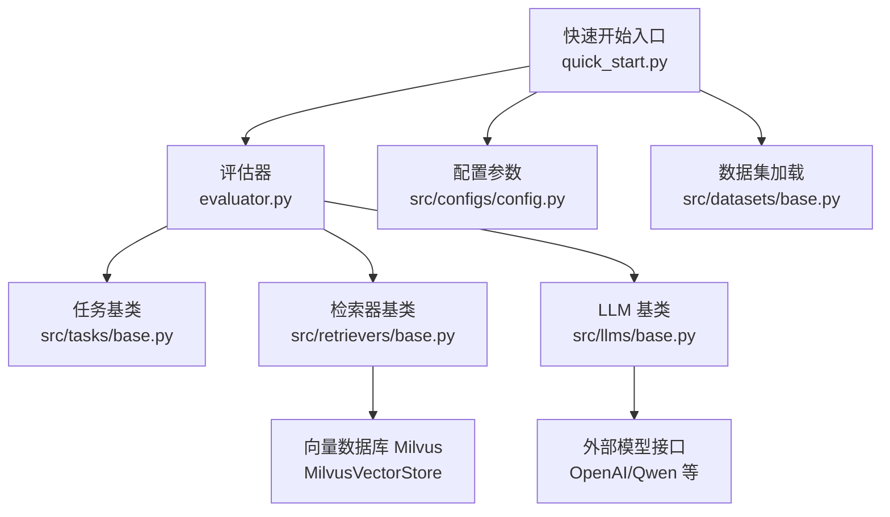
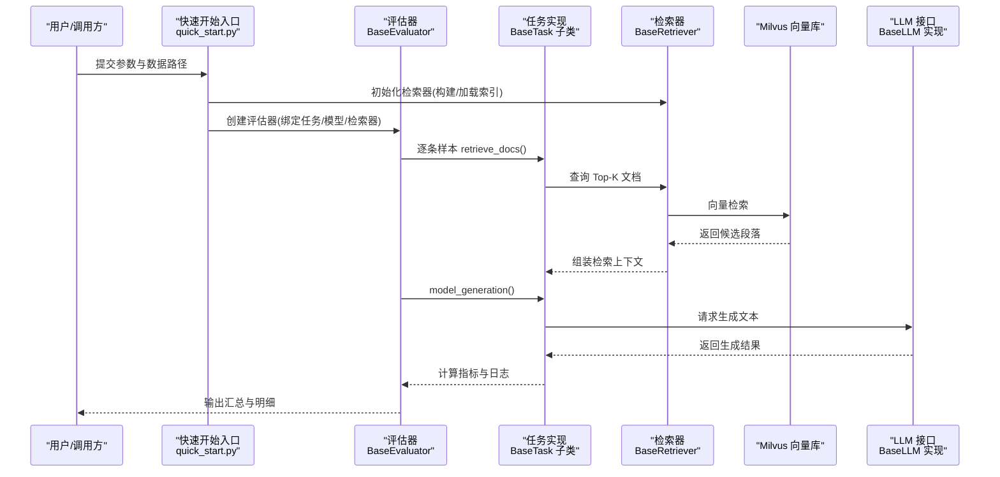
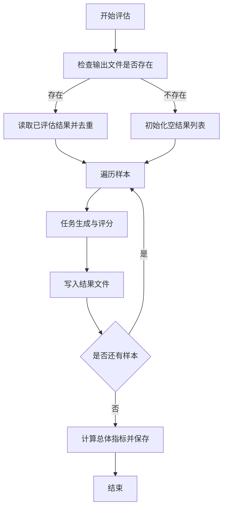
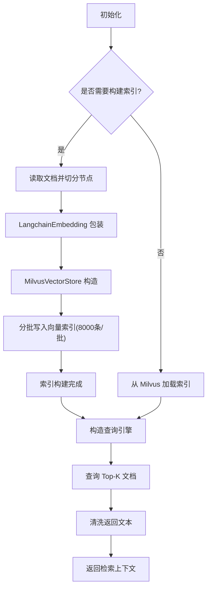
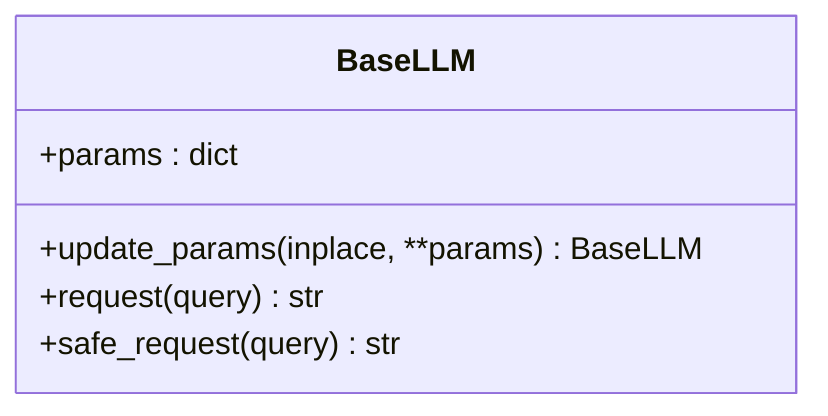
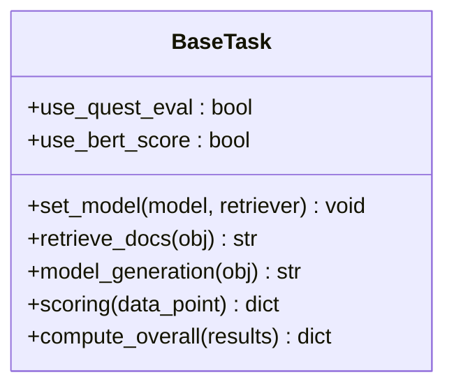
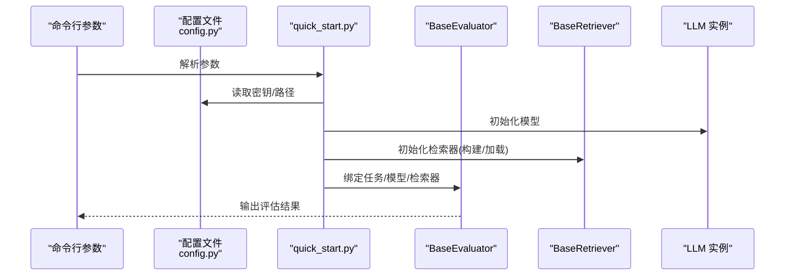
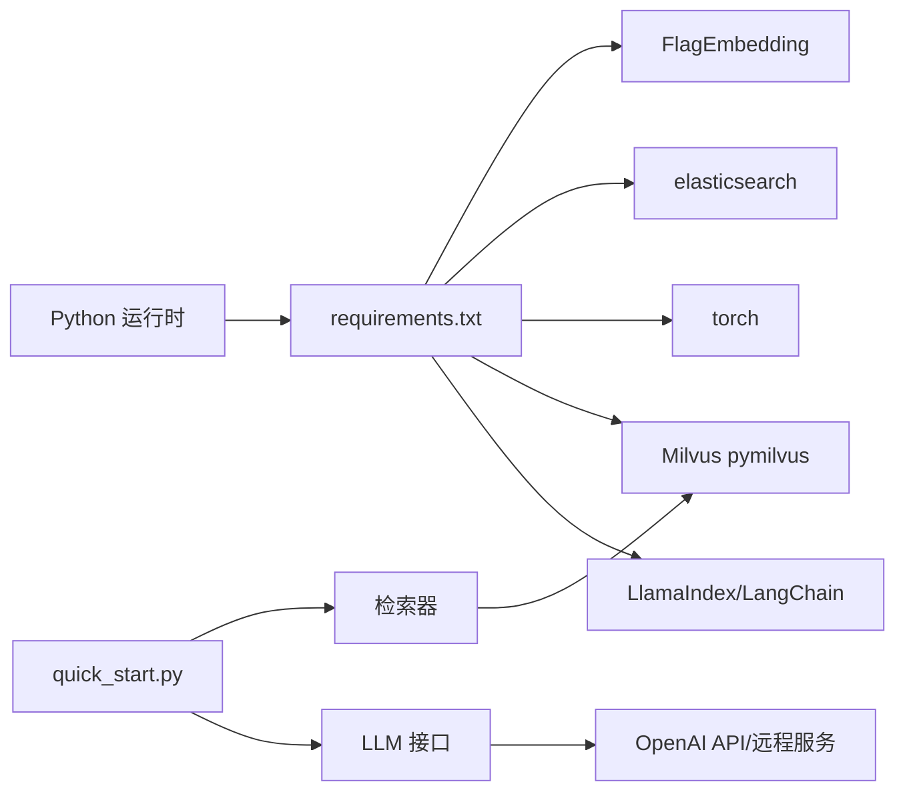

# 集成与生产部署

<cite>
**本文引用的文件**
- [README.md](file://README.md)
- [requirements.txt](file://requirements.txt)
- [quick_start.py](file://quick_start.py)
- [evaluator.py](file://evaluator.py)
- [src/configs/config.py](file://src/configs/config.py)
- [src/llms/base.py](file://src/llms/base.py)
- [src/retrievers/base.py](file://src/retrievers/base.py)
- [src/datasets/base.py](file://src/datasets/base.py)
- [src/tasks/base.py](file://src/tasks/base.py)
</cite>

## 目录
1. [简介](#简介)
2. [项目结构](#项目结构)
3. [核心组件](#核心组件)
4. [架构总览](#架构总览)
5. [详细组件分析](#详细组件分析)
6. [依赖关系分析](#依赖关系分析)
7. [性能考虑](#性能考虑)
8. [故障排查指南](#故障排查指南)
9. [结论](#结论)
10. [附录](#附录)

## 简介
本指南面向在研究或生产环境中集成与部署 CRUD-RAG 的工程团队，目标是帮助您完成从本地开发到容器化与 Kubernetes 集群的全链路落地。内容涵盖：
- 部署架构设计与配置要求（环境依赖、资源配置、网络设置）
- Docker 容器化与 Kubernetes 集群部署策略
- 监控与告警配置建议
- 版本管理、更新与回滚机制
- 安全配置与访问控制最佳实践
- 性能基准测试与容量规划方法

## 项目结构
CRUD-RAG 采用模块化分层组织：数据集加载、嵌入与检索、大语言模型适配、任务与指标、以及统一的评估执行器。整体结构清晰，便于在生产中以服务化方式复用。

图表来源
- [quick_start.py:1-110](file://quick_start.py#L1-L110)
- [evaluator.py:1-192](file://evaluator.py#L1-L192)
- [src/retrievers/base.py:16-142](file://src/retrievers/base.py#L16-L142)
- [src/llms/base.py:6-47](file://src/llms/base.py#L6-L47)
- [src/tasks/base.py:13-74](file://src/tasks/base.py#L13-L74)
- [src/configs/config.py:1-14](file://src/configs/config.py#L1-L14)
- [src/datasets/base.py:4-20](file://src/datasets/base.py#L4-L20)

章节来源
- [README.md:27-68](file://README.md#L27-L68)
- [quick_start.py:14-51](file://quick_start.py#L14-L51)

## 核心组件
- 评估器 BaseEvaluator：负责多线程批处理、结果缓存与断点续跑、总体指标计算与输出落盘。
- 检索器 BaseRetriever：基于 LlamaIndex 与 Milvus 构建/加载向量索引，支持分块写入与增量添加。
- LLM 基类 BaseLLM：抽象请求接口与安全请求封装，便于替换不同推理后端（本地/远程/OpenAI）。
- 任务基类 BaseTask：定义评分与总体统计接口，支持可选的 QuestEval 与 BertScore 指标。
- 配置与启动：通过命令行参数与配置文件集中管理模型、索引、检索与评测参数。

章节来源
- [evaluator.py:13-192](file://evaluator.py#L13-L192)
- [src/retrievers/base.py:16-142](file://src/retrievers/base.py#L16-L142)
- [src/llms/base.py:6-47](file://src/llms/base.py#L6-L47)
- [src/tasks/base.py:13-74](file://src/tasks/base.py#L13-L74)
- [src/configs/config.py:1-14](file://src/configs/config.py#L1-L14)
- [quick_start.py:14-51](file://quick_start.py#L14-L51)

## 架构总览
下图展示从“查询输入”到“生成与评分”的完整链路，以及与 Milvus 和外部 LLM 的交互。

图表来源
- [quick_start.py:54-108](file://quick_start.py#L54-L108)
- [evaluator.py:42-151](file://evaluator.py#L42-L151)
- [src/retrievers/base.py:133-142](file://src/retrievers/base.py#L133-L142)
- [src/llms/base.py:34-47](file://src/llms/base.py#L34-L47)

## 详细组件分析

### 评估器 BaseEvaluator
- 多线程批处理：使用线程池并发执行样本处理，支持进度条与断点续跑。
- 结果缓存与去重：按 ID 去重，避免重复计算；支持保留原始样本便于调试。
- 输出结构：包含任务信息、总体指标与明细结果，便于后续可视化与归档。

图表来源
- [evaluator.py:56-107](file://evaluator.py#L56-L107)
- [evaluator.py:118-151](file://evaluator.py#L118-L151)

章节来源
- [evaluator.py:13-192](file://evaluator.py#L13-L192)

### 检索器 BaseRetriever
- 索引构建：分批处理节点（每次约 8000 条），规避 Milvus 写入限制。
- 索引加载：从 Milvus 加载已有集合，构造查询引擎。
- 增量添加：支持 JSON/目录两种文档类型，按 chunk 尺寸与重叠参数切分并追加索引。
- 查询返回：过滤文件路径元信息，仅保留正文片段。

图表来源
- [src/retrievers/base.py:37-88](file://src/retrievers/base.py#L37-L88)
- [src/retrievers/base.py:89-119](file://src/retrievers/base.py#L89-L119)
- [src/retrievers/base.py:121-132](file://src/retrievers/base.py#L121-L132)
- [src/retrievers/base.py:133-142](file://src/retrievers/base.py#L133-L142)

章节来源
- [src/retrievers/base.py:16-142](file://src/retrievers/base.py#L16-L142)

### LLM 基类 BaseLLM
- 参数管理：统一存储模型参数（名称、温度、最大生成长度、top-p/top-k 等）。
- 安全请求：捕获异常并返回空字符串，避免中断评估流程。
- 扩展点：子类需实现 request 方法以对接不同推理后端（本地/远程/OpenAI）。

图表来源
- [src/llms/base.py:6-47](file://src/llms/base.py#L6-L47)

章节来源
- [src/llms/base.py:6-47](file://src/llms/base.py#L6-L47)

### 任务基类 BaseTask
- 评分接口：scoring 返回包含数值指标、日志与有效性标记的结果字典。
- 总体统计：compute_overall 聚合各样本指标，形成总体报告。
- 可选指标：支持 QuestEval 与 BertScore，QuestEval 依赖外部模型（如 GPT）。

图表来源
- [src/tasks/base.py:13-74](file://src/tasks/base.py#L13-L74)

章节来源
- [src/tasks/base.py:13-74](file://src/tasks/base.py#L13-L74)

### 快速开始与配置
- 命令行参数：覆盖模型、嵌入、索引、检索、任务、线程数等关键配置。
- 启动流程：根据参数选择 LLM 与检索器实现，加载数据集并执行评估。
- 配置文件：集中存放 OpenAI API 密钥、代理、本地模型路径等敏感信息。

图表来源
- [quick_start.py:14-51](file://quick_start.py#L14-L51)
- [quick_start.py:54-108](file://quick_start.py#L54-L108)
- [src/configs/config.py:1-14](file://src/configs/config.py#L1-L14)

章节来源
- [quick_start.py:14-108](file://quick_start.py#L14-L108)
- [src/configs/config.py:1-14](file://src/configs/config.py#L1-L14)

## 依赖关系分析
- 运行时依赖：Python 第三方库通过 requirements.txt 管理，包含 LlamaIndex、LangChain、Milvus、Elasticsearch、FlagEmbedding、torch 等。
- 数据与模型：需要提前准备向量模型权重与 Milvus 服务；首次运行需构建索引。
- 外部接口：OpenAI API 或本地/远程模型服务；QuestEval 指标依赖外部 LLM。

图表来源
- [requirements.txt:1-13](file://requirements.txt#L1-L13)
- [quick_start.py:54-58](file://quick_start.py#L54-L58)
- [src/retrievers/base.py:13-13](file://src/retrievers/base.py#L13-L13)

章节来源
- [requirements.txt:1-13](file://requirements.txt#L1-L13)
- [README.md:76-86](file://README.md#L76-L86)

## 性能考虑
- 线程并发：评估器支持多线程批处理，线程数应结合 CPU 与 I/O 资源调优，避免过度竞争导致延迟抖动。
- 索引分批写入：检索器分批写入 Milvus，减少单次写入压力；建议在离线窗口执行大规模索引构建。
- 检索 Top-K：Top-K 越大，召回越充分但延迟越高；建议通过 A/B 测试确定最优值。
- 模型请求：LLM 安全请求封装可降低失败影响，但需关注限流与超时配置。
- 缓存与断点：评估器支持断点续跑与结果缓存，提升长周期评估的稳定性与效率。

章节来源
- [evaluator.py:56-107](file://evaluator.py#L56-L107)
- [src/retrievers/base.py:74-87](file://src/retrievers/base.py#L74-L87)
- [src/llms/base.py:38-45](file://src/llms/base.py#L38-L45)

## 故障排查指南
- 索引构建失败：确认 Milvus 服务可用、集合名唯一、分批大小合理；检查磁盘空间与内存。
- 检索无结果：核对集合名、维度与嵌入模型一致；验证 chunk 尺寸与重叠参数。
- LLM 请求异常：检查 API 密钥、代理配置与网络连通性；必要时启用安全请求兜底。
- 评估中断：利用断点续跑功能恢复；检查输出目录权限与磁盘空间。
- 指标异常：确认 QuestEval 依赖的外部模型可用；核对任务实现的评分逻辑。

章节来源
- [src/retrievers/base.py:37-88](file://src/retrievers/base.py#L37-L88)
- [src/llms/base.py:38-45](file://src/llms/base.py#L38-L45)
- [evaluator.py:68-74](file://evaluator.py#L68-L74)

## 结论
CRUD-RAG 在模块化设计上具备良好的工程化基础，适合在生产环境中以服务化方式复用。通过合理的资源规划、容器化与 Kubernetes 部署策略、完善的监控告警与安全配置，可实现稳定高效的检索增强生成评测能力。

## 附录

### A. 部署架构与配置要求
- 环境依赖
  - Python 运行时与 requirements.txt 中的第三方库
  - Milvus 服务（向量数据库）
  - 可选：OpenAI API 或本地/远程 LLM 服务
- 资源配置
  - CPU/内存：依据线程数与批量大小调整；建议为 Milvus 与应用分别预留资源
  - 存储：索引构建与持久化输出目录需充足空间
- 网络设置
  - Milvus 与应用在同一网络内；若使用远程 LLM，确保出站访问与代理配置正确

章节来源
- [requirements.txt:1-13](file://requirements.txt#L1-L13)
- [README.md:76-86](file://README.md#L76-L86)
- [src/configs/config.py:1-14](file://src/configs/config.py#L1-L14)

### B. Docker 容器化部署方案
- 建议镜像
  - 基于官方 Python 镜像，安装 requirements.txt 依赖
  - 预热向量模型权重至镜像缓存层
- 容器编排
  - 单容器模式：将 Milvus 与应用容器通过 Docker Compose 组合
  - 分容器模式：Milvus 使用独立服务，应用容器连接外部 Milvus
- 挂载卷
  - 数据与索引目录映射到宿主机持久卷
  - 配置文件挂载为只读卷，避免运行时修改

[本节为概念性部署建议，不直接对应具体源码文件]

### C. Kubernetes 集群部署策略
- 工作负载
  - Deployment：应用服务副本数与滚动更新策略
  - Job/CronJob：离线索引构建与周期性评测任务
- 存储
  - PVC：为 Milvus 与输出目录提供持久化存储
- 网络
  - Service：暴露 Milvus 与应用服务；Ingress 控制外部访问
- 安全
  - Secret：存放 OpenAI API 密钥与代理凭据
  - RBAC：最小权限原则授予 Pod

[本节为概念性部署建议，不直接对应具体源码文件]

### D. 监控与告警
- 指标采集
  - 应用：评估吞吐、错误率、线程池队列长度
  - Milvus：查询延迟、写入速率、集合大小
- 日志
  - 使用结构化日志记录评估详情与异常堆栈
- 告警
  - 针对失败率、延迟阈值与资源使用率设置阈值告警

[本节为通用运维建议，不直接对应具体源码文件]

### E. 版本管理、更新与回滚
- 版本管理
  - 以 Git Tag 标记发布版本；requirements.txt 固定关键依赖版本
- 更新策略
  - 先在预生产验证；灰度发布逐步扩大流量
- 回滚机制
  - 回滚到上一个稳定镜像与配置；必要时回滚 Milvus 集合

[本节为通用运维建议，不直接对应具体源码文件]

### F. 安全配置与访问控制
- 最小权限
  - 仅授予必要的 API 密钥与网络访问
- 加密传输
  - 使用 TLS 保护 Milvus 与外部 LLM 通信
- 访问控制
  - 通过网络策略限制 Pod 间访问；对外暴露面最小化

[本节为通用安全建议，不直接对应具体源码文件]

### G. 性能基准测试与容量规划
- 基准测试
  - 固定数据规模与 Top-K，测量吞吐与 P95 延迟
- 容量规划
  - 依据峰值 QPS 与资源利用率设定副本数与水平扩展阈值
- 调优方向
  - 线程数、Top-K、批量大小、Milvus 分片与副本

[本节为通用性能建议，不直接对应具体源码文件]