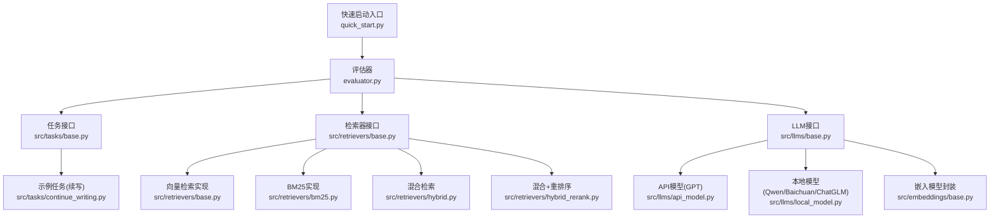
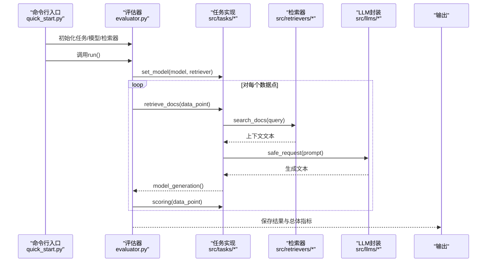
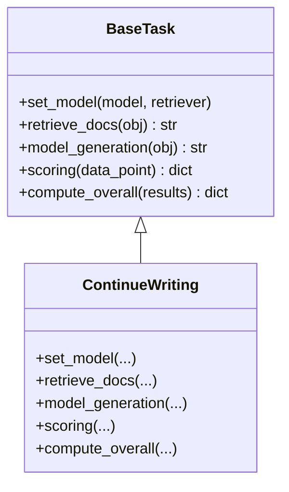
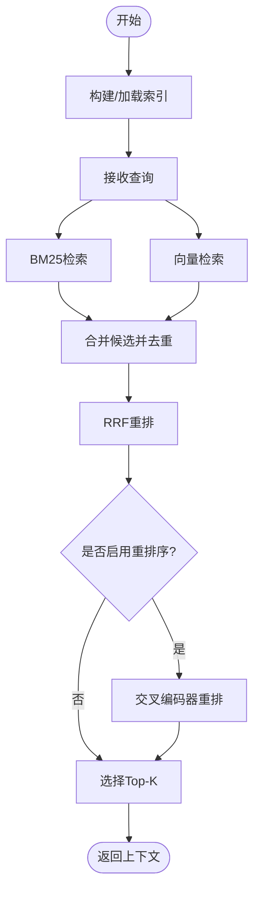
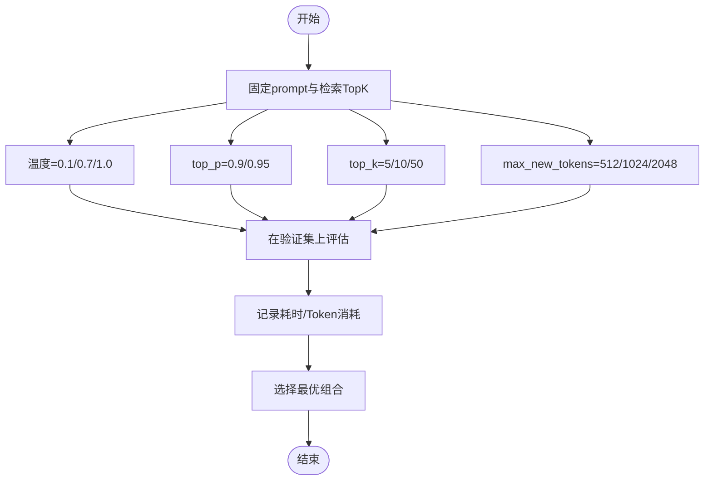
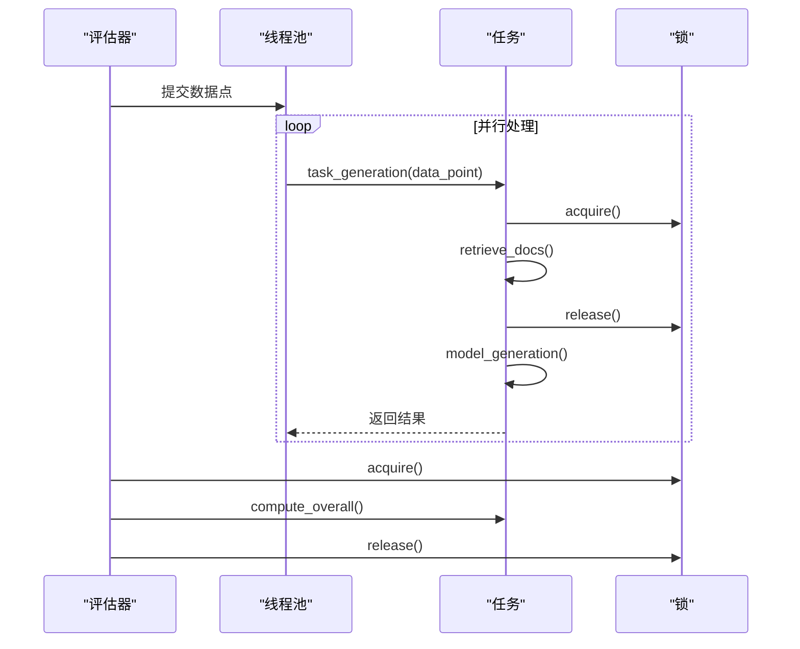
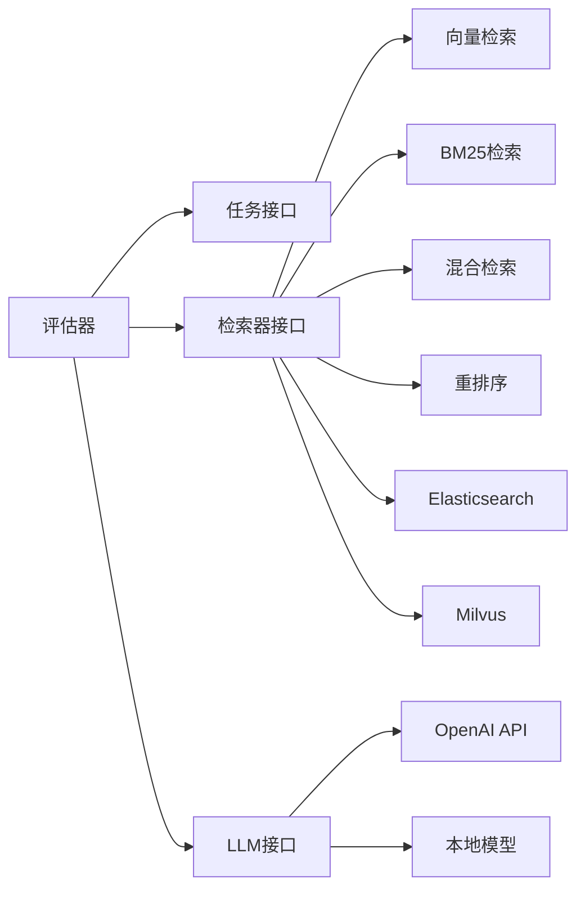

# 高级使用

<cite>
**本文引用的文件**
- [README.md](file://README.md)
- [quick_start.py](file://quick_start.py)
- [evaluator.py](file://evaluator.py)
- [src/configs/config.py](file://src/configs/config.py)
- [src/embeddings/base.py](file://src/embeddings/base.py)
- [src/llms/base.py](file://src/llms/base.py)
- [src/llms/api_model.py](file://src/llms/api_model.py)
- [src/llms/local_model.py](file://src/llms/local_model.py)
- [src/retrievers/base.py](file://src/retrievers/base.py)
- [src/retrievers/bm25.py](file://src/retrievers/bm25.py)
- [src/retrievers/hybrid.py](file://src/retrievers/hybrid.py)
- [src/retrievers/hybrid_rerank.py](file://src/retrievers/hybrid_rerank.py)
- [src/tasks/base.py](file://src/tasks/base.py)
- [src/tasks/continue_writing.py](file://src/tasks/continue_writing.py)
- [src/metric/common.py](file://src/metric/common.py)
</cite>

## 目录
1. [简介](#简介)
2. [项目结构](#项目结构)
3. [核心组件](#核心组件)
4. [架构总览](#架构总览)
5. [详细组件分析](#详细组件分析)
6. [依赖分析](#依赖分析)
7. [性能考虑](#性能考虑)
8. [故障排查指南](#故障排查指南)
9. [结论](#结论)
10. [附录](#附录)

## 简介
本指南面向高级用户，围绕CRUD-RAG在实际研究与生产环境中的高级用法，系统讲解以下主题：
- 自定义任务开发：如何基于抽象基类扩展新任务类型
- 检索策略扩展与优化：向量检索、BM25、混合检索与重排序
- 模型参数调优：系统化地调整温度、采样参数与生成长度
- 性能监控：指标采集、日志记录与资源消耗统计
- 多线程并发：线程池配置、锁与结果聚合
- 大规模数据集处理：分片索引、断点续跑与缓存策略
- 故障排查：异常捕获、错误定位与常见问题
- 集成实践：如何将CRUD-RAG嵌入更大系统

## 项目结构
CRUD-RAG采用模块化设计，按功能域划分目录，便于扩展与维护：
- 数据与配置：数据集、配置文件
- 模型层：本地/远程/API大语言模型封装
- 嵌入层：SentenceTransformer封装与交叉编码器支持
- 检索层：向量检索、BM25、混合检索与重排序
- 任务层：抽象任务接口与具体任务实现
- 评估与指标：批处理评估器、通用指标计算
- 快速启动入口：命令行参数解析与执行流程

图表来源
- [quick_start.py:1-110](file://quick_start.py#L1-L110)
- [evaluator.py:1-192](file://evaluator.py#L1-L192)
- [src/tasks/base.py:1-74](file://src/tasks/base.py#L1-L74)
- [src/retrievers/base.py:1-142](file://src/retrievers/base.py#L1-L142)
- [src/retrievers/bm25.py:1-92](file://src/retrievers/bm25.py#L1-L92)
- [src/retrievers/hybrid.py:1-81](file://src/retrievers/hybrid.py#L1-L81)
- [src/retrievers/hybrid_rerank.py:1-81](file://src/retrievers/hybrid_rerank.py#L1-L81)
- [src/llms/base.py:1-47](file://src/llms/base.py#L1-L47)
- [src/llms/api_model.py:1-33](file://src/llms/api_model.py#L1-L33)
- [src/llms/local_model.py:1-114](file://src/llms/local_model.py#L1-L114)
- [src/embeddings/base.py:1-88](file://src/embeddings/base.py#L1-L88)

章节来源
- [README.md:27-68](file://README.md#L27-L68)
- [quick_start.py:14-110](file://quick_start.py#L14-L110)

## 核心组件
- 抽象任务接口：定义任务生命周期（检索、生成、评分、汇总）
- 抽象检索器接口：统一向量检索、BM25与混合检索
- 抽象LLM接口：统一参数更新、安全请求与异常处理
- 评估器：多线程批处理、断点续跑、结果聚合与持久化
- 指标模块：BLEU、ROUGE-L、BERTScore等通用指标

章节来源
- [src/tasks/base.py:13-74](file://src/tasks/base.py#L13-L74)
- [src/retrievers/base.py:16-142](file://src/retrievers/base.py#L16-L142)
- [src/llms/base.py:6-47](file://src/llms/base.py#L6-L47)
- [evaluator.py:13-192](file://evaluator.py#L13-L192)
- [src/metric/common.py:13-117](file://src/metric/common.py#L13-L117)

## 架构总览
下图展示从命令行入口到评估输出的端到端流程，包括检索、生成与评分三个阶段。

图表来源
- [quick_start.py:54-109](file://quick_start.py#L54-L109)
- [evaluator.py:42-151](file://evaluator.py#L42-L151)
- [src/tasks/continue_writing.py:33-51](file://src/tasks/continue_writing.py#L33-L51)
- [src/retrievers/base.py:133-141](file://src/retrievers/base.py#L133-L141)
- [src/llms/base.py:38-46](file://src/llms/base.py#L38-L46)

## 详细组件分析

### 自定义任务开发
- 继承抽象任务基类，实现以下职责：
  - 设置模型与检索器：在构造后由评估器注入
  - 检索上下文：根据数据点提取查询并调用检索器
  - 生成文本：读取模板、拼接提示并调用LLM的安全请求
  - 评分与汇总：计算指标、记录日志、返回有效性标记
- 最佳实践：
  - 将提示模板集中管理，避免硬编码
  - 使用安全请求包装，确保异常不中断整体流程
  - 在评分中区分数值指标与字符串日志，便于后续分析
  - 汇总时注意有效样本过滤与平均值归一化

图表来源
- [src/tasks/base.py:13-74](file://src/tasks/base.py#L13-L74)
- [src/tasks/continue_writing.py:13-119](file://src/tasks/continue_writing.py#L13-L119)

章节来源
- [src/tasks/base.py:13-74](file://src/tasks/base.py#L13-L74)
- [src/tasks/continue_writing.py:13-119](file://src/tasks/continue_writing.py#L13-L119)

### 检索策略扩展与优化
- 向量检索（Milvus）：支持分片索引、增量添加、相似度TopK控制
- BM25（Elasticsearch）：独立构建索引，匹配查询内容
- 混合检索（RRF）：对BM25与向量检索结果做去重与重排融合
- 混合+重排序：在混合候选基础上使用交叉编码器重排

图表来源
- [src/retrievers/base.py:56-87](file://src/retrievers/base.py#L56-L87)
- [src/retrievers/bm25.py:44-68](file://src/retrievers/bm25.py#L44-L68)
- [src/retrievers/hybrid.py:50-81](file://src/retrievers/hybrid.py#L50-L81)
- [src/retrievers/hybrid_rerank.py:63-81](file://src/retrievers/hybrid_rerank.py#L63-L81)

章节来源
- [src/retrievers/base.py:16-142](file://src/retrievers/base.py#L16-L142)
- [src/retrievers/bm25.py:14-92](file://src/retrievers/bm25.py#L14-L92)
- [src/retrievers/hybrid.py:13-81](file://src/retrievers/hybrid.py#L13-L81)
- [src/retrievers/hybrid_rerank.py:26-81](file://src/retrievers/hybrid_rerank.py#L26-L81)

### 模型参数调优的系统方法
- 参数维度建议：
  - 温度：控制创造性；低值更稳定，高值更发散
  - 采样参数：top_p/top_k影响核采样与候选裁剪
  - 生成长度：max_new_tokens限制输出长度，避免截断
- 调优流程：
  - 固定prompt与检索TopK，仅变化一个参数
  - 在验证集上对比BLEU/ROUGE/QA等指标
  - 记录token消耗与延迟，平衡质量与成本
- 安全请求与异常处理：
  - 使用安全请求包装，避免单点异常导致中断
  - 记录warning日志，便于回溯

图表来源
- [src/llms/base.py:25-46](file://src/llms/base.py#L25-L46)
- [src/llms/api_model.py:17-32](file://src/llms/api_model.py#L17-L32)
- [src/llms/local_model.py:19-25](file://src/llms/local_model.py#L19-L25)

章节来源
- [src/llms/base.py:6-47](file://src/llms/base.py#L6-L47)
- [src/llms/api_model.py:12-33](file://src/llms/api_model.py#L12-L33)
- [src/llms/local_model.py:11-114](file://src/llms/local_model.py#L11-L114)

### 多线程并发处理与调试
- 并发模型：
  - 使用线程池执行数据点批处理
  - 通过锁保护共享状态（如QuestEval保存）
  - 支持断点续跑：按ID跳过已成功样本
- 调试要点：
  - 开启进度条观察吞吐
  - 记录warning日志定位异常
  - 控制线程数避免资源争用

图表来源
- [evaluator.py:56-108](file://evaluator.py#L56-L108)
- [evaluator.py:118-151](file://evaluator.py#L118-L151)

章节来源
- [evaluator.py:13-192](file://evaluator.py#L13-L192)

### 大规模数据集处理的性能优化
- 分片索引：向量索引构建按批次写入，规避内存与服务端限制
- 增量添加：已有索引可追加新文档，无需重建
- 断点续跑：按ID跳过已成功样本，支持长时间任务
- 输出组织：按集合名与TopK命名输出目录，便于复现与对比

章节来源
- [src/retrievers/base.py:74-87](file://src/retrievers/base.py#L74-L87)
- [src/retrievers/base.py:112-119](file://src/retrievers/base.py#L112-L119)
- [evaluator.py:68-74](file://evaluator.py#L68-L74)
- [evaluator.py:31-40](file://evaluator.py#L31-L40)

### 指标体系与监控
- 指标覆盖：BLEU、ROUGE-L、BERTScore、QA-F1/Recall
- 异常防护：装饰器捕获异常，保证评估稳健
- 日志与计费：API模型记录token消耗，便于成本控制

章节来源
- [src/metric/common.py:13-117](file://src/metric/common.py#L13-L117)
- [src/llms/api_model.py:30-32](file://src/llms/api_model.py#L30-L32)

## 依赖分析
- 组件耦合：
  - 评估器与任务/检索器/LLM解耦，通过接口交互
  - 检索器内部可组合多种策略（向量/BM25/重排）
- 外部依赖：
  - 向量数据库Milvus/Elasticsearch
  - SentenceTransformers与交叉编码器
  - OpenAI API与本地HuggingFace模型

图表来源
- [evaluator.py:13-41](file://evaluator.py#L13-L41)
- [src/retrievers/base.py:16-54](file://src/retrievers/base.py#L16-L54)
- [src/retrievers/bm25.py:14-42](file://src/retrievers/bm25.py#L14-L42)
- [src/retrievers/hybrid.py:13-48](file://src/retrievers/hybrid.py#L13-L48)
- [src/retrievers/hybrid_rerank.py:26-61](file://src/retrievers/hybrid_rerank.py#L26-L61)
- [src/llms/api_model.py:12-32](file://src/llms/api_model.py#L12-L32)
- [src/llms/local_model.py:11-87](file://src/llms/local_model.py#L11-L87)

## 性能考虑
- 索引构建：
  - 分批写入Milvus，降低单次压力
  - 选择合适的chunk_size与overlap以平衡召回与速度
- 检索：
  - 控制similarity_top_k，避免过多候选带来的重排开销
  - 混合检索先去重再重排，减少重复计算
- 生成：
  - 合理设置max_new_tokens，避免超长输出
  - 使用安全请求与异常降级，保障吞吐稳定性
- 并发：
  - 根据CPU/GPU与网络带宽调节线程数
  - 使用锁保护共享资源，避免竞态

## 故障排查指南
- 常见问题与对策：
  - API请求失败：检查密钥与代理配置，查看warning日志
  - 索引构建卡住：确认Milvus/Elasticsearch服务可用，减小批次大小
  - 结果为空：检查检索TopK与prompt模板路径
  - 评估中断：启用断点续跑，按ID跳过已成功样本
- 调试建议：
  - 打开进度条观察吞吐
  - 记录异常堆栈与warning信息
  - 逐步缩小参数范围定位问题

章节来源
- [src/llms/api_model.py:17-32](file://src/llms/api_model.py#L17-L32)
- [src/retrievers/base.py:74-87](file://src/retrievers/base.py#L74-L87)
- [evaluator.py:68-74](file://evaluator.py#L68-L74)
- [evaluator.py:98-100](file://evaluator.py#L98-L100)

## 结论
CRUD-RAG提供了清晰的模块化架构与完善的评估流水线。通过自定义任务、扩展检索策略、系统化参数调优与多线程并发，可在研究与生产环境中高效落地。结合断点续跑与指标监控，能够稳定支撑大规模数据集评测，并为后续优化提供数据基础。

## 附录
- 快速开始与参数说明参考命令行入口脚本
- 配置文件用于API密钥与本地模型路径
- 指标模块提供稳健的评估工具

章节来源
- [quick_start.py:14-110](file://quick_start.py#L14-L110)
- [src/configs/config.py:1-14](file://src/configs/config.py#L1-L14)
- [src/metric/common.py:13-117](file://src/metric/common.py#L13-L117)